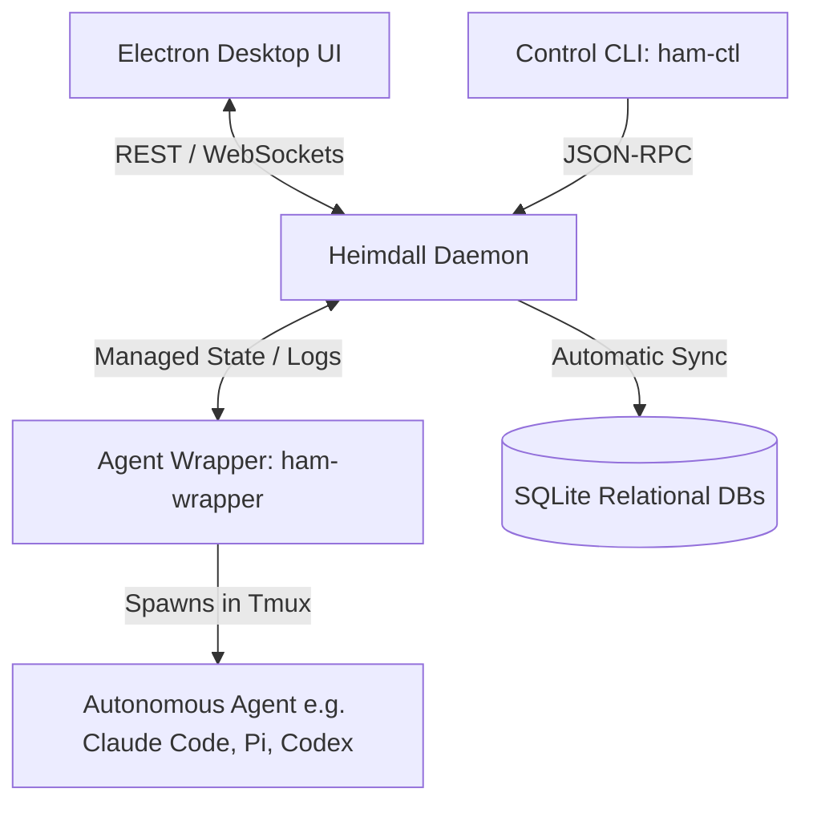

# 🛡️ Heimdall: The Autonomous Agent Orchestrator & Manager

Heimdall is an enterprise-grade, highly optimized orchestrator designed to manage, monitor, and synchronize multiple autonomous AI coding agents operating across your workspace. Built from the ground up with **Odin** (for the high-performance daemon, wrapper, and control CLI) and **React/TypeScript/Electron** (for the beautiful desktop dashboard), Heimdall provides a secure, transaction-safe, and real-time interface for multi-agent workflows.

---

## 🏗️ Architecture

Heimdall is split into four highly specialized, decoupled components:



1.  **The Daemon (`ham-daemon`)**: The core brain. It runs as a lightweight background daemon (managed via systemd), tracking task states, maintaining active agent registries, persisting curated memories, and exposing a real-time WebSocket + REST API.
2.  **The Agent Wrapper (`ham-wrapper`)**: A secure sandbox manager. It spawns autonomous agents in dedicated, isolated tmux windows, handles startup probe detection (safely bypassing prompts like folder trust), injects starter prompts, and intercepts stdin/stdout to stream logs and event triggers back to the daemon.
3.  **The Control CLI (`ham-ctl`)**: The developer's command-line cockpit. Used by both human operators and background agents to create tasks, send messages, claim work, and record memories.
4.  **The Desktop UI (`heimdall`)**: A gorgeous, hardware-accelerated Electron desktop application. Includes a live chat interface, interactive task boards, independent split-scroll memory curation tabs, and a step-by-step first-time setup wizard.

---

## 🚀 Getting Started

### 1. Installation via Nix (Declarative Home Manager)
Heimdall is packaged as a standard Nix flake. To install the binaries and UI in your user environment:

Add to your `flake.nix` inputs:
```nix
inputs.heimdall.url = "github:tanmayv/heimdall-agent-manager";
```

Import the module in your Home Manager configuration:
```nix
{ inputs, ... }: {
  imports = [ inputs.heimdall.homeModules.default ];

  programs.heimdall = {
    enable = true;
    packageNames = [ "daemon" "wrapper" "ctl" "ui" ]; # Installs all binaries + Electron UI
  };
}
```
Run `home-manager switch --flake .#your-profile` to compile, link the systemd user service, and launch!

### 2. First-Time Onboarding Wizard
The moment you boot the Electron app for the first time, Heimdall intercepts the view and renders the **First-Time Setup Wizard**:
*   **Daemon Connection**: Connects to the daemon URL (supports remote cloudtop/VM IPs!).
*   **User Profile**: Registers your friendly Display Name.
*   **Durable Memory PKM Path**: Configures your personal knowledge base directory (the daemon automatically creates the path on the host machine if it doesn't exist!).
*   **Agent Smoke Tests (Optional)**: Performs a non-blocking `which` lookup to verify your configured agent binaries are runnable.
*   **Provision Curation Agents**: Automatically spins up background `memory-auditor` and `memory-reviewer` instances.

---

## 🧠 Memory Curation & Task Auditing
Heimdall implements a continuous, background curation cycle to harvest and persist agent knowledge:
*   **Task Chains**: Agents record their work inside structured task chains.
*   **Memory Auditor**: Once a chain completes, the background Auditor agent analyzes the execution logs and proposes structured factual memories (facts, habits, episodes, skills).
*   **Memory Reviewer**: The proposed memories are held in a `pending` queue. The Reviewer agent (or the human operator via the split-pane **Memory** tab) reviews, refines, and approves the proposals.
*   **Durable PKM**: Approved memories are written as transaction-safe SQLite records and synced to your local markdown PKM folder (e.g. `~/agent_knowledge`).

---

## 🛠️ Local Development

For developers making changes to Heimdall:

### 1. Compile the Odin Daemon/Wrapper
Compile the binaries locally from source in less than 0.5 seconds:
```bash
# Compile Daemon
odin build src/daemon -out:ham-daemon

# Compile Wrapper
odin build src/wrapper -out:ham-wrapper
```

### 2. Hot-Reloading Electron Frontend
To develop the React/TypeScript frontend with **instant, sub-second Hot Module Replacement (HMR)** and native GPU acceleration:
```bash
# Install dependencies
npm install

# Launch Vite Dev Server + Native Electron
npm run dev
```

---

## 🔒 Security & Sandboxing (macOS / Linux GPU Acceleration)
To ensure maximum cross-platform security while keeping high rendering performance:
*   **On macOS & Windows**: The Electron window runs in a fully sandboxed Chromium container for absolute security.
*   **On Linux / Cloudtops**: Under Nix packaging, Chromium sandboxes can block graphics driver linking. Heimdall automatically detects Linux hosts and appends a safe platform-specific `disable-gpu-sandbox` bypass, enabling full **hardware-accelerated GPU rendering** without affecting macOS or Windows security profiles.
