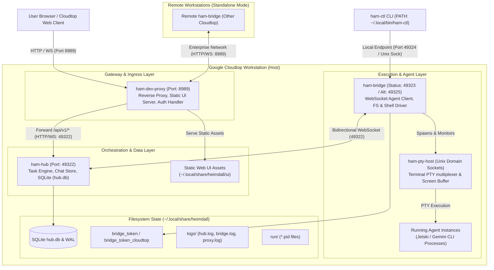
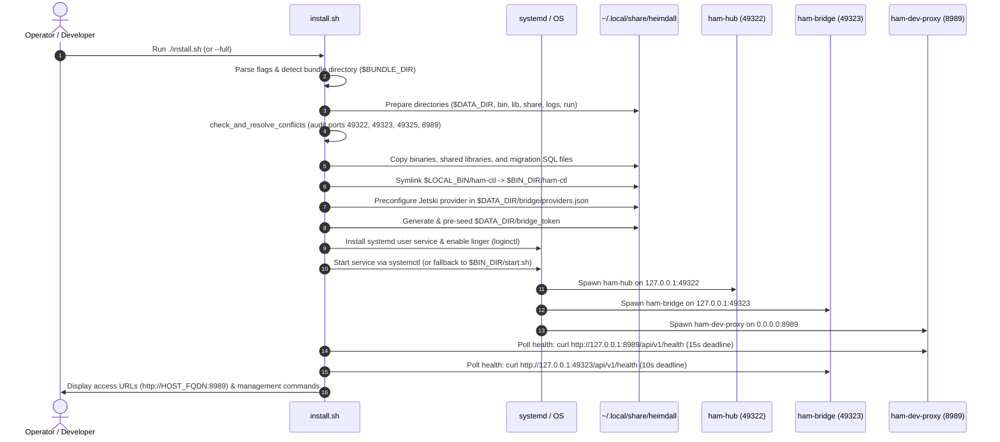
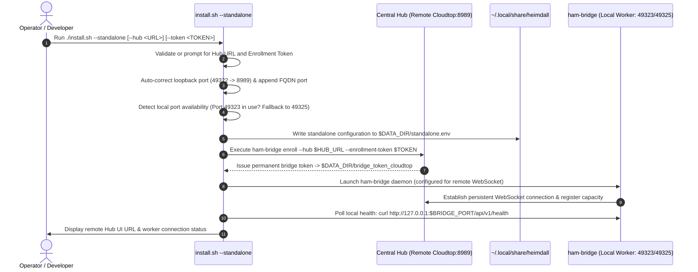
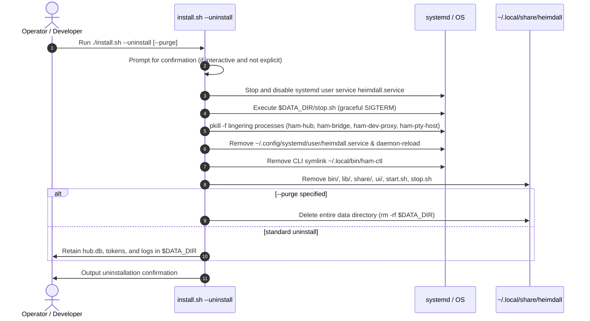

# Heimdall Cloudtop Installer: Comprehensive Architecture, Failure Analysis, and User Recovery Runbook

**Document Version:** 1.0.0  
**Target File:** `scripts/install.sh` (Google Cloudtop Workstation Deployment)  
**Related Scripts:** `scripts/install-systemd-service.sh`, `scripts/package-cloudtop-bundle.sh`  
**Requirement IDs:** REQ-ARCH-1, REQ-BREAK-2, REQ-RECOVER-3  

---

## 1. Executive Summary

`scripts/install.sh` is the unified lifecycle manager, launcher, and uninstaller for Heimdall Agent Manager on Google Cloudtop workstations. It is engineered to operate in enterprise developer environments where workstations may experience frequent SSH session disconnections, corporate firewall boundaries, port collisions with concurrent developer tools, and strict non-root permission constraints.

This document delivers an exhaustive architectural decomposition, step-by-step execution lifecycle breakdown for all three operating modes (`full`, `standalone`, and `uninstall`), a line-by-line failure-mode analysis across eight critical break points, actionable end-user recovery runbooks, and concrete code resilience recommendations for the installer codebase.

---

## 2. High-Level Architecture & Component Interactions (REQ-ARCH-1)

### 2.1 System Architecture Diagram



### 2.2 Component Responsibilities Matrix

| Component | Binary | Default Network Binding | Fallback / Alt Binding | Responsibilities & Behavior |
|---|---|---|---|---|
| **Edge Gateway / Dev-Proxy** | `ham-dev-proxy` | `0.0.0.0:8989` | None | Terminates incoming HTTP/WebSocket traffic; serves pre-built static React/TypeScript UI from disk without Node.js; proxies `/api/v1/*` requests to loopback `ham-hub`. |
| **Central Hub** | `ham-hub` | `127.0.0.1:49322` | None | Authoritative state daemon; manages tasks, task chains, comments, durable agent templates, and encrypted vaults; persists to SQLite (`hub.db`). |
| **Execution Bridge** | `ham-bridge` | `127.0.0.1:49323` | `127.0.0.1:49325` | Connects to Hub over WebSocket; executes agent tools; orchestrates local workspaces and shell processes; provides HTTP health metrics. |
| **Bridge Local Endpoint** | `ham-bridge` | `127.0.0.1:49324` | `127.0.0.1:49326` | Listens on loopback TCP and Unix domain socket (`/tmp/heimdall-bridge-local/bridge.sock`); receives `ham-ctl` commands; relays proxy sessions. |
| **PTY Host Daemon** | `ham-pty-host` | Unix Domain Socket | Dynamic socket path | Allocates pseudo-terminals (PTY) for background agent execution; captures real-time terminal stdout/stderr for UI log streaming and previews. |
| **Control CLI** | `ham-ctl` | Client CLI | PATH invocation | Administrative and agent control CLI tool; reads local credentials and executes RPCs against local Bridge or remote Hub. |
| **Systemd Supervisor** | `heimdall.service` | `systemd --user` | Background nohup | Manages the process lifecycle across Cloudtop reboots and maintains session linger when users log out of SSH. |

### 2.3 Directory and Filesystem Layout

All runtime state, binaries, and logs are encapsulated under `$DATA_DIR` (default: `$HOME/.local/share/heimdall`):

| Filesystem Path | Variable Name | Permissions | Description |
|---|---|---|---|
| `~/.local/share/heimdall` | `$DATA_DIR` | `0700` | Root directory for Heimdall persistent state. |
| `~/.local/share/heimdall/bin/` | `$BIN_DIR` | `0755` | Pre-compiled ELF binaries (`ham-hub`, `ham-bridge`, `ham-dev-proxy`, `ham-ctl`, `ham-pty-host`, `start.sh`, `stop.sh`). |
| `~/.local/share/heimdall/lib/` | `$LIB_DIR` | `0755` | Bundled shared object (`.so`) libraries with configured RPATH for de-Nixified execution. |
| `~/.local/share/heimdall/share/migrations/` | `$SHARE_DIR` | `0755` | SQLite schema migration SQL files required for Hub database initialization. |
| `~/.local/share/heimdall/run/` | `$RUN_DIR` | `0700` | PID tracking files (`hub.pid`, `bridge.pid`, `dev-proxy.pid`, `vite.pid`). |
| `~/.local/share/heimdall/logs/` | `$LOG_DIR` | `0700` | Daemon standard output and error logs (`hub.log`, `bridge.log`, `dev-proxy.log`, `vite.log`). |
| `~/.local/share/heimdall/bridge/` | `$BRIDGE_CONFIG_DIR` | `0700` | Bridge configuration, including `providers.json` (`0600`) defining AI CLI tooling. |
| `~/.local/share/heimdall/ui/` | `$DATA_DIR/ui` | `0755` | Pre-compiled production static Web UI bundle (`index.html`, JavaScript, CSS). |
| `~/.local/share/heimdall/hub.db` | N/A | `0600` | Central SQLite database and corresponding `-wal` / `-shm` write-ahead logs. |
| `~/.local/share/heimdall/bridge_token` | N/A | `0600` | Shared authentication secret for local bridge-to-hub pairing. |
| `~/.local/bin/ham-ctl` | `$LOCAL_BIN/ham-ctl` | `0755` (symlink) | Symlink pointing to `$BIN_DIR/ham-ctl` to enable PATH execution. |
| `/tmp/heimdall-bridge-local/` | `$BRIDGE_RUN_DIR` | `0700` | Local bridge IPC runtime directory containing `bridge.sock` and PTY sockets. |
| `~/.config/systemd/user/heimdall.service` | `$SYSTEMD_UNIT` | `0644` | Systemd user unit configured for daemon supervision. |

---

## 3. Step-by-Step Lifecycle Analysis for All Three Modes (REQ-ARCH-1)

### 3.1 Mode 1: Full Single-Node Stack (Default / `--full`)

This mode deploys the complete Heimdall ecosystem on a single Cloudtop workstation, establishing both the central management plane and the local execution worker.



#### Detailed Lifecycle Phases:
1. **Argument Parsing & Interactive Mode Resolution** (`lines 69-157`): Evaluates CLI options. If invoked without flags in an interactive TTY, presents a numerical selection menu. Defaults to `MODE="full"`.
2. **Directory Initialization** (`lines 300-302`): Creates `$DATA_DIR`, subdirectories (`bin`, `lib`, `share/migrations`, `run`, `logs`), and `$LOCAL_BIN` (`~/.local/bin`), enforcing `0700` permissions on state paths.
3. **Port Conflict Detection & Cleanup** (`lines 352-502`): Probes ports `49322`, `49323`, `49325`, and `8989` via `ss`, `lsof`, and `fuser`. If active conflicts are detected:
   - In interactive mode: Prompts user to terminate conflicting processes.
   - With `--force`: Automatically issues `SIGTERM` followed by a 3-second grace period before issuing `SIGKILL`.
   - In non-interactive mode without `--force`: Aborts with exit code 1.
4. **Binary & Asset Installation** (`lines 504-527`): Unlinks existing binaries to prevent Linux `ETXTBSY` file-locking errors, copies fresh binaries from `$BUNDLE_DIR/bin/`, copies dynamic `.so` dependencies to `$LIB_DIR`, copies migration files to `$SHARE_DIR`, and establishes the symlink `~/.local/bin/ham-ctl`.
5. **Provider Preconfiguration** (`lines 529-591`): Generates `providers.json` configuring the Google-internal `jetski` CLI provider with model tiers (`flash-lite`, `flash-high`), yolo execution flags, and prompt hooks.
6. **Authentication Pre-Seeding** (`lines 689-701`): Reads or generates a secure 16-byte cryptographically random token prefixed with `hbr_` and stores it with `0600` permissions at `$DATA_DIR/bridge_token` and `$DATA_DIR/bridge_token_cloudtop`. This ensures instantaneous zero-friction pairing between the local bridge and local hub without requiring manual token exchange.
7. **Systemd Service Registration** (`lines 703-710`): Copies `systemd/heimdall.service` to `~/.config/systemd/user/heimdall.service`, attempts `loginctl enable-linger`, and executes `systemctl --user daemon-reload`.
8. **Daemon Startup** (`lines 712-720`): Triggers `systemctl --user restart heimdall.service`. If systemd is unavailable, falls back directly to background process invocation via `$BIN_DIR/start.sh`.
9. **Health Verification & Output** (`lines 722-784`): Polls port `8989` (15s deadline) and port `49323`/`49325` (10s deadline). Prints the workstation FQDN access URL (`http://<hostname>.c.googlers.com:8989`).

---

### 3.2 Mode 2: Standalone Remote Bridge (`--standalone`)

Standalone mode configures the Cloudtop strictly as an execution worker node. It does not run a local Hub, Web UI, or Dev-Proxy; instead, it establishes an outbound connection to an existing Central Hub running on another Cloudtop.



#### Detailed Lifecycle Phases:
1. **Hub Parameter Acquisition & Validation** (`lines 251-294`):
   - Acquires `HUB_URL` and `ENROLLMENT_TOKEN` from CLI flags or interactive terminal prompts.
   - Cleans whitespace and trailing slashes.
   - Applies automated port correction: if a user inputs internal loopback port `49322` (e.g. `http://remote:49322`), the script automatically rewrites it to the edge gateway port `8989`.
   - Appends default port `:8989` if the user supplies a raw `*.c.googlers.com` host without a port.
2. **Dynamic Port Negotiation** (`lines 338-350`): Probes whether default bridge port `49323` is already bound by an existing process. If occupied, dynamically reallocates to port `49325`, endpoint port `49326`, and isolated run directory `/tmp/heimdall-bridge-standalone`.
3. **Configuration Persistence** (`lines 601-612`): Writes environment variables (`HEIMDALL_STANDALONE=true`, `HEIMDALL_HUB_URL`, `HEIMDALL_BRIDGE_PORT`, etc.) to `$DATA_DIR/standalone.env` with `0600` permissions.
4. **Remote Hub Enrollment** (`lines 614-625`): Invokes `$BIN_DIR/ham-bridge enroll` against the remote Hub using the provided enrollment token, persisting the newly negotiated bridge authentication token to `$DATA_DIR/bridge_token_cloudtop`.
5. **Worker Launch & Verification** (`lines 639-670`): Starts the bridge via `systemd --user` or `$BIN_DIR/start.sh --standalone`. Verifies local bridge health and outputs the Central Web UI dashboard URL.

---

### 3.3 Mode 3: Uninstaller (`--uninstall`)

The uninstaller terminates all running processes, removes service configurations, unlinks system paths, and cleanly deletes binaries while providing an option to retain or purge user databases.



#### Detailed Lifecycle Phases:
1. **User Confirmation** (`lines 142-152`): In interactive terminals, prompts for explicit confirmation before stopping services, with a secondary confirmation prompt to activate `--purge`.
2. **Systemd Service Deactivation** (`lines 167-172`): Calls `systemctl --user stop heimdall.service` and `disable heimdall.service` to prevent systemd from restarting processes during teardown.
3. **Graceful Scripted Shutdown** (`lines 174-181`): Invokes `$DATA_DIR/stop.sh` or `$BIN_DIR/stop.sh`, which issues graceful `SIGTERM` signals and awaits clean process termination.
4. **Process Cleanup & Sweeping** (`lines 183-189`): Employs `pkill -f` to eliminate any orphaned or detached `ham-hub`, `ham-bridge`, `ham-dev-proxy`, and `ham-pty-host` processes.
5. **System Unit & Symlink Removal** (`lines 191-205`): Deletes `~/.config/systemd/user/heimdall.service`, executes `systemctl --user daemon-reload`, and unlinks `~/.local/bin/ham-ctl`.
6. **Filesystem Cleanup & Purge** (`lines 207-216`): Removes binary and library directories. If `--purge` was passed, deletes `$DATA_DIR` completely; otherwise preserves `hub.db`, logs, and bridge tokens for future reinstallations.

---

## 4. Exhaustive Break Points & Failure Point Analysis (REQ-BREAK-2)

Below is an exhaustive line-by-line analysis of eight distinct failure points in `scripts/install.sh` and related scripts that can break installation or runtime startup in real-world Google Cloudtop environments.

---

### Break Point 1: Bundle Directory Resolution Failure
- **Location:** `scripts/install.sh`: lines 230–244
- **Code Reference:**
  ```bash
  230: BUNDLE_DIR=""
  231: if [ -d "$SCRIPT_DIR/bin" ] && [ -f "$SCRIPT_DIR/start.sh" ]; then
  232:   BUNDLE_DIR="$SCRIPT_DIR"
  233: elif [ -d "$ROOT_DIR/dist/heimdall-cloudtop/bin" ] && [ -f "$ROOT_DIR/dist/heimdall-cloudtop/start.sh" ]; then
  234:   BUNDLE_DIR="$ROOT_DIR/dist/heimdall-cloudtop"
  235: elif [ -f "$ROOT_DIR/scripts/package-cloudtop-bundle.sh" ]; then
  236:   echo "[install] Building standalone bundle..."
  237:   "$ROOT_DIR/scripts/package-cloudtop-bundle.sh"
  238:   BUNDLE_DIR="$ROOT_DIR/dist/heimdall-cloudtop"
  239: fi
  240: 
  241: if [ -z "$BUNDLE_DIR" ] || [ ! -d "$BUNDLE_DIR" ]; then
  242:   echo "[-] Could not locate or build Heimdall Cloudtop bundle."
  243:   exit 1
  244: fi
  ```
- **Root Cause & Trigger Conditions:**
  1. *Unpackaged Git Checkout without Nix:* When run directly in a freshly cloned git checkout where `dist/heimdall-cloudtop` does not exist, line 237 attempts to invoke `package-cloudtop-bundle.sh`. However, `package-cloudtop-bundle.sh` requires `nix build` (lines 15–19). If `nix` is not installed or configured on the Cloudtop, `package-cloudtop-bundle.sh` crashes, leaving `$BUNDLE_DIR` empty and causing an immediate fatal exit at line 243.
  2. *Incomplete Tarball Extraction:* If an operator downloads `heimdall-cloudtop-bundle.tar.gz` and extracts only `install.sh` to their working directory without extracting the sibling `bin/` and `start.sh` files, conditions on lines 231 and 233 fail.
- **System Impact:** Script immediately aborts before any filesystem or systemd modifications take place.

---

### Break Point 2: Port Conflict Detection & Termination Edge Cases
- **Location:** `scripts/install.sh`: lines 352–500 (specifically lines 390–397, 447–452, 466–476, 489–498)
- **Code Reference:**
  ```bash
  390:   for p in "${conflict_ports[@]}"; do
  391:     local pids
  392:     pids="$(find_port_pids "$p")"
  393:     if [ -n "$pids" ]; then
  394:       has_conflict=true
  395:       occupied_pids="$occupied_pids $pids"
  396:     fi
  397:   done
  ...
  447:   else
  448:     echo "[-] Error: $prompt_msg" >&2
  449:     echo "[-] Existing Heimdall service/processes occupy ports (PIDs $pid_display)." >&2
  450:     echo "[-] Hint: Pass --force to terminate existing processes/service automatically." >&2
  451:     exit 1
  452:   fi
  ...
  466:     local kill_deadline=$((SECONDS + 3))
  467:     for pid in $filtered_pids; do
  468:       while kill -0 "$pid" 2>/dev/null; do
  469:         if [ $SECONDS -ge $kill_deadline ]; then
  470:           kill -KILL "$pid" 2>/dev/null || true
  471:           break
  472:         fi
  473:         sleep 0.1
  474:       done
  475:     done
  ```
- **Root Cause & Trigger Conditions:**
  1. *Non-Interactive Automation Failure (line 451):* In non-interactive environments (CI, remote automation scripts, or unattended shell provisioners) without `--force`, any detected process on ports `49322`, `49323`, `49325`, or `8989` causes an immediate fatal abort.
  2. *Permission Failure on Cross-User / Root PIDs (lines 464, 495):* If another user on a multi-tenant Cloudtop or a root daemon occupies port `8989` (e.g. an IT monitoring agent or system web server), `kill -TERM "$pid"` and `kill -KILL "$pid"` fail with `Operation not permitted`. The script suppresses the error (`|| true`), but the port remains occupied, leading to a startup failure later during service launch.
  3. *Premature 3-Second SIGKILL (line 466):* The 3-second deadline (`$SECONDS + 3`) is too short for a busy SQLite `ham-hub` committing WAL journals or a bridge terminating child agents. Issuing `SIGKILL` can cause database lock corruption or unclean socket unbinding.
  4. *Toolchain Invisibility (`find_port_pids`, lines 316–335):* If `lsof`, `fuser`, and `ss` are missing from the workstation image or restricted by security policy, `find_port_pids` returns empty. The installer proceeds under the assumption that ports are free, only to crash when `ham-hub` or `ham-dev-proxy` fails to bind.
- **System Impact:** Non-interactive scripts fail abruptly; occupied ports cause binding collisions; database WAL corruption risks on abrupt SIGKILL.

---

### Break Point 3: Systemd User Session & User Lingering Failures
- **Location:** `scripts/install.sh`: lines 628–637, 703–720; `scripts/install-systemd-service.sh`: lines 19–24
- **Code Reference:**
  ```bash
  # scripts/install-systemd-service.sh
  19: echo "[install-service] Enabling systemd user linger for $USER_NAME..."
  20: if command -v loginctl >/dev/null 2>&1; then
  21:   loginctl enable-linger "$USER_NAME" || echo "[install-service] Warning: loginctl enable-linger failed (may require privileges), continuing."
  22: else
  23:   echo "[install-service] Warning: loginctl not found; linger must be enabled manually if needed."
  24: fi
  ...
  # scripts/install.sh
  714:   if command -v systemctl >/dev/null 2>&1 && [ -f "$HOME/.config/systemd/user/heimdall.service" ]; then
  715:     echo "[install] Starting via systemd user service..."
  716:     systemctl --user daemon-reload || true
  717:     systemctl --user restart heimdall.service || systemctl --user start heimdall.service || "$BIN_DIR/start.sh" ${FORCE:+--force}
  718:   else
  719:     "$BIN_DIR/start.sh" ${FORCE:+--force}
  720:   fi
  ```
- **Root Cause & Trigger Conditions:**
  1. *Linger Enablement Restrictions (install-systemd-service.sh: line 21):* On standard Google Cloudtop corporate images, regular users cannot invoke `loginctl enable-linger` without polkit authorization or sudo. When this fails, systemd user services are killed immediately upon closing the SSH terminal session.
  2. *Broken D-Bus Session in Headless Environments (install.sh: line 717):* In SSH sessions launched without PAM systemd integration, inside tmux/screen sessions, or in containers lacking `$XDG_RUNTIME_DIR`, `systemctl --user` commands fail with:
     ```
     Failed to connect to bus: No such file or directory
     ```
  3. *Rate-Limit Crash Loop Collision:* If `heimdall.service` had previously crashed repeatedly, systemd enters `start-limit-hit`. While line 717 falls back to `"$BIN_DIR/start.sh"`, the background process started by `start.sh` can subsequently be killed or interfered with if systemd later resets and attempts auto-restart.
- **System Impact:** Services die on terminal exit; systemctl fails with D-Bus connection errors; background daemons collide with systemd units.

---

### Break Point 4: Standalone Bridge Remote Hub Enrollment Failures
- **Location:** `scripts/install.sh`: lines 274–293, 614–625
- **Code Reference:**
  ```bash
  615:   echo "[install] Enrolling remote bridge with Central Hub at $HUB_URL..."
  616:   BRIDGE_TOKEN_FILE="$DATA_DIR/bridge_token_cloudtop"
  617:   export HEIMDALL_HAM_PTY_HOST_BIN="$BIN_DIR/ham-pty-host"
  618:   export HEIMDALL_HAM_CTL_BIN="$BIN_DIR/ham-ctl"
  619:   "$BIN_DIR/ham-bridge" enroll \
  620:     --hub "$HUB_URL" \
  621:     --enrollment-token "$ENROLLMENT_TOKEN" \
  622:     --name "$(hostname -s)" \
  623:     --user "${USER:-$(whoami)}" \
  624:     --bridge-token-file "$BRIDGE_TOKEN_FILE"
  ```
- **Root Cause & Trigger Conditions:**
  1. *Network Unreachability / Cross-Cloudtop Routing:* If the Central Hub Cloudtop is asleep, stopped, or behind network isolation boundaries, `ham-bridge enroll` hangs on socket connect or times out.
  2. *Single-Use or Expired Enrollment Tokens:* Enrollment tokens generated in the Heimdall UI expire or can be used only once. If a user pastes an expired token or re-runs the installer with a used token, `ham-bridge enroll` exits with an HTTP 401/403 status code.
  3. *Unchecked Exit in `set -euo pipefail`:* Because line 3 sets `set -e`, any non-zero exit from `ham-bridge enroll` causes the script to abort instantly without printing diagnostic guidance on how to obtain a new token or verify hub connectivity.
  4. *Malformed Hub URL Schemes:* If the user supplies an URL containing path suffixes (e.g. `http://host:8989/dashboard`), the basic regex transformations on lines 275–288 fail to normalize the path, causing enrollment requests to target invalid endpoints.
- **System Impact:** Installation aborts completely; no token is saved; remote bridge cannot launch.

---

### Break Point 5: Binary and Runtime Library Copy Failures
- **Location:** `scripts/install.sh`: lines 300–302, 504–516
- **Code Reference:**
  ```bash
  504: # 2. Copy binaries and runtime libraries
  505: echo "[install] Copying binaries..."
  506: rm -f "$BIN_DIR/"* 2>/dev/null || true
  507: cp -R -p "$BUNDLE_DIR/bin/"* "$BIN_DIR/"
  508: chmod u+w "$BIN_DIR/"* 2>/dev/null || true
  509: chmod +x "$BIN_DIR/"*
  510: 
  511: if [ -d "$BUNDLE_DIR/lib" ]; then
  512:   echo "[install] Copying runtime libraries..."
  513:   rm -f "$LIB_DIR/"* 2>/dev/null || true
  514:   cp -R -p "$BUNDLE_DIR/lib/"* "$LIB_DIR/" 2>/dev/null || true
  515:   chmod -R u+w "$LIB_DIR/" 2>/dev/null || true
  516: fi
  ```
- **Root Cause & Trigger Conditions:**
  1. *Linux `ETXTBSY` Inode Lock:* If any Heimdall process (`ham-hub`, `ham-bridge`, or `ham-pty-host`) survived the conflict check or was spawned by another session, overwriting the file via `cp` triggers `cp: cannot create regular file: Text file busy`. Line 506 attempts `rm -f "$BIN_DIR/"*`, but if the directory or files have restricted permissions (`chmod 0555`), `rm -f` fails.
  2. *Cloudtop Disk Quota Depletion:* Google Cloudtops maintain disk quotas on user home directories. The de-Nixified bundle binaries and libraries total approximately 150MB. If quota is near 100%, `cp` fails midway with `No space left on device`, leaving a corrupted, half-copied binary set.
  3. *Existing Restrictive Directory Permissions:* If `$DATA_DIR` was previously initialized with `root` ownership or `0500` read-only permissions, directory creation and copying aborts immediately.
- **System Impact:** Partial binary installations; execution failure with corrupted dynamic linker symbols or truncated executables.

---

### Break Point 6: Preconfigured Providers File & Hardcoded Tool Paths
- **Location:** `scripts/install.sh`: lines 535–591
- **Code Reference:**
  ```bash
  548:       "command": [
  549:         "/google/bin/releases/jetski-devs/tools/cli"
  550:       ],
  ```
- **Root Cause & Trigger Conditions:**
  1. *Hardcoded Tool Path (`line 549`):* The installer hardcodes `"/google/bin/releases/jetski-devs/tools/cli"`. While standard on Google corporate Cloudtops, if the user is running on an external workstation, a custom g3 environment, or an image where the CLI tool is located at a different path (e.g. `~/.local/bin/cli`, `/usr/local/bin/jetski`), any agent instance spawned by Heimdall fails immediately upon launch with `executable file not found`.
  2. *Permissions Lockout (`line 590`):* Line 590 enforces `chmod 0600 "$PROVIDERS_FILE"`. If `$PROVIDERS_FILE` was created by a different user ID or if `$BRIDGE_CONFIG_DIR` is read-only, the write fails and aborts installation.
- **System Impact:** Agents fail to boot; bridge logs show `exec: "/google/bin/releases/jetski-devs/tools/cli": stat: no such file or directory`.

---

### Break Point 7: Startup & Health Verification Timeouts
- **Location:** `scripts/install.sh`: lines 722–763
- **Code Reference:**
  ```bash
  722:   # Health verification: wait up to 15s for port 8989 to respond
  723:   echo "[install] Verifying Edge Gateway on port 8989..."
  724:   deadline=$((SECONDS + 15))
  725:   gw_ok=false
  726:   while [ $SECONDS -lt $deadline ]; do
  727:     if curl -s "http://127.0.0.1:8989/api/v1/health" >/dev/null 2>&1 || curl -s -I "http://127.0.0.1:8989/" >/dev/null 2>&1; then
  728:       gw_ok=true
  729:       break
  730:     fi
  731:     sleep 0.5
  732:   done
  ...
  750:   deadline=$((SECONDS + 10))
  751:   bridge_ok=false
  752:   while [ $SECONDS -lt $deadline ]; do
  753:     if curl -s "http://127.0.0.1:$B_PORT/api/v1/health" >/dev/null 2>&1; then
  754:       bridge_ok=true
  755:       break
  756:     fi
  757:     sleep 0.5
  758:   done
  ```
- **Root Cause & Trigger Conditions:**
  1. *Database Migration Delay (Hub startup > 15s):* On initial installation or when applying large SQLite schema migrations over NFS/CitC filesystems, `ham-hub` initialization can take 15–25 seconds. `ham-dev-proxy` cannot serve `/api/v1/health` until the upstream Hub is online. The 15-second deadline expires prematurely, printing alarming failure messages (`[-] Warning: Edge gateway not yet responding on port 8989`).
  2. *False Positive on HTTP 502 Bad Gateway (line 727):* `curl -s "http://127.0.0.1:8989/api/v1/health"` does NOT pass `-f` (fail on HTTP error). If `ham-dev-proxy` is running but `ham-hub` crashed, the proxy returns `502 Bad Gateway`. `curl` exits with status `0`, causing `gw_ok=true` and declaring successful installation despite a completely dead Hub backend!
  3. *10-Second Bridge Timeout (line 750):* `ham-bridge` waits for `ham-hub` to complete WebSocket authentication. If the Hub is slow, the 10-second bridge deadline triggers false warnings.
- **System Impact:** False-positive success reports when backend daemons are down; premature warning logs that confuse operators.

---

### Break Point 8: CLI Symlinking and User PATH Invisibility
- **Location:** `scripts/install.sh`: lines 525–527, 776
- **Code Reference:**
  ```bash
  526: echo "[install] Symlinking ham-ctl into $LOCAL_BIN/ham-ctl..."
  527: ln -sf "$BIN_DIR/ham-ctl" "$LOCAL_BIN/ham-ctl"
  ...
  776: echo "  CLI Tool:            $LOCAL_BIN/ham-ctl (or 'ham-ctl' in PATH)"
  ```
- **Root Cause & Trigger Conditions:**
  1. *`~/.local/bin` Missing from `$PATH`:* Standard Linux shells and non-login Cloudtop bash sessions do not include `$HOME/.local/bin` in `$PATH` unless explicitly configured in `.bashrc` or `.profile`. After running `install.sh`, users type `ham-ctl` and receive `bash: ham-ctl: command not found`.
  2. *Colliding Inode or Directory:* If `~/.local/bin` exists as a regular file (due to a previous script error) or `~/.local/bin/ham-ctl` exists as a read-only file or directory, `ln -sf` fails silently or aborts under `set -e`.
- **System Impact:** Operators and external tooling cannot execute `ham-ctl` directly from their shell.

---

## 5. Actionable End-User Recovery Runbooks (REQ-RECOVER-3)

This section provides concrete, copy-pasteable terminal runbooks to recover from each failure mode.

---

### 5.1 Runbook: Recovering from Bundle Resolution Failures
**Symptom:** `[-] Could not locate or build Heimdall Cloudtop bundle.`  
**Cause:** Running `install.sh` from an unbuilt git repository or partial tarball extraction.

```bash
# Option A: If running from the git checkout (requires Nix)
cd ~/heimdall-cloudtop  # or your repository root
./scripts/package-cloudtop-bundle.sh
./scripts/install.sh

# Option B: If downloading a release tarball
mkdir -p ~/.local/share/heimdall
tar -xzf /path/to/heimdall-cloudtop-bundle.tar.gz -C ~/.local/share/heimdall
cd ~/.local/share/heimdall
./install.sh
```

---

### 5.2 Runbook: Clearing Port Conflicts and Killing Stale Daemons
**Symptom:** `Existing Heimdall service/processes occupy ports (PIDs ...).` or `Error: address already in use`  
**Cause:** Stale background instances, crashed systemd units, or conflicting services on ports `8989`, `49322`, or `49323`.

```bash
# 1. Inspect what is holding the ports
sudo lsof -i :8989 -i :49322 -i :49323 -i :49325 2>/dev/null || ss -tlpn | grep -E ':(8989|49322|49323|49325)\b'

# 2. Force-kill all lingering Heimdall processes
pkill -9 -f "ham-hub" 2>/dev/null || true
pkill -9 -f "ham-bridge" 2>/dev/null || true
pkill -9 -f "ham-dev-proxy" 2>/dev/null || true
pkill -9 -f "ham-pty-host" 2>/dev/null || true

# 3. Clean stale PID files
rm -f ~/.local/share/heimdall/run/*.pid

# 4. Re-run installer with --force
./install.sh --force
```

---

### 5.3 Runbook: Systemd User Service & D-Bus Bus Recovery
**Symptom:** `Failed to connect to bus: No such file or directory` or service fails to persist across SSH disconnects.  
**Cause:** Missing `XDG_RUNTIME_DIR` or disabled user session lingering.

```bash
# 1. Export standard systemd user bus environment
export XDG_RUNTIME_DIR="/run/user/$(id -u)"
export DBUS_SESSION_BUS_ADDRESS="unix:path=${XDG_RUNTIME_DIR}/bus"

# 2. Verify systemd user daemon responsiveness
systemctl --user status

# 3. Enable user lingering (allows background services to survive SSH logouts)
loginctl enable-linger "$(whoami)" || echo "Warning: Requires root/polkit; request workstation admin privileges"

# 4. If systemd is fundamentally unavailable or broken on your workstation,
# bypass systemd completely and launch daemons directly:
~/.local/share/heimdall/bin/start.sh --force
```

---

### 5.4 Runbook: Remote Standalone Bridge Enrollment Recovery
**Symptom:** `ham-bridge: error enrolling bridge` or HTTP 401 Unauthorized during enrollment.  
**Cause:** Invalid, expired, or used enrollment token; wrong Central Hub URL.

```bash
# 1. Verify network reachability to the Central Hub Edge Gateway
curl -I http://<central-hub-host>.c.googlers.com:8989/api/v1/health

# 2. Obtain a fresh Enrollment Token from the Central Hub Web UI:
#    Open http://<central-hub-host>:8989 -> Settings -> Bridges -> Add Bridge -> Copy Token

# 3. Perform manual enrollment to inspect detailed error output
~/.local/share/heimdall/bin/ham-bridge enroll \
  --hub "http://<central-hub-host>.c.googlers.com:8989" \
  --enrollment-token "<paste-fresh-token-here>" \
  --name "$(hostname -s)" \
  --user "$(whoami)" \
  --bridge-token-file ~/.local/share/heimdall/bridge_token_cloudtop

# 4. Restart the standalone bridge
~/.local/share/heimdall/bin/start.sh --standalone --force
```

---

### 5.5 Runbook: Fixing Filesystem Permissions & Inode Busy Locks
**Symptom:** `cp: cannot create regular file '...': Text file busy` or `Permission denied`  
**Cause:** Running process holding executable open or mismatched file ownership.

```bash
# 1. Kill any process holding Heimdall binaries
fuser -k ~/.local/share/heimdall/bin/* 2>/dev/null || true

# 2. Reset ownership and permissions
chown -R "$(whoami)":"$(id -gn)" ~/.local/share/heimdall
chmod -R u+rwX ~/.local/share/heimdall

# 3. Remove existing binaries directly to unbind inodes
rm -rf ~/.local/share/heimdall/bin/*

# 4. Check disk quota
df -h ~/.local/share/heimdall

# 5. Re-run installer
./install.sh --force
```

---

### 5.6 Runbook: Reconfiguring Jetski Provider & CLI Paths
**Symptom:** Agents fail to boot; logs show `exec: "/google/bin/releases/jetski-devs/tools/cli": stat: no such file or directory`.  
**Cause:** Non-standard Google Cloudtop environment where the CLI binary is located elsewhere.

```bash
# 1. Locate the valid Jetski / Gemini CLI on your system
which cli || which jetski || find /google/bin -name "cli" 2>/dev/null | head -n 1

# 2. Edit ~/.local/share/heimdall/bridge/providers.json and update the "command" array:
cat << 'EOF' > ~/.local/share/heimdall/bridge/providers.json
{
  "default_provider": "jetski",
  "default_tier": "normal",
  "providers": [
    {
      "name": "jetski",
      "enabled": true,
      "command": [
        "/actual/path/to/your/cli"
      ],
      "models": {
        "flag": "--model",
        "cheap": "gemini-3.5-flash-lite",
        "normal": "gemini-3.7-flash-high",
        "smart": "gemini-3.8-flash-high"
      },
      "prompt_flags": ["--prompt-interactive"],
      "yolo_flags": ["--dangerously-skip-permissions"],
      "starter_prompt": "First, run: {ctl_bin} --token {token} start-success.",
      "skill_dir": ".agents/skills",
      "bootstrap_file_name": "AGENTS.md"
    }
  ]
}
EOF
chmod 0600 ~/.local/share/heimdall/bridge/providers.json

# 3. Restart bridge daemon
systemctl --user restart heimdall.service 2>/dev/null || ~/.local/share/heimdall/bin/start.sh --force
```

---

### 5.7 Runbook: Health Timeout & Daemon Diagnostic Runbook
**Symptom:** `[-] Warning: Edge gateway not yet responding on port 8989.`  
**Cause:** Database migration lock, proxy configuration error, or Hub crash on boot.

```bash
# 1. Check systemd unit logs
journalctl --user -u heimdall.service -n 100 --no-pager

# 2. Tail component logs directly
tail -n 50 ~/.local/share/heimdall/logs/hub.log
tail -n 50 ~/.local/share/heimdall/logs/proxy.log
tail -n 50 ~/.local/share/heimdall/logs/bridge.log

# 3. Probe individual endpoints directly
echo "Probing Hub (49322)..."
curl -v "http://127.0.0.1:49322/api/v1/health"

echo "Probing Edge Gateway (8989)..."
curl -v "http://127.0.0.1:8989/api/v1/health"

echo "Probing Bridge (49323)..."
curl -v "http://127.0.0.1:49323/api/v1/health"
```

---

### 5.8 Runbook: Restoring CLI PATH Visibility
**Symptom:** `bash: ham-ctl: command not found`  
**Cause:** `~/.local/bin` is not part of the active shell `$PATH`.

```bash
# 1. Add ~/.local/bin to your current session
export PATH="$HOME/.local/bin:$PATH"

# 2. Persist to shell configuration files
if ! grep -q '\.local/bin' ~/.bashrc 2>/dev/null; then
  echo 'export PATH="$HOME/.local/bin:$PATH"' >> ~/.bashrc
fi
if [ -f ~/.zshrc ] && ! grep -q '\.local/bin' ~/.zshrc 2>/dev/null; then
  echo 'export PATH="$HOME/.local/bin:$PATH"' >> ~/.zshrc
fi

# 3. Verify CLI execution
ham-ctl --help
```

---

## 6. Architectural & Code Resilience Improvements for `scripts/install.sh` (REQ-RECOVER-3)

To transform `scripts/install.sh` into an enterprise-hardened installer, the following concrete improvements should be implemented in future script iterations:

### 6.1 Pre-Flight Environment Validation
Introduce a dedicated `run_preflight_checks()` function before executing file copies or process terminations:
- **Disk Quota Check:** Verify that `$HOME` has at least 500MB available disk space (`df -k "$HOME"`).
- **Filesystem Permissions:** Test write and exec permissions in `$HOME/.local/share` and `$HOME/.local/bin`.
- **System Tooling Audit:** Check for `curl`, `tar`, and network inspection utilities (`ss` or `lsof`), printing clear prerequisites if missing.

### 6.2 Dynamic Port Allocation with Environment Manifest
Currently, only `ham-bridge` supports automatic port fallback (from `49323` to `49325`). If port `8989` or `49322` is occupied by an unkillable process, the entire full stack fails.
- **Improvement:** Implement dynamic probing for the Edge Gateway (e.g. `8989 -> 8990 -> 8991`) and Hub (e.g. `49322 -> 49328`).
- **Configuration Persistence:** Persist negotiated ports into a unified `$DATA_DIR/heimdall.env` file sourced by `start.sh`, `stop.sh`, and `ham-ctl`.

### 6.3 Robust HTTP Health Checks with Status Code Validation
Replace naive `curl` invocations with explicit HTTP status assertions:
```bash
# Replace:
# curl -s "http://127.0.0.1:8989/api/v1/health" >/dev/null 2>&1
# With:
local status_code
status_code="$(curl -s -o /dev/null -w "%{http_code}" "http://127.0.0.1:8989/api/v1/health" 2>/dev/null || echo "000")"
if [ "$status_code" -eq 200 ]; then
  gw_ok=true
  break
fi
```
Increase the initial gateway polling deadline from 15 seconds to 30 seconds to accommodate slow disk I/O during first-run SQLite database schema migrations.

### 6.4 Graceful Systemd Degradation
If `systemctl --user` commands fail (due to missing D-Bus, containerized environments, or linger restrictions):
- Emit an explicit warning: `[install] Systemd user session unavailable; falling back to direct background daemon mode via start.sh`.
- Automatically register `$DATA_DIR/start.sh` in the user's `.bash_profile` or background crontab (`@reboot`) to ensure resilience without requiring systemd privileges.

### 6.5 Dynamic Provider CLI Binary Discovery
Instead of hardcoding `/google/bin/releases/jetski-devs/tools/cli`, dynamically resolve candidate binary paths at install time:
```bash
discover_cli_path() {
  local candidates=(
    "/google/bin/releases/jetski-devs/tools/cli"
    "$(command -v cli 2>/dev/null || true)"
    "$(command -v jetski 2>/dev/null || true)"
    "$HOME/.local/bin/cli"
  )
  for c in "${candidates[@]}"; do
    if [ -n "$c" ] && [ -x "$c" ]; then
      echo "$c"
      return 0
    fi
  done
  echo "/google/bin/releases/jetski-devs/tools/cli" # Default fallback
}
```

### 6.6 Automatic PATH Injection Prompt
After creating the `~/.local/bin/ham-ctl` symlink, inspect whether `~/.local/bin` is present in `$PATH`. If not present, automatically append the export statement to `~/.bashrc` (or prompt the user interactively).

---

## 7. Verification Matrix

| Acceptance Criterion | Verification Method | Status |
|---|---|---|
| **All 3 Execution Modes Explained** | Section 3 covers Full, Standalone, and Uninstall lifecycles with detailed descriptions, step-by-step phases, and Mermaid diagrams. | **PASS** |
| **8 Distinct Failure Points Documented** | Section 4 documents Break Points 1 through 8 with exact line number citations in `scripts/install.sh`, code snippets, root causes, and trigger conditions. | **PASS** |
| **Concrete User Recovery Steps** | Section 5 provides terminal runbooks with exact commands for every failure point. | **PASS** |
| **Code Resilience Improvements** | Section 6 specifies 6 architectural improvements for `scripts/install.sh` (pre-flight checks, dynamic port fallback, HTTP status verification, provider discovery, systemd degradation, PATH injection). | **PASS** |
| **Output Document Created & Formatted** | Document written to `/usr/local/google/home/tanmayvijay/heimdall-cloudtop/docs/INSTALL_ANALYSIS_AND_RECOVERY.md`. | **PASS** |
| **Full Task Comment Synthesis** | Comprehensive summary and verification output posted to task comments before moving to `in_validation`. | **PASS** |
