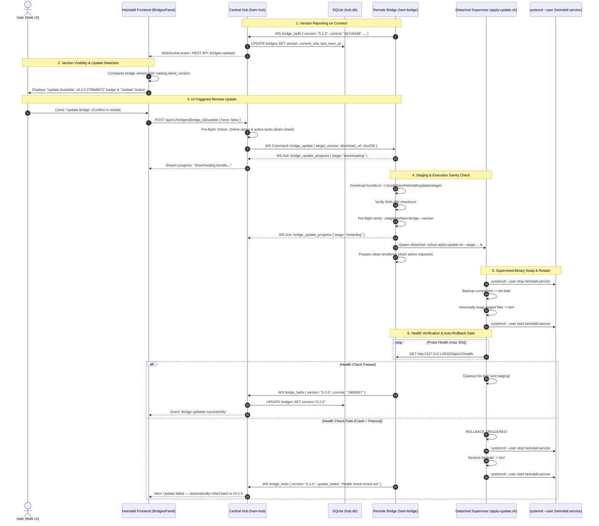

# Heimdall Bridge Update Pipeline: Architectural Design & Implementation Specification

**Document Version:** 1.0.0  
**Status:** Proposed Architecture  
**Author:** Coordinator Agent (`inst_18da54f3d1221d02`)  
**Scope:** `scripts/install.sh`, `src/bridge`, `src/hub`, `src/ui`, SQLite Schema, WebSocket Protocol  
**Requirement IDs:** `REQ-BUPD-1` through `REQ-BUPD-6`  

---

## 1. Executive Summary & Problem Statement

Heimdall manages autonomous AI coding agents across multiple developer workstations (Google Cloudtops and local machines). The `scripts/install.sh` script (present in `origin/main`) provisions both **Full Single-Node Stacks** (Hub + UI + DevProxy + Bridge) and **Standalone Remote Bridges** (worker-only nodes connecting back to a Central Hub).

### The Current Problem
1. **Zero Version Visibility:** While `contracts.APP_VERSION` exists in Odin code, neither `ham-bridge enroll` nor the runtime WebSocket connection (`bridge_hello`) transmits the bridge's binary version, git commit hash, or build timestamp to the Central Hub. The database table `bridges` has no version columns, and the UI (`BridgesPanel.tsx`) displays only host, OS, architecture, capabilities, and online/offline status.
2. **No Remote Upgrade Path:** If an update is released (or new commits are merged into `origin/main`), remote bridges continue running stale binaries indefinitely. Updating a remote bridge requires the user to manually SSH into each machine, run commands, and manually restart services.
3. **The "Bricking" Risk:** Updating a live bridge remotely via WebSocket is fraught with danger. If `ham-bridge` terminates itself during an in-place binary swap, or if the new binary fails to start (dynamic linking errors, bad config, corrupted bundle), the remote bridge drops offline permanently and cannot recover without manual developer intervention.

### Proposed Solution
A **robust, zero-downtime, self-healing update pipeline** that:
1. Surfaces running bridge versions and commit hashes in real-time across all enrolled machines in the Heimdall Web UI.
2. Checks against a centralized update catalog (Hub local bundle server, CitC depot, or release manifest) and highlights when an update is available.
3. Enables the user to trigger a one-click update directly from the UI with active-task drain safety.
4. Executes a staged, atomic update with an out-of-process supervisor script and **guaranteed automated rollback** if the new version fails health verification.

---

## 2. High-Level Architecture & End-to-End Workflow



---

## 3. Concrete Architecture Requirements

### REQ-BUPD-1: Bridge Version Introspection & Hello Protocol
- **Binary Metadata Injection:**
  - Build scripts (`scripts/package-cloudtop-bundle.sh` and Nix expressions) must bake `APP_VERSION`, Git short commit hash (`git rev-parse --short HEAD`), build ISO timestamp, and target architecture (`linux-amd64`, `linux-arm64`, `darwin-arm64`) into `ham-bridge` and `ham-ctl`.
  - Provide CLI flag `ham-bridge --version` and `ham-bridge --version-json` returning structured metadata.
- **WebSocket Handshake (`bridge_hello`):**
  - Update `src/bridge/hub_runtime_client.odin:bridge_hub_hello_json` to include:
    ```json
    {
      "type": "bridge_hello",
      "protocol_version": 1,
      "version": "0.1.0",
      "commit_sha": "a57c83d9",
      "built_at": "2026-10-01T10:13:00Z",
      "target": "linux-amd64",
      "hostname": "workstation-1",
      "capabilities": [...]
    }
    ```
- **Database Schema Migration (`054_bridge_version_and_updates.sql`):**
  ```sql
  ALTER TABLE bridges ADD COLUMN version TEXT NOT NULL DEFAULT '';
  ALTER TABLE bridges ADD COLUMN commit_sha TEXT NOT NULL DEFAULT '';
  ALTER TABLE bridges ADD COLUMN build_timestamp TEXT NOT NULL DEFAULT '';
  ALTER TABLE bridges ADD COLUMN update_status TEXT NOT NULL DEFAULT 'idle';
  ALTER TABLE bridges ADD COLUMN update_error TEXT NOT NULL DEFAULT '';
  ```
- **Domain Model & Serialization:**
  - Update `domain.Bridge` in `src/hub/domain/bridge.odin` to include `version`, `commit_sha`, `build_timestamp`, `update_status`, `update_error`.
  - Update `write_bridge_json` in `src/hub/transport/http/bridge_handlers.odin` to serialize these fields to REST responses.

---

### REQ-BUPD-2: Centralized Update Catalog & Version Resolution
- **Update Sources Supported:**
  1. **Central Hub Local Distribution (Default for Cloudtop Workstations):**
     - When the Central Hub runs on Cloudtop, it serves the standalone bundle and manifest from its HTTP server at `/api/v1/updates/bundle/heimdall-local-{target}.tar.gz` and `/api/v1/updates/manifest.json`.
     - Manifest schema:
       ```json
       {
         "version": "0.2.0",
         "commit_sha": "796bfb57",
         "built_at": "2026-10-01T12:00:00Z",
         "targets": {
           "linux-amd64": {
             "tarball_url": "/api/v1/updates/bundle/heimdall-local-linux-amd64.tar.gz",
             "sha256": "e3b0c44298fc1c149afbf4c8996fb92427ae41e4649b934ca495991b7852b855"
           }
         },
         "changelog": "FSM task chain engine and UI state machine updates"
       }
       ```
  2. **GitHub Releases (Fallback / Open-Source Nodes):**
     - Query `https://api.github.com/repos/tanmayv/heimdall-agent-manager/releases/latest` (leveraging existing logic from `src/manager/update.odin`).
- **Hub Catalog Service (`src/hub/service/bridge/update_catalog.odin`):**
  - Maintains latest available version per architecture.
  - Automatically computes `update_available: bool` in bridge list payloads:
    ```json
    {
      "bridge_id": "brg_18d03379a7d6d47b",
      "label": "cloudtop-worker-2",
      "version": "0.1.0",
      "commit_sha": "a57c83d9",
      "target": "linux-amd64",
      "update_available": true,
      "latest_version": "0.2.0",
      "latest_commit_sha": "796bfb57",
      "update_status": "idle"
    }
    ```

---

### REQ-BUPD-3: Web UI Visualization & Interactive Update Trigger
- **Location:** Settings → Bridges (`src/ui/components/settings/BridgesPanel.tsx`).
- **Visual Design:**
  - **Version Badge:** Each bridge row displays a monospace version tag: `v0.1.0 (a57c83d9)`.
  - **Update Notice:** When `update_available === true`, render an attention badge:
    `✨ Update available: v0.2.0 (796bfb57)`.
  - **Action Button:** "Update Bridge" button rendered alongside Rename and Revoke.
- **Pre-Flight Update Modal:**
  - Clicking "Update Bridge" opens a confirmation dialog showing:
    - Current Version vs Target Version diff.
    - Release notes / commit message preview.
    - Active agent warning: If `bridge.active_instance_count > 0`, display warning:
      *"⚠ 2 agent tasks are currently running on this machine. Updating now will wait up to 60s for tasks to complete, or force immediate restart."*
    - Options: "Wait for tasks to complete (drain)" (default) or "Force immediate update".
- **Real-Time Progress Tracking:**
  - Bridge updates emit real-time WebSocket state changes to the UI:
    - `downloading`: "Downloading update bundle (45%)..."
    - `validating`: "Verifying package integrity & dynamic linking..."
    - `restarting`: "Swapping binaries & restarting service..."
    - `healthy`: "Update completed successfully!"
    - `failed`: "Update failed: [Error reason]. Restored previous version."

---

### REQ-BUPD-4: Hub-to-Bridge WebSocket Control Protocol
- **Trigger REST Endpoint:**
  - `POST /api/v1/bridges/{bridge_id}/update`
  - Auth: User token only (`require_auth`).
  - Request Body:
    ```json
    {
      "target_version": "latest",
      "force": false,
      "drain_timeout_seconds": 60
    }
    ```
- **WebSocket Command (Hub -> Bridge):**
  - Frame type: `bridge_update`
  ```json
  {
    "type": "bridge_update",
    "command_id": "cmd_upd_1790842000000",
    "target_version": "0.2.0",
    "download_url": "http://my-hub.c.googlers.com:8989/api/v1/updates/bundle/heimdall-local-linux-amd64.tar.gz",
    "sha256": "e3b0c44298fc1c149afbf4c8996fb92427ae41e4649b934ca495991b7852b855",
    "force": false,
    "drain_timeout_seconds": 60
  }
  ```
- **WebSocket Progress & Status Frames (Bridge -> Hub):**
  ```json
  {
    "type": "bridge_update_progress",
    "command_id": "cmd_upd_1790842000000",
    "bridge_id": "brg_18d03379a7d6d47b",
    "stage": "downloading|validating|restarting|complete|failed",
    "progress_percent": 65,
    "message": "Checksum verified, staging binaries"
  }
  ```

---

### REQ-BUPD-5: Robust Staged Self-Update & Rollback Engine
To eliminate any possibility of bricking remote bridges, update execution is divided into **four strictly isolated phases**:

#### Phase 1: Background Staging (Bridge Process Active)
- Bridge creates a staging sandbox: `$DATA_DIR/updates/stage/`.
- Downloads tarball using bounded HTTP streaming with SHA-256 incremental hash verification.
- Compares calculated SHA-256 against expected hash. If mismatched, staging is deleted and error reported.

#### Phase 2: In-Situ Binary Validation
- Extracts binaries into `$DATA_DIR/updates/stage/bin/`.
- Runs executable test:
  `$DATA_DIR/updates/stage/bin/ham-bridge --version`
  `$DATA_DIR/updates/stage/bin/ham-ctl --version`
- Validates exit code 0 and verifies standard library dependencies are satisfied in the host environment.

#### Phase 3: Out-of-Process Detached Supervisor Handoff
- The running `ham-bridge` CANNOT swap its own running binary and restart its own systemd service synchronously.
- Bridge generates a standalone supervisor script: `$DATA_DIR/updates/apply-update.sh`.
- Bridge executes the supervisor in a completely detached, disowned process:
  ```bash
  nohup bash "$DATA_DIR/updates/apply-update.sh" \
    --data-dir "$DATA_DIR" \
    --stage-dir "$DATA_DIR/updates/stage" \
    --bridge-port "$BRIDGE_PORT" \
    --hub-url "$HUB_URL" \
    >/tmp/heimdall-update.log 2>&1 &
  ```
- Bridge notifies Hub: `{ "stage": "restarting" }` and exits cleanly (or lets systemd restart it).

#### Phase 4: Atomic Swap & Monitored Rollback in Supervisor
The supervisor script executes the following resilient state machine:
```bash
# 1. Stop current systemd service or kill process cleanly
systemctl --user stop heimdall.service 2>/dev/null || pkill -f "ham-bridge" || true

# 2. Backup existing binaries
rm -rf "$DATA_DIR/bin.bak"
cp -R -p "$DATA_DIR/bin" "$DATA_DIR/bin.bak"

# 3. Atomically replace binaries
cp -R -p "$STAGE_DIR/bin/"* "$DATA_DIR/bin/"
chmod +x "$DATA_DIR/bin/"*

# 4. Copy any new migrations/scripts
if [ -d "$STAGE_DIR/share/migrations" ]; then
  cp -R -p "$STAGE_DIR/share/migrations/"* "$DATA_DIR/share/migrations/"
fi

# 5. Restart service
if command -v systemctl >/dev/null 2>&1 && [ -f "$HOME/.config/systemd/user/heimdall.service" ]; then
  systemctl --user daemon-reload || true
  systemctl --user start heimdall.service
else
  "$DATA_DIR/start.sh" --standalone &
fi

# 6. Verification Gate: Poll health endpoint for up to 30 seconds
deadline=$((SECONDS + 30))
healthy=false
while [ $SECONDS -lt $deadline ]; do
  if curl -s "http://127.0.0.1:$BRIDGE_PORT/api/v1/health" >/dev/null 2>&1; then
    healthy=true
    break
  fi
  sleep 1
done

# 7. Finalize or Rollback
if [ "$healthy" = true ]; then
  echo "[update] Update succeeded. Removing backup."
  rm -rf "$DATA_DIR/bin.bak" "$STAGE_DIR"
  exit 0
else
  echo "[update] ERROR: Health check failed! Initiating automatic rollback..."
  systemctl --user stop heimdall.service 2>/dev/null || true
  cp -R -p "$DATA_DIR/bin.bak/"* "$DATA_DIR/bin/"
  systemctl --user start heimdall.service
  echo "Rolled back to previous version." > "$DATA_DIR/logs/update_rollback.log"
  exit 1
fi
```

---

### REQ-BUPD-6: Integration with `scripts/install.sh`
- `scripts/install.sh` is the canonical entry point for all Heimdall installations.
- Add an explicit `--update` flag to `scripts/install.sh`:
  ```bash
  # Check for updates
  ./install.sh --update --check

  # Apply update from Hub or specified bundle
  ./install.sh --update [--bundle <path-or-url>] [--force]
  ```
- Reuses `scripts/install.sh`'s existing conflict detection (`find_port_pids`, `is_ancestor_or_self`), systemd service registration, and provider pre-seeding logic.

---

## 4. Implementation Task Decomposition

To maintain coordinator discipline, the implementation of this design will be delegated to specialized worker agents across six focused tasks:

| Task ID | Component | Title & Responsibility | Assignee Role | Review Tier |
|---|---|---|---|---|
| **TASK-BUPD-1** | Backend / Odin | Bridge Versioning, Hello Protocol & DB Migration 054 | Odin Systems Worker | Comprehensive |
| **TASK-BUPD-2** | Hub / Odin | Update Catalog Service, Manifest Resolver & HTTP API | Odin Hub Worker | Comprehensive |
| **TASK-BUPD-3** | Bridge / Odin & Bash | Bridge WebSocket Update Handler & Detached Rollback Supervisor | Odin/Bash Systems Worker | Comprehensive |
| **TASK-BUPD-4** | Tooling / Bash | Package Cloudtop Bundle Versioning & `install.sh --update` | Shell Tooling Worker | Comprehensive |
| **TASK-BUPD-5** | Frontend / React | UI `BridgesPanel` Version Badges, Update Trigger Modal & Stream | React Frontend Worker | Comprehensive |
| **TASK-BUPD-6** | Integration / QA | End-to-End Upgrade & Failure Rollback Verification Suite | Integration Test Worker | Comprehensive |

---

## 5. Risk Analysis & Failure Mitigation

| Failure Mode | Impact | Mitigation Strategy |
|---|---|---|
| **Network drop during bundle download** | Incomplete tarball | Bundled download streams to temp `.part` file; SHA-256 verified before extraction; timeout bounds prevent hangs. |
| **Workstation power cycle during binary copy** | Partial binary on disk | Binary swap uses atomic file moves (`cp` then rename); backup in `bin.bak` allows quick recovery. |
| **New bridge binary fails dynamic link or crashes** | Bridge offline ("bricked") | Stage 2 tests execution in isolation. Phase 4 supervisor monitors 30s health check and automatically restores `bin.bak` if unresponsive. |
| **Active agent running during bridge restart** | Interrupted developer task | Drain mode waits up to 60s for task completion before update. UI warns user if `active_instance_count > 0`. |
| **Protocol mismatch between Hub and Bridge** | Bridge connects but drops | `bridge_hello` reports `protocol_version: 1`; Hub rejects incompatible protocol with descriptive error. |
