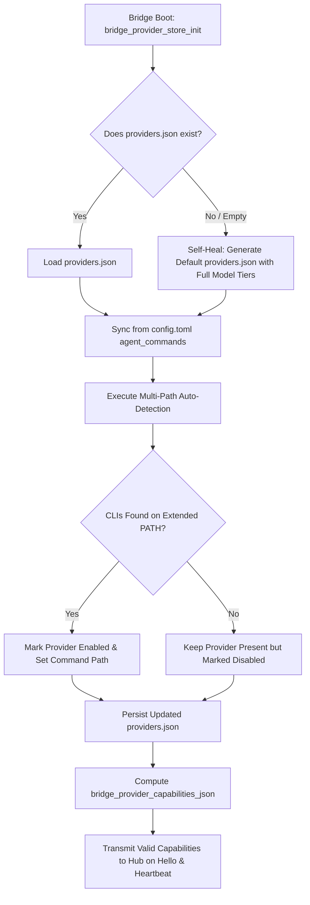

# Architectural Audit: Bridge Provider Seeding & Onboarding Flow
**Document**: `docs/plans/bridge_provider_seeding_onboarding_audit.md`  
**Requirement ID**: `REQ-PROVIDER-SEED-AUDIT-1`  
**Subsystems**: `src/bridge/`, `src/manager/`, `scripts/`, `src/ctl/`, `src/hub/`  
**Auditor**: Worker Agent (`inst_18dbaae8be265355`)  
**Status**: Comprehensive Audit & Architecture Proposal  

---

## 1. Executive Summary & Problem Statement

Heimdall bridges (`ham-bridge`) act as the local execution workers that interface with AI agent processes (such as Claude Code, OpenAI Codex, Google Jetski, Google Antigravity, GitHub Copilot, and Pi). When an agent instance is launched or assigned to a task chain, the Heimdall Hub inspects the registered capabilities of available bridges to schedule and dispatch the agent.

### The Core Failure Mode: Silent Empty Capabilities (`capabilities: []`)
When a new Heimdall bridge is onboarded and enrolled:
1. The bridge initializes its provider store, attempting to load `~/.local/share/heimdall/bridge/providers.json`.
2. On a new machine or fresh dev-stack, `providers.json` **does not exist**.
3. The bridge executes fallback auto-detection (`bridge_provider_autodetect_unlocked`) against hardcoded seed definitions in `src/bridge/provider_seeds.odin`.
4. However, the `Bridge_Provider_Seed` data structure in Odin **completely lacks model tier configurations** (`cheap`, `normal`, `smart`).
5. When the bridge formats its capability report for Hub registration (`bridge_provider_capabilities_json` in `src/bridge/provider_store.odin`), it evaluates whether each enabled provider has at least one configured model tier. Because the seeds provide no models, **every auto-detected provider evaluates to an empty default tier (`default_tier == ""`) and is silently dropped from the report**.
6. The bridge reports `capabilities: []` to the Hub during `bridge_hello` and `bridge_heartbeat`.
7. As a consequence, the newly enrolled bridge is incapable of accepting any agent launch requests unless a human operator manually creates and configures `providers.json` with custom JSON formatting.

Furthermore, internal corporate tooling like Google's `jetski` CLI (`/google/bin/releases/jetski-devs/tools/cli`) is omitted from bridge seeds entirely, despite being referenced in `config.toml` and the Web UI. Additionally, systemd/launchd service units deliberately constrain the daemon's PATH to system binaries, preventing PATH-based auto-detection of user-installed CLIs.

This document presents a complete audit of the current implementation across Odin sources and shell scripts, analyzes every friction point and failure mode, and provides a concrete architectural design and implementation plan to deliver a streamlined, zero-friction, self-healing onboarding experience.

---

## 2. Deep-Dive Source Code Audit

### 2.1 Audit of `src/bridge/provider_seeds.odin`

#### Hardcoded Seeds & Struct Definition
In `src/bridge/provider_seeds.odin`, `Bridge_Provider_Seed` is declared at lines 5–16:

```odin
Bridge_Provider_Seed :: struct {
	name:                string,
	logo:                string,
	command:             []string,
	prompt_flags:        []string,
	yolo_flags:          []string,
	starter_prompt:      string,
	prompt_delivery:     string,
	skill_dir:           string,
	bootstrap_file_name: string,
	startup_detection:   cfg_lib.Startup_Detection_Config,
}
```

The static seed table `BRIDGE_PROVIDER_SEEDS` is defined at lines 18–95:
- **`claude`** (lines 19–36): `command = {"claude"}`, `yolo_flags = {"--dangerously-skip-permissions"}`, `bootstrap_file_name = "CLAUDE.md"`.
- **`codex`** (lines 37–52): `command = {"codex"}`, `yolo_flags = {"--approval-policy=never"}`, `bootstrap_file_name = "AGENTS.md"`.
- **`copilot`** (lines 53–66): `command = {"copilot"}`, `bootstrap_file_name = "AGENTS.md"`.
- **`pi`** (lines 67–80): `command = {"pi"}`, `bootstrap_file_name = "AGENTS.md"`.
- **`antigravity`** (lines 81–94): `command = {"agy"}`, `bootstrap_file_name = "AGENTS.md"`.

#### Architectural Findings & Deficiencies:
1. **Absence of `models` Configuration**:
   The `Bridge_Provider_Seed` struct contains fields for process execution, prompts, directories, and startup detection, but **zero fields for model tier configurations** (`Model_Tiers_Config` containing `flag`, `cheap`, `normal`, `smart`).
2. **Omission of `jetski` and Corporate/Custom Tooling**:
   Google's `jetski` CLI is completely missing from `BRIDGE_PROVIDER_SEEDS`. While the Web UI (`src/ui/components/settings/providerCatalog.ts:49-73`) and root configuration (`config.toml:100-119`) treat `jetski` as a premier agent provider, the bridge backend has no knowledge of it in its seed registry.
3. **Static, Non-Extensible Architecture**:
   `BRIDGE_PROVIDER_SEEDS` is a compile-time fixed array returned via `bridge_provider_seed_data()` (line 97). There is no plugin architecture, no environment-specific extension hook (e.g., detecting if running on a Google Cloudtop or inside CitC), and no discovery hook for custom local binaries.

---

### 2.2 Audit of `src/bridge/provider_store.odin`

#### Store Initialization & File Path Resolution
- **Path Resolution** (`bridge_provider_store_path`, lines 336–340):
  ```odin
  bridge_provider_store_path :: proc() -> string {
  	data_dir := bridge_expand_home(bridge_config.data_dir)
  	if strings.trim_space(data_dir) == "" do data_dir = bridge_expand_home("~/.local/share/heimdall")
  	return strings.concatenate({strings.trim_right(data_dir, "/"), "/bridge/providers.json"})
  }
  ```
- **Store Initialization** (`bridge_provider_store_init`, lines 273–291):
  Called in `src/bridge/main.odin:81` on bridge startup:
  ```odin
  bridge_provider_store_path_value = bridge_provider_store_path()
  bridge_provider_load_unlocked()
  need_save := bridge_provider_autodetect_unlocked()
  bridge_provider_store_loaded = true
  sync.mutex_unlock(&bridge_provider_mutex)
  if need_save do bridge_provider_save_overrides()
  ```
- **Store Loading** (`bridge_provider_load_unlocked`, lines 351–384):
  Reads `providers.json`. If the file does not exist (returns `err != nil` at line 355), the function aborts silently. It does not seed, generate, or self-heal a missing `providers.json`.

#### Auto-Detection Logic (`bridge_provider_autodetect_unlocked`, lines 316–334)
```odin
bridge_provider_autodetect_unlocked :: proc() -> bool {
	seeds := bridge_provider_seed_data()
	any_added := false
	for seed in seeds {
		if len(seed.command) == 0 do continue
		exec_name := seed.command[0]
		if _, has := bridge_provider_override_for_name_unlocked(seed.name); has do continue
		found := bridge_runtime_find_on_path(exec_name)
		if found == "" do continue
		override := Bridge_Provider_Override{
			name        = strings.clone(seed.name),
			command     = bridge_clone_string_slice([]string{found}),
			command_set = true,
		}
		bridge_provider_upsert_override_unlocked(override)
		any_added = true
	}
	return any_added
}
```
**Critical Findings**:
1. It queries `bridge_runtime_find_on_path(exec_name)` (`src/bridge/hub_runtime_client.odin:1986`), which only scans the bridge process's immediate `os.get_env("PATH")`.
2. When a binary is located, it creates a `Bridge_Provider_Override` that sets **only `name` and `command`**.
3. **No models are set in the override** (`models_flag_set`, `models_cheap_set`, etc. remain `false`).
4. If `providers.json` did not exist previously, `bridge_provider_save_overrides()` writes a `providers.json` containing only the discovered command paths with no model tiers.

#### Profile Merging (`bridge_effective_provider_profiles`, lines 436–470)
Profiles are generated in two passes:
- Pass 1 builds from seeds (`bridge_provider_profile_from_seed`, lines 471–487) and merges store overrides. Note that `bridge_provider_profile_from_seed` does not populate `profile.models` (it remains zero-initialized).
- When merged with the auto-detected override, `profile.models` remains completely blank:
  `{ flag = "", cheap = "", normal = "", smart = "" }`.

#### Capability Filtering Mechanism (`bridge_provider_capabilities_json`, lines 607–646)
The bridge generates capability descriptions sent to the Hub:
```odin
bridge_provider_capabilities_json :: proc() -> string {
...
	for pass in 0..<2 {
		for profile in profiles {
			if pass == 0 && profile.name != default_provider do continue
			if pass == 1 && profile.name == default_provider do continue
			if !profile.enabled do continue
			default_tier := bridge_provider_default_tier(profile)
			if default_tier == "" do continue
...
```
Now examine `bridge_provider_default_tier(profile)` at lines 574–580:
```odin
bridge_provider_default_tier :: proc(profile: Bridge_Provider_Profile) -> string {
	if bridge_provider_default_tier_value != "" && bridge_provider_model_for_tier(profile, bridge_provider_default_tier_value) != "" do return bridge_provider_default_tier_value
	if strings.trim_space(profile.models.normal) != "" do return "normal"
	if strings.trim_space(profile.models.cheap) != "" do return "cheap"
	if strings.trim_space(profile.models.smart) != "" do return "smart"
	return ""
}
```
**The Mathematical Root Cause of Empty Capabilities**:
1. Because `profile.models` has empty strings for `cheap`, `normal`, and `smart`, `bridge_provider_default_tier` returns `""`.
2. In `bridge_provider_capabilities_json`, `if default_tier == "" do continue` triggers for every single seed and auto-detected provider.
3. The loop emits zero entries. The builder returns `[]`.
4. `bridge_hub_hello_json()` (`src/bridge/hub_runtime_client.odin:2855`) and `bridge_hub_heartbeat_json()` (`src/bridge/hub_runtime_client.odin:2452`) transmit `"capabilities": []` to the Hub.

---

### 2.3 Audit of Onboarding Flows

#### Flow 1: Node Enrollment (`src/manager/enroll.odin` and `src/bridge/main.odin:134-186`)
- `manager_enroll_command` (lines 20–87) accepts `--hub` and `--enrollment-token`.
- It performs an HTTP POST to `/api/v1/bridges/enroll`, retrieves `bridge_token` and `bridge_id`, saves the token to the token file (`manager_write_token_file`), and updates `[wrapper].daemon_url` and `[daemon].daemon_id` in `config.toml` (`manager_write_enrolled_config`).
- **Deficiency**: `enroll.odin` has zero awareness of `providers.json`. It does not verify whether any providers exist, does not seed default providers, and does not check for executable agent CLIs.

#### Flow 2: Production Installer (`scripts/install.sh`)
- `scripts/install.sh` establishes directories (`~/.local/share/heimdall`, `~/.local/bin`) and creates systemd/launchd service units.
- In `scripts/install.sh:840-846`, the installer explicitly documents:
  > *"DELIBERATELY NOT COVERED: the agent CLIs (`claude`, `codex`, ...). They never resolve against this PATH. `src/lib/tmux/tmux.odin`'s `build_shell_command` wraps every agent command in `exec $SHELL -l -c`, a LOGIN shell, specifically so they resolve against the user's own PATH... Only `tmux` itself has to be reachable from this unit; the pane's login shell does the rest."*
- **The Core Conflict**:
  While it is true that spawned agents run inside tmux with a login shell, **the bridge daemon itself runs inside the systemd service unit**.
  When the bridge boots, `bridge_provider_autodetect_unlocked` executes `bridge_runtime_find_on_path`, which looks up binaries using the **service unit's restricted PATH** (`/usr/local/bin:/usr/bin:/bin:...`).
  User-installed tools located in `~/.local/bin`, `~/.npm-global/bin`, `~/.nix-profile/bin`, or custom enterprise release directories are invisible to the bridge process.
- Furthermore, `scripts/install.sh` does not generate `providers.json` at all.

#### Flow 3: Local Dev Stack (`scripts/dev-stack.sh`)
- `scripts/dev-stack.sh` runs `ham-bridge enroll` (line 117) and spawns `ham-bridge` via `nohup` (line 216).
- It never touches `providers.json`.
- The development bridge immediately connects with `capabilities: []`.
- Integration tests (such as `tests/test_agent_chain_create_and_subscriptions.py:211-229`) are forced to manually mock and write a synthetic `providers.json` before starting the bridge, proving that out-of-the-box bootstrapping fails.

---

### 2.4 Real-World Verification in Live Environment

To prove this deficiency on a live system, executing `./.heimdall/bin/ham-ctl bridge providers` in the current environment reveals:
- Host `brg_18da28f7cdb0409b` (label: `"desktop"`, Linux node enrolled via standard script):
  `"capabilities": []`
- Host `brg_18c6783bf3b4f9a1` (label: `"ham-bridge"`):
  `"capabilities": []`

These real machines connected to the Heimdall Hub are completely disabled from running agent chains because their bridges never configured `models` in `providers.json`.

---

## 3. Friction Points, Failure Modes & Edge Cases

| Area | Current Behavior | Failure Mode / Friction Point |
|---|---|---|
| **First Boot** | `providers.json` missing; fallback seeds lack `models`. | Bridge registers with `capabilities: []`; Hub cannot schedule tasks. |
| **Manual Authoring** | Operator must hand-craft `~/.local/share/heimdall/bridge/providers.json`. | Error-prone JSON syntax, obscure property names, zero CLI feedback. |
| **Config Disconnect** | `config.toml` has `[wrapper.agent-cmd.<provider>.models]`. `main.odin:370` parses it into `cfg.agent_commands`. | `src/bridge/provider_store.odin` never reads `cfg.agent_commands`. Configured models are lost. |
| **PATH Visibility** | Bridge daemon runs under systemd/launchd with minimal PATH. | CLI tools in `~/.local/bin`, `~/.nix-profile/bin`, or Cloudtop paths fail auto-detection. |
| **Corporate/Google Environment** | `jetski` is not in `BRIDGE_PROVIDER_SEEDS`. | Cloudtop engineers cannot use Google's internal Gemini tooling without manual JSON overrides. |
| **CLI Management Gap** | `ham-ctl` has `bridge providers` (read-only query). | No CLI commands to trigger re-detection, enable/disable providers, or edit models. |
| **Restart Behavior** | Auto-detection only runs if provider name is not already in overrides. | If an override exists with missing models, restarting the bridge never heals the missing models. |

---

## 4. Streamlining Architecture Proposal & Concrete Design

To achieve an automated, zero-friction onboarding flow, the architecture must ensure that:
1. Every standard provider seed contains sensible default model tiers.
2. Auto-detection searches beyond the system daemon PATH.
3. The bridge self-heals missing or broken provider configurations automatically.
4. Bridge configuration merges seamlessly with `config.toml`.
5. Operators and agents can manage providers directly via `ham-ctl`.



### 4.1 Enriched Seed Catalog (`src/bridge/provider_seeds.odin`)

Update `Bridge_Provider_Seed` to include `models: cfg_lib.Model_Tiers_Config` and `default_tier: string`, and add `jetski` as a first-class seed:

```odin
Bridge_Provider_Seed :: struct {
	name:                string,
	logo:                string,
	command:             []string,
	candidate_paths:     []string, // Extra paths to probe (e.g. ~/.local/bin, /google/bin/releases/...)
	prompt_flags:        []string,
	yolo_flags:          []string,
	starter_prompt:      string,
	prompt_delivery:     string,
	skill_dir:           string,
	bootstrap_file_name: string,
	models:              cfg_lib.Model_Tiers_Config,
	default_tier:        string,
	startup_detection:   cfg_lib.Startup_Detection_Config,
}
```

#### Proposed Seed Definitions:
1. **`jetski`** (Google Internal Gemini CLI):
   - `command = {"jetski"}`
   - `candidate_paths = {"/google/bin/releases/jetski-devs/tools/cli", "~/.local/bin/jetski"}`
   - `models`: `flag = "--model"`, `cheap = "Gemini 3.5 Flash"`, `normal = "Gemini 3.5 Flash"`, `smart = "Gemini 3.1 Pro"`
   - `default_tier = "normal"`
   - `bootstrap_file_name = "AGENTS.md"`, `skill_dir = ".agents/skills"`
2. **`claude`** (Anthropic Claude Code):
   - `command = {"claude"}`
   - `candidate_paths = {"~/.local/bin/claude", "~/.npm-global/bin/claude"}`
   - `models`: `flag = "--model"`, `cheap = "claude-3-5-haiku-latest"`, `normal = "claude-3-5-sonnet-latest"`, `smart = "claude-3-7-sonnet-latest"`
   - `default_tier = "normal"`
   - `yolo_flags = {"--dangerously-skip-permissions"}`, `bootstrap_file_name = "CLAUDE.md"`
3. **`codex`** (OpenAI Codex CLI):
   - `command = {"codex"}`
   - `candidate_paths = {"~/.local/bin/codex"}`
   - `models`: `flag = "-m"`, `cheap = "gpt-4o-mini"`, `normal = "gpt-4o"`, `smart = "gpt-5-pro"`
   - `default_tier = "normal"`
   - `yolo_flags = {"--approval-policy=never", "--yolo"}`
4. **`pi`** (Pi Codex / Anthropic):
   - `command = {"pi"}`
   - `candidate_paths = {"~/.local/bin/pi", "~/.cargo/bin/pi"}`
   - `models`: `flag = "--model"`, `cheap = "openai-codex/gpt-5.4"`, `normal = "openai-codex/gpt-5.4"`, `smart = "openai-codex/gpt-5.5"`
   - `default_tier = "normal"`
5. **`antigravity`** (Google Antigravity `agy`):
   - `command = {"agy"}`
   - `candidate_paths = {"/google/bin/releases/antigravity/tools/cli", "~/.local/bin/agy"}`
   - `models`: `flag = "--model"`, `cheap = "Gemini 3.5 Flash (Medium)"`, `normal = "Gemini 3.5 Flash (Medium)"`, `smart = "Gemini 3.1 Pro (High)"`
   - `default_tier = "normal"`
6. **`copilot`** (GitHub Copilot CLI):
   - `command = {"copilot"}`
   - `candidate_paths = {"~/.local/bin/copilot"}`
   - `models`: `flag = "--model"`, `cheap = "claude-sonnet-4.6"`, `normal = "claude-sonnet-4.6"`, `smart = "claude-opus-4.6"`
   - `default_tier = "normal"`

---

### 4.2 Multi-Path & Extended Detection Engine

Modify `bridge_runtime_find_on_path` to probe extended locations:
1. Standard user paths: `~/.local/bin`, `~/bin`, `~/.nix-profile/bin`, `/nix/var/nix/profiles/default/bin`.
2. macOS Homebrew paths: `/opt/homebrew/bin`, `/usr/local/bin`.
3. Google Cloudtop release paths: `/google/bin/releases/jetski-devs/tools/cli`, `/google/bin/releases/antigravity/tools/cli`.
4. Login Shell Probe (Fallback): If a command is not found in standard paths, execute a fast non-interactive login shell probe: `$SHELL -l -c "which <binary>"` to resolve user environment aliases and dynamic paths.

---

### 4.3 Self-Healing Store Lifecycle & Seed Injection

In `src/bridge/provider_store.odin`:
1. **Initialize from Seeds if Store Missing or Empty**:
   If `providers.json` does not exist or has an empty provider list, instantiate all seeds with their default model configurations.
2. **Auto-Detection Model Preservation**:
   When `bridge_provider_autodetect_unlocked` detects a binary on the host, it must not only record `command = [found]`, but **inherit the default model tiers from the seed** (or from existing overrides).
3. **Ingest `config.toml` `[wrapper.agent-cmd]`**:
   Bridge startup reads `bridge_config.agent_commands`. `provider_store` should ingest any model tiers or custom commands defined in `config.toml`, guaranteeing that edits to `config.toml` take effect without needing manual JSON duplication.
4. **Dynamic Capability Refresh**:
   Whenever a provider is detected, toggled, or updated, immediately broadcast a `capability_report` over the active WebSocket to the Hub (`hub_runtime_client.odin:1785`).

---

### 4.4 Management CLI Extensions (`ham-ctl bridge providers`)

Extend `ham-ctl` to provide full administrative control over providers:

```bash
# List all providers and their detection/capability status on a bridge
ham-ctl bridge providers [--bridge <id>]

# Trigger a re-probe of host paths and auto-detection
ham-ctl bridge providers detect [--bridge <id>]

# Enable or disable a provider
ham-ctl bridge providers enable <provider-name> [--bridge <id>]
ham-ctl bridge providers disable <provider-name> [--bridge <id>]

# Configure model tier mapping
ham-ctl bridge providers set-models <provider-name> --flag "--model" --cheap "..." --normal "..." --smart "..."

# Set system default provider and default tier
ham-ctl bridge providers set-default <provider-name> --tier normal
```

---

### 4.5 Onboarding Script Integration

1. **`src/manager/enroll.odin` & `src/bridge/main.odin`**:
   Upon successful node enrollment, automatically call `bridge_provider_store_init()` and write a clean, fully populated `providers.json` before completing enrollment.
2. **`scripts/install.sh`**:
   Add a pre-configuration step during installation:
   - Probe for existing agent CLIs (`jetski`, `claude`, `codex`, `pi`, `copilot`, `agy`).
   - Write `$DATA_DIR/bridge/providers.json` populated with discovered binaries and complete model tier mappings.
3. **`scripts/dev-stack.sh`**:
   Automatically seed a working `providers.json` in the dev bridge's data directory so developers running the local stack have immediate access to agents.

---

## 5. Step-by-Step Implementation Roadmap

| Phase | Milestone | Files Modified | Verification |
|---|---|---|---|
| **Phase 1** | Seed Catalog Enrichment | `src/bridge/provider_seeds.odin` | Add `models` and `candidate_paths` to `Bridge_Provider_Seed`. Add `jetski` and complete model tiers for all 6 providers. Verify Odin compiles cleanly. |
| **Phase 2** | Provider Store Auto-Detection & Self-Healing | `src/bridge/provider_store.odin` | Update `bridge_provider_profile_from_seed` to populate models. Update `bridge_provider_autodetect_unlocked` to preserve model tiers. Add automatic generation of `providers.json` when missing. |
| **Phase 3** | `config.toml` Ingestion | `src/bridge/provider_store.odin`, `src/bridge/main.odin` | Ingest `bridge_config.agent_commands` into provider store overrides during initialization. |
| **Phase 4** | Enrollment & Installer Automation | `src/manager/enroll.odin`, `scripts/install.sh`, `scripts/dev-stack.sh` | Ensure enrollment commands and scripts initialize `providers.json` automatically on first boot. |
| **Phase 5** | CLI Subcommands | `src/ctl/bridge.odin`, `src/ctl/agent_mode.odin` | Implement `ham-ctl bridge providers detect/enable/disable/set-models`. |
| **Phase 6** | Automated Test Coverage | `src/bridge/provider_store_test.odin`, `tests/` | Add test cases verifying: (a) zero-config first boot generates non-empty capabilities, (b) autodetect preserves model tiers, (c) `jetski` detection. |

---

## 6. Conclusion

The silent omission of bridge capabilities (`capabilities: []`) is a critical flaw stemming from a structural mismatch: seeds lack models, autodetect only records command paths, and capability reporting drops any provider without models. 

By enriching the seed definitions, expanding discovery paths to include user and Google-specific directories, self-healing missing `providers.json` files with complete default tiers, and bridging `config.toml` with the provider store, Heimdall bridges will consistently report accurate, ready-to-run capabilities immediately upon enrollment—delivering a seamless, zero-friction developer onboarding experience.
