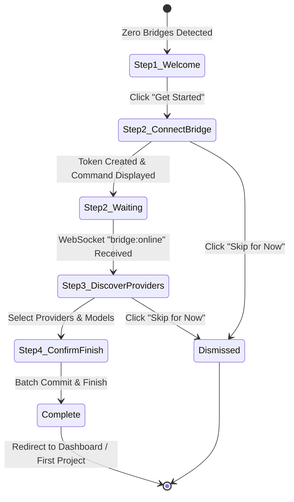
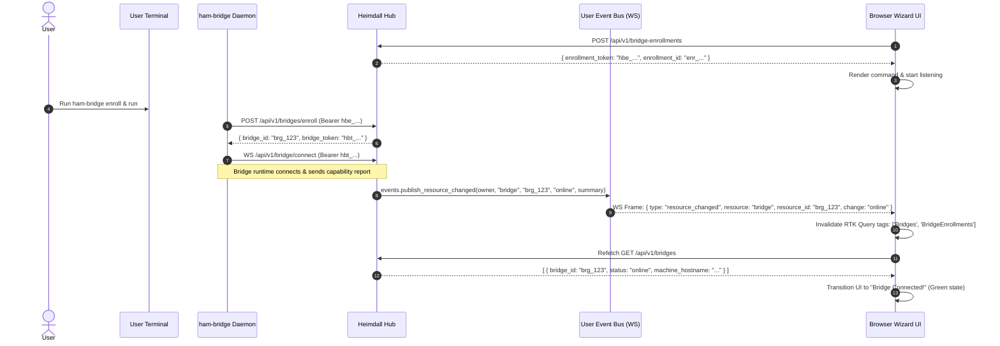
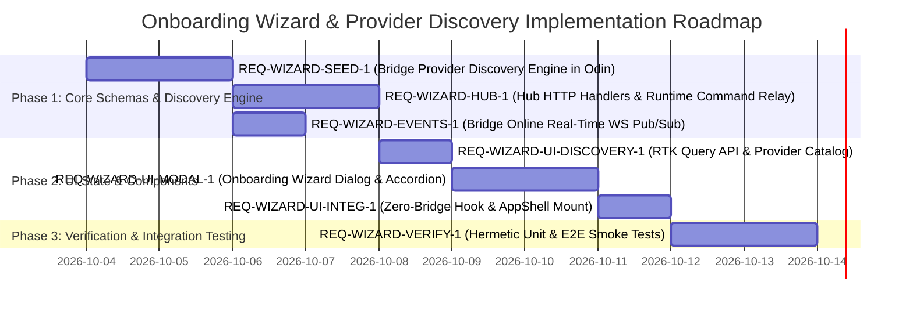

# Heimdall First-Time User Onboarding Wizard & Seeded Provider Discovery

**Design & Architecture Specification**  
**Document Location**: `docs/plans/onboarding-wizard-and-provider-discovery-plan.md`  
**Requirement IDs**: `REQ-WIZARD-PLAN-1`, `REQ-WIZARD-UI-1`, `REQ-WIZARD-HUB-1`, `REQ-WIZARD-BRIDGE-1`, `REQ-WIZARD-SEED-1`  
**Status**: Architecture & Implementation Plan  
**Target Subsystems**: `src/ui/`, `src/bridge/`, `src/hub/`, `src/lib/config/`

---

## Executive Summary & Background

Heimdall orchestrates autonomous agent task chains across host machines via a distributed model:
1. **Heimdall Hub**: Central coordinator, state database (`hub.db`), REST API, WebSocket pub/sub event bus, and browser UI.
2. **Heimdall Bridge**: A lightweight local background daemon (`ham-bridge`) installed on developer or server machines. It connects outbound to the Hub via WebSocket, receives agent execution jobs, spawns sandboxed agent CLI processes in isolated directories, and streams PTY inputs, outputs, and filesystem events.

### The Problem
When a new user logs into Heimdall for the first time:
- No bridges are registered or connected (`bridgesQuery.data.bridges.length === 0`).
- Without a bridge, no agent processes can run and no tasks can be executed.
- Currently, users must manually navigate deep into **Settings → Bridges**, create an enrollment token, figure out how to run `ham-bridge`, and then navigate to **Settings → Providers** to manually configure CLI flags, model tiers, and startup detection.
- This creates friction, increases time-to-first-task, and risks misconfiguration (e.g., incorrect model flags, missing block detection patterns, or misconfigured directory trust prompts).

### The Solution
An integrated **First-Time User Onboarding Wizard** and **Seeded Provider Discovery System**:
- **Automatic Detection**: On login, Heimdall detects the zero-bridge state and presents a friendly, modal wizard.
- **Frictionless Bridge Enrollment**: Guided bridge setup providing one-click token generation, copy-pasteable OS-specific setup commands, and **instant real-time detection** when the bridge comes online over WebSockets.
- **Seeded Provider Discovery**: Upon connection, the bridge inspects the machine's local `PATH` against a curated seed catalog (`claude`, `codex`, `pi`, `jetski`, `antigravity`, `copilot`), identifying installed binaries, probing versions, and packaging sensible defaults.
- **Streamlined Multi-Provider Setup**: A clean UI enabling users to configure and enable multiple providers in a single flow:
  - **Primary UI**: Focuses strictly on confirming model tier assignments (`cheap`, `normal`, `smart`) with sensible defaults.
  - **Advanced Accordion**: Tucks flags, directory trust patterns, auto-enter rules, and startup block detection safely out of sight for users who do not need custom low-level flags.
- **One-Click Activation**: Atomically persists provider configurations to the bridge and directs the user immediately to their first task or workspace.

---

## 1. UI First-Time Detection & Flow

### 1.1 Detection Logic & Trigger Conditions
The Onboarding Wizard automatically activates when a user is authenticated but has no active bridge infrastructure.

#### Conditions for Auto-Trigger:
1. **Authenticated Session**: User is logged in (`auth.user` exists).
2. **Zero Valid Bridges**:
   - `bridgesQuery.data?.bridges` is loaded (`!bridgesQuery.isLoading && !bridgesQuery.isError`).
   - Every bridge in the list is either missing or revoked (`status === 'revoked' || revoked_at != null`).
   - Active count: `activeBridges.length === 0`.
3. **Not Explicitly Dismissed in Current Session**:
   - `sessionStorage.getItem('heimdall:onboarding_dismissed') !== 'true'`.
   - Once completed or skipped, `localStorage.setItem('heimdall:onboarding_completed', 'true')` ensures returning users are not re-prompted unless they explicitly launch it.
4. **Manual Trigger**:
   - Accessible at any time via:
     - URL hash: `#/onboarding`
     - Help menu / User menu: "Setup Wizard..."
     - Bridges Settings Panel: "Run Setup Wizard" button in empty state.

### 1.2 Wizard Progress Steps & Flow



#### Step 1: Welcome & Architecture Overview
- **Visuals**: Clean graphic illustrating Heimdall Hub (in cloud/browser) connecting to the user's local Heimdall Bridge.
- **Copy**:
  - Headline: *"Welcome to Heimdall"*
  - Subhead: *"Let's connect your workspace to run autonomous agents safely on your machine."*
  - Key Highlights:
    - 🔒 **Local & Secure**: Agents run in isolated local directories with explicit sandbox policies.
    - ⚡ **Multi-Provider**: Use Claude Code, OpenAI Codex, Google Gemini (Jetski/Antigravity), or GitHub Copilot.
    - 🛠️ **Full Tool Access**: Agents compile, test, edit files, and run commands using your local development tools.
- **Primary CTA**: `Get Started (Connect Bridge) →`
- **Secondary CTA**: `Skip for now` (dismisses wizard, redirects to read-only dashboard).

#### Step 2: Connect Bridge
- **Purpose**: Guide the user to install and enroll their first bridge daemon.
- **Behavior on Enter**:
  - Automatically triggers `createBridgeEnrollment({ label: `${user.username}-workstation`, expiresInSeconds: 3600 })`.
  - While generating token: Displays subtle shimmer loader.
  - On token received: Stores `enrollment_token` and `enrollment_id`.
- **UI Elements**:
  - **OS Selector Tabs**: `Linux`, `macOS`, `Windows (PowerShell)`, `Nix / NixOS`.
  - **Setup Command Card**:
    - High-contrast terminal code block with one-click copy button and visual tooltip (`Copied!`).
    - Tab-specific formatted commands (see Section 2.2).
  - **Live Connection Status Box**:
    - Animated pulsing radar or spinner: *"Waiting for bridge connection..."*
    - Explanatory subtext: *"Run the command above in your terminal. This window will update automatically the moment your bridge is detected."*
  - **Automatic Transition**: As soon as the bridge connects, the status flips to a green checkmark: *"Bridge Connected: <hostname> (<os>/<arch>)"*, plays a subtle celebration animation, and enables the primary button `Continue to Provider Setup →`.

#### Step 3: Discover Providers & Configuration
- **Purpose**: Detect CLI tools already on the host and configure model tiers.
- **Behavior on Enter**:
  - Issues `GET /api/v1/bridges/{bridge_id}/providers/discover` to the connected bridge.
  - Bridge performs a fast PATH scan for known CLI tools (`claude`, `codex`, `pi`, `jetski`, `agy`, `copilot`).
  - Displays a dual-section list:
    1. **Detected on your system** (pre-checked by default).
    2. **Additional supported providers** (unchecked, marked "Not found on PATH" with install hints).
- **Multi-Provider Configuration**:
  - Users can enable multiple providers concurrently.
  - A radio selector picks which provider is the **Default Provider** for new tasks.
- **Per-Provider Card Layout** (adhering strictly to UX Refinements):
  - **Header**: Icon, Provider Name (e.g. "Anthropic Claude Code"), Detection badge (`Detected: /usr/local/bin/claude` or `Not Detected`), Enable Checkbox.
  - **Clean Model Tier Selection (Main UI)**:
    - Displayed directly on the card without unnecessary technical jargon.
    - Three model selectors:
      - 🟢 **Cheap / Fast Tier** (e.g., `claude-3-5-haiku-latest` or `Gemini 3.5 Flash`) - used for simple searches, file reading, and summaries.
      - 🔵 **Normal / Balanced Tier** (e.g., `claude-3-5-sonnet-latest` or `Gemini 3.5 Flash`) - used for standard coding and edits.
      - 🟣 **Smart / Deep Tier** (e.g., `claude-3-7-sonnet-latest` or `Gemini 3.1 Pro`) - used for complex architectures, debugging, and review.
    - Each dropdown is pre-populated with curated suggested models for that provider, but also supports custom text entry.
  - **"Advanced Settings" Collapsible Accordion**:
    - Closed by default so users never have to fiddle with low-level flags unless desired.
    - When expanded, provides:
      - **Executable Command & Path**: Editable command array (default: `["claude"]`).
      - **Prompt & YOLO Flags**: e.g., `--dangerously-skip-permissions`, `--yolo`.
      - **Startup Detection & Block Patterns**:
        - Regexes to detect blocked states (e.g., `Need authentication`, `Rate limit exceeded`).
        - Auto-enter patterns (e.g., `Yes, I trust this folder`).
        - Pre-enter keystrokes (e.g., `Down` arrow).
      - **Prompt Delivery Mode**: `flag-injection` vs `positional` vs `tmux-send`.
      - **Telemetry & Activity Polling**: Activity check interval, min/max gap.

#### Step 4: Confirm & Finish
- **Purpose**: Review configured setup, commit in batch, and transition to working state.
- **Summary Display**:
  - Connected Bridge: Hostname, OS, Architecture.
  - Enabled Providers: List of enabled providers with their designated default models.
  - Default Provider & Tier highlighted.
- **Action**: Click `Complete Setup & Start Working`.
  - Dispatches batch configuration mutation (`POST /api/v1/bridges/{bridge_id}/providers/batch-configure`).
  - Marks onboarding completed in local storage.
  - Automatically redirects to the New Task / New Project creation dialog.

### 1.3 ASCII Wireframe of Onboarding Wizard

```
+---------------------------------------------------------------------------------+
|  Heimdall Setup Wizard                                             [Step 3 of 4] |
+---------------------------------------------------------------------------------+
|  [1. Welcome]  -->  [2. Connect Bridge]  -->  [(3) Discover Providers]  -->  [4. Finish]
+---------------------------------------------------------------------------------+
|                                                                                 |
|  Select AI Providers for Bridge "tanmay-workstation" (Linux x86_64)             |
|  Heimdall detected 2 providers on your machine PATH. Check the ones you want.   |
|                                                                                 |
|  +---------------------------------------------------------------------------+  |
|  | [X] Anthropic Claude Code              [✓ Detected: /usr/local/bin/claude] |  |
|  |     (*) Set as Default Provider                                           |  |
|  |                                                                           |  |
|  |     Model Tiers:                                                          |  |
|  |       Cheap Tier:  [ claude-3-5-haiku-latest                     | v ]    |  |
|  |       Normal Tier: [ claude-3-5-sonnet-latest                    | v ]    |  |
|  |       Smart Tier:  [ claude-3-7-sonnet-latest                     | v ]    |  |
|  |                                                                           |  |
|  |     > Advanced Settings (Flags, Auto-Enter, Block Detection) [Expand]     |  |
|  +---------------------------------------------------------------------------+  |
|                                                                                 |
|  +---------------------------------------------------------------------------+  |
|  | [X] Jetski (Google Gemini)             [✓ Detected: /usr/local/bin/jetski] |  |
|  |     ( ) Set as Default Provider                                           |  |
|  |                                                                           |  |
|  |     Model Tiers:                                                          |  |
|  |       Cheap Tier:  [ Gemini 3.5 Flash                            | v ]    |  |
|  |       Normal Tier: [ Gemini 3.5 Flash                            | v ]    |  |
|  |       Smart Tier:  [ Gemini 3.1 Pro                              | v ]    |  |
|  |                                                                           |  |
|  |     v Advanced Settings (Flags, Auto-Enter, Block Detection) [Collapse]   |  |
|  |       Command:        [ jetski                                   ]        |  |
|  |       YOLO Flags:     [ --dangerously-skip-permissions           ]        |  |
|  |       Block Regex:    [ (Rate limit|Quota exceeded|Auth required) ]       |  |
|  |       Auto-Enter:     [ Yes, I trust this folder                 ]        |  |
|  +---------------------------------------------------------------------------+  |
|                                                                                 |
|  +---------------------------------------------------------------------------+  |
|  | [ ] OpenAI Codex CLI                   [⚠ Not Found on PATH]              |  |
|  |     Install via `npm install -g @openai/codex` to use.                   |  |
|  +---------------------------------------------------------------------------+  |
|                                                                                 |
|  [ Back ]                                            [ Save & Continue (3) -> ] |
+---------------------------------------------------------------------------------+
```

---

## 2. Bridge Enrollment UX & Real-Time Connection Detection

### 2.1 Enrollment Token Generation API
Bridge enrollment relies on the existing Heimdall Hub enrollment ceremony (`src/hub/transport/http/bridge_handlers.odin:43`):
- **Request**:
  ```http
  POST /api/v1/bridge-enrollments
  Content-Type: application/json
  Authorization: Bearer <user_token>

  {
    "label": "tanmay-workstation",
    "expires_in_seconds": 3600
  }
  ```
- **Response** (HTTP 201 Created):
  ```json
  {
    "enrollment_id": "enr_18db0ae...",
    "expires_at": "2026-10-03T15:21:48Z",
    "enrollment_token": "hbe_18db0ae...",
    "setup_command": "ham-bridge enroll --hub https://hub.example.com"
  }
  ```

### 2.2 OS-Specific Shell Commands
To eliminate copy-paste errors across operating systems, the UI dynamically produces tailored commands depending on the active tab:

#### 1. Linux (Standalone / Binary / Package)
```bash
# Download and enroll bridge in one step
curl -fsSL https://get.heimdall.dev/bridge-install.sh | bash -s -- \
  --hub https://hub.example.com \
  --token hbe_18db0ae...
```
*Or manual binary command:*
```bash
ham-bridge enroll --hub https://hub.example.com --enrollment-token hbe_18db0ae...
ham-bridge --hub https://hub.example.com
```

#### 2. macOS (Homebrew or Direct)
```bash
# Homebrew installation
brew install heimdall-dev/tap/ham-bridge
ham-bridge enroll --hub https://hub.example.com --enrollment-token hbe_18db0ae...
ham-bridge --hub https://hub.example.com
```

#### 3. Windows (PowerShell)
```powershell
# PowerShell install and enroll
iwr -useb https://get.heimdall.dev/bridge-install.ps1 | iex
.\ham-bridge.exe enroll --hub https://hub.example.com --enrollment-token hbe_18db0ae...
.\ham-bridge.exe --hub https://hub.example.com
```

#### 4. Nix / NixOS
```bash
nix run github:heimdall-dev/heimdall#ham-bridge -- enroll \
  --hub https://hub.example.com \
  --enrollment-token hbe_18db0ae...
```

### 2.3 Real-Time Bridge Online Detection Architecture

To provide an instant, delightful response when the user executes the command in their shell:



#### WebSocket Event Bus Extension
1. **Hub Backend (`src/hub/service/bridge_runtime/` and `src/hub/transport/http/bridge_handlers.odin`)**:
   - In `enroll_bridge_handler` and upon bridge WebSocket handshake completion:
     ```odin
     // Emit resource_changed event on the owner's event bus
     if h.event_bus != nil && bridge.owner_user_id != "" {
         summary := fmt.tprintf("{\"bridge_id\":\"%s\",\"hostname\":\"%s\",\"status\":\"online\"}",
             bridge.bridge_id, bridge.machine_hostname)
         defer delete(summary)
         events.publish_resource_changed(h.event_bus, bridge.owner_user_id, "bridge", bridge.bridge_id, "online", summary)
     }
     ```
2. **UI Event Invalidation (`src/ui/api/wsInvalidation.ts`)**:
   - Add explicit handling for `case 'bridge':` in `handleResourceChanged`:
     ```typescript
     case 'bridge': {
       dispatch(heimdallApi.util.invalidateTags([
         { type: 'Bridges' as const, id: 'LIST' },
         { type: 'Bridges' as const, id: resourceId },
         { type: 'BridgeEnrollments' as const, id: 'LIST' },
       ]));
       return;
     }
     ```
3. **Redundant Resilient Polling (Fallback)**:
   - While Step 2 (Connect Bridge) is mounted and active, the UI sets `pollingInterval: 2500` (2.5 seconds) on `useListBridgesQuery`.
   - This guarantees bridge detection within 2.5s even if the user's browser temporarily disconnected from WebSocket or a proxy dropped the socket frame.

---

## 3. Bridge Seeded Provider Discovery Architecture

### 3.1 Design Principles
1. **Zero Cloud Dependency**: Binary checks run locally on the bridge host via native system calls (`os.stat` across `$PATH`).
2. **Deterministic & Safe**: PATH scanning does not execute arbitrary binaries unless checking `--version` with a strict 1-second timeout.
3. **Comprehensive Preset Schema**: Each provider seed carries full metadata: model tier defaults, CLI flags, block detection regexes, and auto-enter terminal automation rules.
4. **Extensibility**: Custom providers or local scripts can easily be onboarded using the same schema.

### 3.2 Seed Catalog Schema (Odin & TypeScript)

#### Odin Schema (`src/bridge/provider_discovery.odin`)
```odin
package main

import cfg_lib "odin_test:lib/config"

Bridge_Provider_Seed_Catalog_Entry :: struct {
    name:                 string,
    label:                string,
    binary_candidates:    []string,
    version_flag:         string,
    models_flag:          string,
    available_models:     []string,
    default_tiers:        cfg_lib.Model_Tiers_Config,
    prompt_flags:         []string,
    yolo_flags:           []string,
    starter_prompt:       string,
    prompt_delivery:      string,   // "flag-injection" | "positional" | "tmux-send"
    prompt_tmux_enter:    bool,
    prompt_tmux_delay_ms: int,
    skill_dir:            string,
    bootstrap_file_name:  string,
    logo:                 string,
    startup_detection:    cfg_lib.Startup_Detection_Config,
    activity_detection:   cfg_lib.Activity_Detection_Config,
}

Bridge_Discovered_Provider :: struct {
    name:                 string,
    label:                string,
    installed:            bool,
    executable_path:      string,
    detected_version:     string,
    seed_entry:           Bridge_Provider_Seed_Catalog_Entry,
    has_active_override:  bool,
    current_enabled:      bool,
}

Bridge_Provider_Discovery_Report :: struct {
    bridge_id:            string,
    hostname:             string,
    discovered:           [dynamic]Bridge_Discovered_Provider,
}
```

### 3.3 Complete Seed Specifications for Major Providers

#### 1. Anthropic Claude Code (`claude`)
- **Binary Candidates**: `["claude"]`
- **Version Flag**: `--version`
- **Models Flag**: `--model`
- **Available Models**:
  - `claude-3-7-sonnet-latest`
  - `claude-3-5-sonnet-latest`
  - `claude-3-5-haiku-latest`
  - `claude-3-opus-latest`
- **Default Model Tiers**:
  - `cheap`: `claude-3-5-haiku-latest`
  - `normal`: `claude-3-5-sonnet-latest`
  - `smart`: `claude-3-7-sonnet-latest`
- **Prompt Flags**: `["--prompt", "-p"]`
- **YOLO Flags**: `["--dangerously-skip-permissions"]`
- **Starter Prompt**: `"First, run: {ctl_bin} agent start-success. Then read your bootstrap file (CLAUDE.md) for context, identity, and what you can do."`
- **Prompt Delivery**: `"flag-injection"`
- **Skill Dir**: `".claude/skills"`
- **Bootstrap File**: `"CLAUDE.md"`
- **Startup & Block Detection**:
  - `enabled`: `true`
  - `startup_probe_seconds`: `20`
  - `capture_interval_ms`: `500`
  - `blocked_patterns`: `["Need authentication", "Please run claude login", "Rate limit exceeded", "API key invalid"]`
  - `auto_enter_patterns`: `["Yes, I trust this folder", "Trust this folder"]`
  - `auto_enter_pre_keys`: `["Down"]`
  - `startup_unknown_is_blocked`: `false`
  - `sanitized_reason_mapping`: `["trust=Claude Code directory trust prompt", "login=Claude Code authentication required"]`

#### 2. OpenAI Codex CLI (`codex`)
- **Binary Candidates**: `["codex"]`
- **Version Flag**: `--version`
- **Models Flag**: `-m`
- **Available Models**:
  - `gpt-5-pro`
  - `gpt-5`
  - `gpt-4o`
  - `gpt-4o-mini`
  - `o1`
  - `o3-mini`
- **Default Model Tiers**:
  - `cheap`: `gpt-4o-mini`
  - `normal`: `gpt-4o`
  - `smart`: `gpt-5-pro`
- **Prompt Flags**: `[]`
- **YOLO Flags**: `["--approval-policy=never", "--yolo"]`
- **Starter Prompt**: `"First, run: {ctl_bin} agent start-success. Then read AGENTS.md for context."`
- **Prompt Delivery**: `"flag-injection"`
- **Skill Dir**: `".codex/skills"`
- **Bootstrap File**: `"AGENTS.md"`
- **Startup & Block Detection**:
  - `enabled`: `true`
  - `startup_probe_seconds`: `20`
  - `capture_interval_ms`: `500`
  - `blocked_patterns`: `["Sign in required", "API key missing", "Insufficient quota"]`
  - `auto_enter_patterns`: `["Allow for this session", "Always allow"]`
  - `auto_enter_pre_keys`: `[]`
  - `startup_unknown_is_blocked`: `false`
  - `sanitized_reason_mapping`: `["auth=OpenAI Codex login required"]`

#### 3. Pi (`pi`)
- **Binary Candidates**: `["pi"]`
- **Version Flag**: `--version`
- **Models Flag**: `--model`
- **Available Models**:
  - `openai-codex/gpt-5.5`
  - `openai-codex/gpt-5.4`
  - `anthropic/claude-sonnet-4-6`
  - `anthropic/claude-opus-4-8`
- **Default Model Tiers**:
  - `cheap`: `openai-codex/gpt-5.4`
  - `normal`: `openai-codex/gpt-5.4`
  - `smart`: `openai-codex/gpt-5.5`
- **Prompt Flags**: `[]`
- **YOLO Flags**: `[]`
- **Starter Prompt**: `"First, run: {ctl_bin} agent start-success. Then read AGENTS.md for context."`
- **Prompt Delivery**: `"positional"`
- **Skill Dir**: `".pi/skills"`
- **Bootstrap File**: `"AGENTS.md"`
- **Startup & Block Detection**:
  - `enabled`: `true`
  - `startup_probe_seconds`: `20`
  - `capture_interval_ms`: `500`
  - `blocked_patterns`: `["Error: authentication required", "Connection refused"]`
  - `auto_enter_patterns`: `[]`
  - `auto_enter_pre_keys`: `[]`
  - `startup_unknown_is_blocked`: `false`

#### 4. Google Jetski (`jetski`)
- **Binary Candidates**: `["jetski"]`
- **Version Flag**: `--version`
- **Models Flag**: `--model`
- **Available Models**:
  - `Gemini 3.5 Flash`
  - `Gemini 3.1 Pro`
  - `Gemini 3.0 Flash`
  - `Gemini 3.0 Pro`
  - `Gemini 2.5 Flash`
  - `Gemini 2.5 Pro`
- **Default Model Tiers**:
  - `cheap`: `Gemini 3.5 Flash`
  - `normal`: `Gemini 3.5 Flash`
  - `smart`: `Gemini 3.1 Pro`
- **Prompt Flags**: `[]`
- **YOLO Flags**: `[]`
- **Starter Prompt**: `"First, run: {ctl_bin} agent start-success. Then read AGENTS.md for context."`
- **Prompt Delivery**: `"flag-injection"`
- **Skill Dir**: `".agents/skills"`
- **Bootstrap File**: `"AGENTS.md"`
- **Startup & Block Detection**:
  - `enabled`: `true`
  - `startup_probe_seconds`: `25`
  - `capture_interval_ms`: `500`
  - `blocked_patterns`: `["Authentication failed", "Session expired", "Permission denied"]`
  - `auto_enter_patterns`: `["Trust directory", "Proceed with execution"]`
  - `auto_enter_pre_keys`: `[]`
  - `startup_unknown_is_blocked`: `false`

#### 5. Google Antigravity (`agy` / `antigravity`)
- **Binary Candidates**: `["agy", "antigravity"]`
- **Version Flag**: `--version`
- **Models Flag**: `--model`
- **Available Models**:
  - `Gemini 3.5 Flash (Medium)`
  - `Gemini 3.1 Pro (High)`
  - `Gemini 3.0 Flash`
  - `Gemini 3.0 Pro`
- **Default Model Tiers**:
  - `cheap`: `Gemini 3.5 Flash (Medium)`
  - `normal`: `Gemini 3.5 Flash (Medium)`
  - `smart`: `Gemini 3.1 Pro (High)`
- **Prompt Flags**: `["--prompt-interactive", "-i"]`
- **YOLO Flags**: `["--dangerously-skip-permissions"]`
- **Starter Prompt**: `"First, run: {ctl_bin} agent start-success. Then read AGENTS.md for context."`
- **Prompt Delivery**: `"flag-injection"`
- **Skill Dir**: `".agents/skills"`
- **Bootstrap File**: `"AGENTS.md"`
- **Startup & Block Detection**:
  - `enabled`: `true`
  - `startup_probe_seconds`: `20`
  - `capture_interval_ms`: `500`
  - `blocked_patterns`: `["OAuth error", "Token expired"]`
  - `auto_enter_patterns`: `["Trust workspace", "Confirm"]`
  - `auto_enter_pre_keys`: `[]`
  - `startup_unknown_is_blocked`: `false`

#### 6. GitHub Copilot CLI (`copilot`)
- **Binary Candidates**: `["copilot"]`
- **Version Flag**: `--version`
- **Models Flag**: `--model`
- **Available Models**:
  - `claude-sonnet-4.6`
  - `claude-opus-4.6`
  - `gpt-4o`
  - `o1-mini`
- **Default Model Tiers**:
  - `cheap`: `claude-sonnet-4.6`
  - `normal`: `claude-sonnet-4.6`
  - `smart`: `claude-opus-4.6`
- **Prompt Flags**: `["-i"]`
- **YOLO Flags**: `["--yolo"]`
- **Starter Prompt**: `"First, run: {ctl_bin} agent start-success. Then read AGENTS.md for context."`
- **Prompt Delivery**: `"flag-injection"`
- **Skill Dir**: `".copilot/skills"`
- **Bootstrap File**: `"AGENTS.md"`
- **Startup & Block Detection**:
  - `enabled`: `true`
  - `startup_probe_seconds`: `15`
  - `capture_interval_ms`: `500`
  - `blocked_patterns`: `["GitHub authentication required", "gh auth login"]`
  - `auto_enter_patterns`: `[]`
  - `auto_enter_pre_keys`: `[]`
  - `startup_unknown_is_blocked`: `false`

### 3.4 PATH Inspection Implementation in Odin
The discovery procedure uses `bridge_runtime_find_on_path` from `src/bridge/hub_runtime_client.odin`:
1. Iterates over `SEEDED_CATALOG` entries.
2. For each candidate binary in `binary_candidates`:
   - Checks `$PATH` directories using `os.stat`.
   - If found, marks `installed = true` and saves `executable_path = absolute_path`.
   - Probes `candidate --version` using a non-blocking process spawn with a 1000ms deadline.
3. Cross-references `bridge_provider_overrides` from `provider_store.odin` to check if the user had previously enabled or overridden this provider.
4. Returns the structured report to the Hub runtime dispatcher.

---

## 4. Provider Selection & Activation API Contract

### 4.1 Discovery Endpoint
- **HTTP Route**: `GET /api/v1/bridges/{bridge_id}/providers/discover`
- **Hub Handler**: `discover_bridge_providers_handler` in `src/hub/transport/http/bridge_handlers.odin`
- **Relay**: Dispatches runtime command `command_type = "discover_providers"` to bridge over WebSocket.
- **Response**:
  ```json
  {
    "bridge_id": "brg_18db0ae...",
    "hostname": "tanmay-workstation",
    "discovered": [
      {
        "name": "claude",
        "label": "Anthropic Claude Code",
        "installed": true,
        "executable_path": "/usr/local/bin/claude",
        "detected_version": "Claude Code v1.0.4",
        "has_active_override": false,
        "current_enabled": true,
        "seed_entry": {
          "models_flag": "--model",
          "available_models": ["claude-3-7-sonnet-latest", "claude-3-5-sonnet-latest", "claude-3-5-haiku-latest"],
          "default_tiers": {
            "cheap": "claude-3-5-haiku-latest",
            "normal": "claude-3-5-sonnet-latest",
            "smart": "claude-3-7-sonnet-latest"
          },
          "prompt_flags": ["--prompt", "-p"],
          "yolo_flags": ["--dangerously-skip-permissions"],
          "startup_detection": {
            "enabled": true,
            "blocked_patterns": ["Need authentication", "Rate limit exceeded"],
            "auto_enter_patterns": ["Yes, I trust this folder"],
            "auto_enter_pre_keys": ["Down"]
          }
        }
      },
      {
        "name": "codex",
        "label": "OpenAI Codex CLI",
        "installed": false,
        "executable_path": "",
        "detected_version": "",
        "has_active_override": false,
        "current_enabled": false,
        "seed_entry": { ... }
      }
    ]
  }
  ```

### 4.2 Batch Configuration & Activation Endpoint
To prevent partial states and eliminate multiple round trips from the wizard:
- **HTTP Route**: `POST /api/v1/bridges/{bridge_id}/providers/batch-configure`
- **Hub Handler**: `batch_configure_bridge_providers_handler` in `src/hub/transport/http/bridge_handlers.odin`
- **Relay**: Relays `command_type = "batch_configure_providers"` to bridge.
- **Request Payload**:
  ```json
  {
    "default_provider": "claude",
    "default_tier": "smart",
    "providers": [
      {
        "name": "claude",
        "enabled": true,
        "profile": {
          "command": ["claude"],
          "models": {
            "flag": "--model",
            "cheap": "claude-3-5-haiku-latest",
            "normal": "claude-3-5-sonnet-latest",
            "smart": "claude-3-7-sonnet-latest"
          },
          "yolo_flags": ["--dangerously-skip-permissions"],
          "prompt_flags": ["--prompt", "-p"],
          "startup_detection": {
            "enabled": true,
            "blocked_patterns": ["Need authentication", "Rate limit exceeded"],
            "auto_enter_patterns": ["Yes, I trust this folder"],
            "auto_enter_pre_keys": ["Down"]
          }
        }
      },
      {
        "name": "jetski",
        "enabled": true,
        "profile": {
          "command": ["jetski"],
          "models": {
            "flag": "--model",
            "cheap": "Gemini 3.5 Flash",
            "normal": "Gemini 3.5 Flash",
            "smart": "Gemini 3.1 Pro"
          }
        }
      }
    ]
  }
  ```
- **Response**:
  ```json
  {
    "ok": true,
    "bridge_id": "brg_18db0ae...",
    "default_provider": "claude",
    "default_tier": "smart",
    "configured_count": 2
  }
  ```
- **Side Effect**: Emits capability report update to Hub, ensuring Hub capabilities cache is immediately synchronized.

---

## 5. Engineering Task Breakdown & Implementation Roadmap



### Task 1: Bridge Provider Discovery Engine in Odin
- **Requirement ID**: `REQ-WIZARD-SEED-1`
- **Target Files**:
  - `src/bridge/provider_discovery.odin` (NEW)
  - `src/bridge/provider_seeds.odin` (MODIFY)
  - `src/bridge/hub_runtime_client.odin` (MODIFY)
- **Work Items**:
  1. Add `Bridge_Provider_Seed_Catalog_Entry` with all 6 providers (`claude`, `codex`, `pi`, `jetski`, `antigravity`, `copilot`), including model tiers, block detection regexes, and auto-enter pre-keys.
  2. Implement `bridge_discover_providers :: proc() -> Bridge_Provider_Discovery_Report` inspecting `$PATH` for each binary candidate via `bridge_runtime_find_on_path`.
  3. Wire runtime command `"discover_providers"` and `"batch_configure_providers"` into `bridge_hub_handle_provider_command` in `hub_runtime_client.odin`.
- **Acceptance Criteria**:
  - `discover_providers` returns accurate `installed: true/false` and paths for local tools.
  - Adding multiple providers persists cleanly into `provider_store.odin`.
  - Odin unit tests in `src/bridge/provider_discovery_test.odin` pass hermetically.

### Task 2: Hub HTTP Endpoints & Runtime Relay
- **Requirement ID**: `REQ-WIZARD-HUB-1`
- **Target Files**:
  - `src/hub/transport/http/bridge_handlers.odin` (MODIFY)
  - `src/hub/app/wiring.odin` (MODIFY)
- **Work Items**:
  1. Add route `GET /api/v1/bridges/{bridge_id}/providers/discover` invoking `bridge_provider_relay(..., "discover_providers")`.
  2. Add route `POST /api/v1/bridges/{bridge_id}/providers/batch-configure` handling multi-provider saving and default setting in a single operation.
- **Acceptance Criteria**:
  - Returns HTTP 200 with JSON discovery report when bridge is online.
  - Returns HTTP 404 / 422 with proper error codes if bridge is offline.
  - Registered routes properly authenticated via `require_auth`.

### Task 3: Bridge Real-Time Connection WebSocket Event
- **Requirement ID**: `REQ-WIZARD-EVENTS-1`
- **Target Files**:
  - `src/hub/service/bridge_runtime/bridge_runtime_service.odin` (MODIFY)
  - `src/hub/transport/http/bridge_handlers.odin` (MODIFY)
  - `src/ui/api/wsInvalidation.ts` (MODIFY)
- **Work Items**:
  1. Emit `events.publish_resource_changed` with resource `"bridge"` when a bridge enrolls or opens its live WebSocket connection.
  2. In `wsInvalidation.ts`, add `case 'bridge':` to invalidate RTK Query tags `Bridges` and `BridgeEnrollments`.
- **Acceptance Criteria**:
  - Browser receives `{ type: "resource_changed", resource: "bridge", change: "online" }` upon bridge connection.
  - RTK Query automatically triggers refetch of `/api/v1/bridges` without page reload.

### Task 4: UI API Client & Provider Catalog Update
- **Requirement ID**: `REQ-WIZARD-UI-DISCOVERY-1`
- **Target Files**:
  - `src/ui/api/endpoints/bridgeSupport.ts` (MODIFY)
  - `src/ui/components/settings/providerCatalog.ts` (MODIFY)
- **Work Items**:
  1. Add `useDiscoverBridgeProvidersQuery` and `useBatchConfigureBridgeProvidersMutation` to `bridgeSupportApi`.
  2. Update `SUPPORTED_PROVIDER_PRESETS` in `providerCatalog.ts` to ensure models and flags align with bridge seeds.
- **Acceptance Criteria**:
  - Fully typed TypeScript models matching the Odin JSON schema.
  - Mutations properly invalidate `BridgeProviders` and `Bridges` cache tags.

### Task 5: Onboarding Wizard Modal & Multi-Provider Setup UI
- **Requirement ID**: `REQ-WIZARD-UI-MODAL-1`
- **Target Files**:
  - `src/ui/components/onboarding/OnboardingWizardModal.tsx` (NEW)
  - `src/ui/components/onboarding/steps/WelcomeStep.tsx` (NEW)
  - `src/ui/components/onboarding/steps/ConnectBridgeStep.tsx` (NEW)
  - `src/ui/components/onboarding/steps/DiscoverProvidersStep.tsx` (NEW)
  - `src/ui/components/onboarding/steps/ConfirmFinishStep.tsx` (NEW)
  - `src/ui/components/onboarding/ProviderSetupCard.tsx` (NEW)
- **Work Items**:
  1. Build multi-step modal with step progress indicator.
  2. Implement Step 2 with OS command generation and live bridge detection hook.
  3. Implement Step 3 with:
     - Multi-provider selection checkboxes.
     - Clean, focused model tier dropdowns (`cheap`, `normal`, `smart`).
     - Collapsible "Advanced Settings" accordion for flags, auto-enter, and block detection.
     - Radio selection for Default Provider.
- **Acceptance Criteria**:
  - Matches the wireframe and UX refinements.
  - Accordion remains closed by default; model pickers remain intuitive and easy to use.
  - Allows selecting and configuring multiple providers simultaneously.

### Task 6: Zero-Bridge Detection & App Integration
- **Requirement ID**: `REQ-WIZARD-UI-INTEG-1`
- **Target Files**:
  - `src/ui/components/shell/AppShell.tsx` (MODIFY)
  - `src/ui/components/settings/BridgesPanel.tsx` (MODIFY)
- **Work Items**:
  1. Mount `OnboardingWizardModal` in `AppShell.tsx`.
  2. Add `useZeroBridgeDetection` hook to automatically launch the wizard when no valid bridges exist for the user.
  3. Add persistent dismissal handling in `localStorage` and `sessionStorage`.
  4. Add manual "Setup Wizard" trigger in `BridgesPanel.tsx`.
- **Acceptance Criteria**:
  - Brand-new user on fresh instance immediately sees Onboarding Wizard.
  - Existing users with connected bridges are unaffected.
  - Dismissing or completing prevents annoying popups on subsequent page loads.

### Task 7: End-to-End Verification & Documentation
- **Requirement ID**: `REQ-WIZARD-VERIFY-1`
- **Target Files**:
  - `tests/test_bridge_provider_discovery.odin` (NEW)
  - `tests/test_onboarding_wizard_e2e.py` (NEW)
- **Work Items**:
  1. Odin unit tests verifying PATH scanner and version parser.
  2. Python/Playwright E2E smoke test verifying:
     - Fresh user zero-bridge modal prompt.
     - Token generation & simulated bridge enrollment.
     - Real-time transition to provider discovery.
     - Multi-provider selection and model tier saving.
- **Acceptance Criteria**:
  - All tests exit 0.
  - Zero regression in existing bridge enrollment or shell sessions.

---

## 6. Verification & Quality Assurance Strategy

### 6.1 Hermetic Testing Strategy
- **No Mock Pollution**: Bridge tests execute in isolated directories with mock PATH entries (`/tmp/mock-bin/claude`, etc.) to confirm deterministic detection without needing actual cloud accounts.
- **Memory Safety**: Odin tracking allocator verification ensures zero memory leaks in JSON string formatting and PATH parsing (`delete(candidate)`, `delete(path)` properly called).
- **Graceful Failure**: If a binary is missing or non-executable, discovery returns `installed: false` with zero crashes or hangs.

### 6.2 Manual Verification Walkthrough
1. **Reset State**: Clear local bridge database or start devstack on isolated test ports.
2. **Log in as New User**: Open Heimdall UI in browser.
3. **Verify Modal Launch**: Welcome modal should automatically appear on first load.
4. **Copy Command**: Step 2 presents the enrollment command with a pre-filled token.
5. **Run Bridge**: Run `ham-bridge enroll` in terminal.
6. **Watch Real-Time Flip**: Observe the UI flipping to "Connected" within <1 second without page refresh.
7. **Configure Providers**: Verify detected providers are checked. Select model tiers. Expand Advanced accordion to verify flags and auto-enter patterns.
8. **Finish & Inspect**: Click "Complete Setup", navigate to Settings → Providers, and confirm all selected providers and default tiers are faithfully persisted.
