# Git Diff Report: `origin/main` vs `feat/cloudtop-single-node`

**Date**: 2026-09-09  
**Repository**: `heimdall-agent-manager`  
**Base Ancestor (Merge-Base)**: `23ffaf4af9c5b59fefa9f1333e53b64215860cb1`  
**Current Branch (`feat/cloudtop-single-node`)**: `9d849ba` (ahead by 33 commits)  
**Target Upstream (`origin/main`)**: `f4120e0` (ahead of merge base by 9 commits)  
**Relative Status**: `feat/cloudtop-single-node` is **ahead by 33 commits** and **behind by 9 commits**.

---

## 1. Executive Summary

This report establishes the complete structural comparison between `origin/main` and `feat/cloudtop-single-node`. The objective is to bring all features, fixes, and schema improvements from `origin/main` into `feat/cloudtop-single-node` so that the cloudtop branch is no longer behind `main`, **without removing or regressing any of the Cloudtop workstation, CitC, or ÜberProxy capabilities added in this branch**.

A dry-run merge and AST analysis reveal that **only 5 files overlap** across the two branches. Out of those 5 files, `src/hub/app/wiring.odin` merges cleanly automatically. Exactly **4 files require conflict resolution**, plus a standard **database migration sequence renumbering** (`027` collision).

```
                       [23ffaf4] (Merge-Base)
                          /                 \
                         /                   \
        [origin/main: 9 commits]      [cloudtop: 33 commits]
       - GET /api/v1/agents/live tree - CT-1 to CT-17 Single-Node Stack
       - Gold Coordinator display name- CitC Bridge & Depot Explorer
       - Cross-project live chains    - ÜberProxy LOAS Auth & Ingress Gateway
       - Built-in 'empty' template    - Local Path & CitC Pickers
       - Seeded coordinator agent     - Zero-dependency standalone bundle
       - Web push deep links          - IPv6 Dual-Stack & Loop Detection
       - Memory error text fix        - Port 8989 Edge Proxy
                         \                   /
                          \                 /
                       [Harmonized Sync Target]
```

---

## 2. Incoming Features & Fixes from `origin/main` (9 Commits)

The following table details every commit introduced on `origin/main` since divergence from `23ffaf4`:

| Commit Hash | Commit Subject | Component | Functional Changes |
| :--- | :--- | :--- | :--- |
| `f4120e0` | `fix(hub/push): deep-link push notifications by agent_instance_id` | Hub Push Service | Modifies `webpush_payload.odin` to deep-link directly to instance URL (`/conversations/<agent_instance_id>`), avoiding 404s when conversation ID is pending. Includes unit test in `webpush_send_test.odin`. |
| `8540024` | `feat: default 'empty' template + seeded 'coordinator' agent; edit agents in UI` | Hub Agent/Content + UI | **1.** Deprecates and removes hardcoded `tmpl_system_reviewer` in favor of virtual default `tmpl_empty` (`domain.TEMPLATE_EMPTY_ID`).<br>**2.** Automatically seeds a default durable `coordinator` agent (`agt_coordinator_<user_id>`) with `tmpl_empty` for every user upon creation (`user_service.odin`).<br>**3.** Database migration `027_default_coordinator_agent.sql` seeds coordinator for existing users and remaps agents to `tmpl_empty`.<br>**4.** UI `AgentDetailPanel.tsx` enables interactive editing of agent template, provider, tier, and instructions.<br>**5.** Hub unit tests: `create_agent_template_test.odin`, `templates_builtin_test.odin`, `provision_coordinator_test.odin`. |
| `1361478` | `fix(ui): stop activity bubbles replaying after conversation switch` | UI Chat | Prevents previous agent thinking/activity bubbles from re-animating when switching active conversation views in `AgentActivityBubbles.tsx` and `agentActivitySlice.ts`. |
| `aa0c42b` | `docs(agents/live): register sidebar-session-group-separator debug id in AGENTS.md` | Documentation | Formally registers `sidebar-session-group-separator-${conversationId}` in the AGENTS.md test debug-id catalog. |
| `12f16fd` | `feat(agents/live): API creation-time ordering (chain-grouped) + sidebar group separators` | Hub HTTP + UI Sidebar | Enforces creation-time ordering (`created_at`) across agent chains and renders subtle divider lines (`role="separator"`, `data-debug-id="sidebar-session-group-separator-..."`) between distinct chain groups within a project in the left navigation rail. |
| `ca1bb3c` | `feat(agents/live): cross-project chains (Option A) — chain under every member-project + full members[] with project_id` | Hub Live Tree | Projects in the sidebar live tree display chains that contain members from that project, even if the chain originated in another project, providing complete cross-project visibility. |
| `df92848` | `feat: GET /api/v1/agents/live tree + coordinator gold own-name + all-projects sidebar` | Hub HTTP + UI Shell | **1.** Introduces high-performance `GET /api/v1/agents/live` in `taskchain_handlers.odin` and `wiring.odin`, serving the complete Projects -> Chains -> Agents tree in a single call.<br>**2.** Highlights chain coordinator agents in amber/gold (`text-amber-300`) in both the sidebar rail and command palette.<br>**3.** Updates `AppShell.tsx` to consume `useGetAgentsLiveQuery` and render all projects without client-side dropping of empty groups. |
| `d6a6892` | `feat(ui): show chain coordinator display name in yellow (sidebar + command palette)` | UI Palette/Rail | Initial coordinator styling pass (refined by `df92848`). |
| `32fc601` | `fix(ui): surface real memory-save error instead of "[object Object]"` | UI Memory | Exports `memoryErrorText(err)` in `src/ui/api/endpoints/memory.ts` to unwrap `CUSTOM_ERROR` payloads and replaces broken stringification across `MemoryPage.tsx`, `MemoryDetailPage.tsx`, and `MemoryPanel.tsx`. |

---

## 3. Cloudtop Features to Retain (33 Commits + In-Progress CT-17)

All features implemented on `feat/cloudtop-single-node` represent essential Google-internal Cloudtop workstation, CitC, and ÜberProxy infrastructure and must remain completely intact:

```mermaid
graph TD
    subgraph Cloudtop Infrastructure
        CT1["CT-1/2: Loopback Auto-Pairing & Mesh Pruning"]
        CT3["CT-3/4: Dev Proxy on Port 8989 & Code Audit Mode"]
        CT5["CT-5/6: ~/.heimdall Storage, gcert Monitor & systemd"]
        CT7["CT-7: Port 8989 Edge Gateway & LOAS Verification"]
        CT8["CT-8: Multi-Cloudtop Remote Bridge Topology"]
        CT9["CT-9: ÜberProxy PEN Headers & Audit Logging"]
        CT10["CT-10: Auto-Jetski Detection & FQDN Enrollment"]
        CT11["CT-11: Zero-Dependency Standalone Packaging & MPM"]
        CT17["CT-17: Port Conflict Detection & IPv6 Dual-Stack"]
    end
    subgraph CitC & Explorer Integration
        FIG1["FIG-1/2: CitC Bridge FS Handlers & Relays"]
        FIG3["FIG-3/4: FigDirectoryPicker UI & Test Suite"]
        CT12["CT-12: Full Bridge Auto-Enrollment & Hub Adoption"]
        CT13["CT-13: Local Directory Picker with Root Browsing & Hidden Toggle"]
        CT14["CT-14: Unified CitC Workspace & Directory Picker"]
        CT16["CT-16: CitC Project Modal & Depot Deployment"]
    end
    CT1 --> CT3 --> CT5 --> CT7 --> CT8 --> CT9 --> CT10 --> CT11 --> CT17
    FIG1 --> FIG3 --> CT12 --> CT13 --> CT14 --> CT16
```



1. **Edge Gateway & Security**: Dev proxy on port 8989 (`ham-dev-proxy`) handling ÜberProxy authentication (`X-UberProxy-User`), PEN header propagation, audit logging, and IPv6 dual-stack (`net.IP6_Any` fallback to `net.IP4_Any`).
2. **CitC Workspace Integration**: `/fig/workspaces` and `/fig/tree` bridge handlers, project schema columns (`project_type`, `workspace_name`, `relative_path`), and the unified `FigDirectoryPicker` with search debouncing and recency ordering.
3. **Local Directory Browsing**: Root filesystem navigation (`/`), dotfile toggle, and Enter key path navigation in `BridgeDirectoryPicker`.
4. **Resilience & Automation**: Port conflict and systemd restart-loop detection in `install.sh`/`start.sh`, automatic loopback pairing (`brg_local`), `gcert` validity monitoring, and fallback bridge resolution in `agent_service.odin`.
5. **Standalone Distribution**: Zero-Nix / Zero-Node standalone bundle (`dist/heimdall-cloudtop/`), pre-built UI assets, extracted `libsqlite3`, and CitC depot sync at `/google/src/cloud/tanmayvijay/heimdall/google3/experimental/users/tanmayvijay/heimdall-bin/`.

---

## 4. File Overlap & Conflict Resolution Matrix

Only **5 files** were modified in both branches since `23ffaf4`:

| File Path | Change in `origin/main` | Change in `cloudtop` | Merge Status | Resolution Strategy |
| :--- | :--- | :--- | :--- | :--- |
| `src/hub/app/wiring.odin` | Registered `/api/v1/agents/live` route before wildcard. | Registered CitC Bridge Fig routes (`/api/v1/bridges/:id/fig/*`). | **Auto-merges cleanly** | Git merges both route blocks without conflict. |
| `src/hub/repository/sqlite/migrations.odin` | Added migration `027_default_coordinator_agent.sql`. Extended `migration_order` to 27. | Added migration `027_fig_projects.sql`. Extended `migration_order` to 27. | **Conflict** | **Renumber Cloudtop Migration to 028**:<br>1. Keep `027_default_coordinator_agent.sql` as migration 027 from `main`.<br>2. Rename `027_fig_projects.sql` to `028_fig_projects.sql`.<br>3. Set `migration_order :: [28]string` with both migrations included.<br>4. Include both SQL constants (`MIGRATION_027_DEFAULT_COORDINATOR_AGENT` and `MIGRATION_028_FIG_PROJECTS`) and both fast-forward/upgrade procedures. |
| `src/hub/service/agent/agent_service.odin` | 1. Added `has_template_id` to `Create_Agent_Input`.<br>2. `create_agent` defaults empty template to `domain.TEMPLATE_EMPTY_ID`.<br>3. `update_agent` validates and saves template changes.<br>4. Added `agent_template_available`. | 1. Added `service.audit_mode` permission checks to `create_instance` and `relaunch_instance`.<br>2. Added `brg_local` fallback resilience.<br>3. Defaulted provider/tier to `"jetski"` and `"normal"`.<br>4. Added `first_non_empty` overload. | **Conflict** | **Combine All Edits**:<br>1. Incorporate template validation, default `TEMPLATE_EMPTY_ID`, and `agent_template_available` from `origin/main`.<br>2. Keep audit mode checks, `brg_local` fallback, and `"jetski"`/`"normal"` defaults from `cloudtop`.<br>Both sets of changes operate on different fields and procedures. |
| `src/hub/service/content/content_service.odin` | Replaced `tmpl_system_reviewer` with `domain.TEMPLATE_EMPTY_ID` and added `empty_template()` helper. | Added `audit_mode: bool` to `Content_Service` and added owner check to `request_pane_capture`. | **Conflict** | **Combine All Edits**:<br>1. Retain `empty_template()` procedure and `domain.TEMPLATE_EMPTY_ID` in `get_template`, `list_templates`, and `template_available`.<br>2. Retain `audit_mode` field on `Content_Service` and audit validation in `request_pane_capture`. |
| `src/ui/components/shell/AppShell.tsx` | 1. Switched sidebar data source to `useGetAgentsLiveQuery`.<br>2. Reordered rail to API-defined project & chain order with group separators.<br>3. Added gold highlighting for coordinator agents. | 1. Extended `ProjectSummary` with `projectType` and `workspaceName`.<br>2. Added CitC badge `· <workspaceName>` and colored folder icons (`text-amber-400` vs `text-sky-400`). | **Conflict** | **Harmonize Shell & Live Tree**:<br>1. Use `useGetAgentsLiveQuery` and API-defined tree sorting/group separators from `main`.<br>2. Ensure `LiveProject` / project buckets preserve `projectType` and `workspaceName`.<br>3. Keep CitC workspace badges and custom folder icons in `ProjectGroupItem`. |

---

## 5. Non-Overlapping Files Added by `origin/main`

These files from `origin/main` do not conflict and will be added directly into the Cloudtop branch:

1. `src/hub/repository/sqlite/migrations/027_default_coordinator_agent.sql`
2. `src/hub/service/agent/create_agent_template_test.odin`
3. `src/hub/service/content/templates_builtin_test.odin`
4. `src/hub/service/user/provision_coordinator_test.odin`
5. `src/hub/service/user/user_service.odin` (coordinator auto-provisioning)
6. `src/hub/service/push/webpush_payload.odin` & `webpush_send_test.odin`
7. `src/hub/transport/http/agents_live_test.odin`
8. `src/ui/api/endpoints/agentsLive.ts`
9. `src/ui/components/agents/AgentDetailPanel.tsx` (agent editor UI)
10. `src/ui/components/chat/AgentActivityBubbles.tsx` & `agentActivitySlice.ts` (bubble replay fix)
11. `tests/test_agents_live_sidebar_static.py`
12. `tests/test_ui_memory_error_text_static.py`

---

## 6. Execution & Verification Plan

### Staging & Sequencing
1. **Allow CT-17 to Complete**: Worker `coder #41` is actively finalizing CT-17 (`src/dev_proxy/main.odin` and conflict detection scripts). Neither of those files conflicts with `origin/main`.
2. **Execute Sync as Task CT-18**:
   - Merge `origin/main` into `feat/cloudtop-single-node`.
   - Rename `027_fig_projects.sql` -> `028_fig_projects.sql`.
   - Apply the harmonized code for `migrations.odin`, `agent_service.odin`, `content_service.odin`, and `AppShell.tsx`.
   - Update `Agents_Live_Project` in `taskchain_handlers.odin` and `LiveProject` in `agentsLive.ts` to carry `project_type` and `workspace_name` so CitC badges render in the new live tree.

### Verification Matrix
- **Static Contract Tests**:
  - `python3 tests/test_agents_live_sidebar_static.py` -> Validates route ordering, live tree serialization, and gold coordinator names.
  - `python3 tests/test_ui_memory_error_text_static.py` -> Validates memory error unwrap logic.
  - `python3 tests/test_fig_frontend.py` & `python3 tests/test_fig_workspace_integration.py` -> Validates CitC integration.
  - `python3 tests/test_local_directory_picker.py` -> Validates root browsing and hidden toggles.
  - `python3 tests/test_cloudtop_edge_gateway_uberproxy.py` -> Validates edge proxy and ÜberProxy headers.
- **Frontend Build & Typecheck**:
  - `npm run typecheck` (`tsc -b`)
  - `npm run build`
- **Backend Compilation**:
  - `nix build .#ham-hub .#ham-bridge .#ham-dev-proxy .#ham-ctl`
- **Packaging & Depot Sync**:
  - `scripts/package-cloudtop-bundle.sh` -> Build and package self-contained standalone bundle.
  - Sync updated bundle and binaries to CitC experimental depot.
