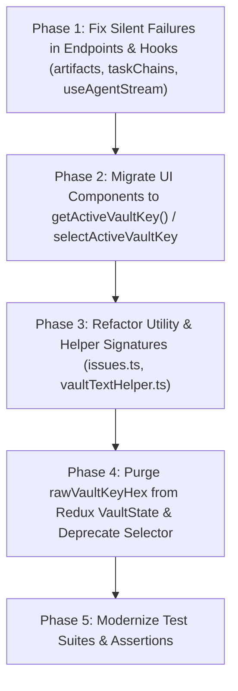

# Comprehensive Audit Report: All `rawKey` / `rawVaultKeyHex` References

**Date:** 2026-10-04  
**Requirement:** REQ-AUDIT-RAWKEY-1  
**Status:** Completed Audit & Migration Blueprint  
**Scope:** Entire repository (`src/` and `tests/`)  

---

## 1. Executive Summary

Following zero-trust WebCrypto hardening (`REQ-VAULT-HARDEN-1`, `REQ-VAULT-HARDEN-2`), raw 64-character hexadecimal vault keys are strictly forbidden from being stored in Redux (`state.vault.rawVaultKeyHex` is permanently `undefined` or `null`) and are never persisted to `sessionStorage` (`readSessionVaultKey()` unconditionally returns `null`). Instead, cryptographic key material is held exclusively as non-extractable WebCrypto `CryptoKey` handles in memory via `getActiveVaultKey()` and persisted across sessions using IndexedDB structured cloning.

However, an exhaustive search across the codebase reveals that **521 lines across 57 files** (and 570 lines across 59 files when including PascalCase `importRawKeyHex`/`exportRawKeyHex` utilities) still contain legacy references to `rawKey`, `rawKeyHex`, `rawVaultKeyHex`, and `selectRawVaultKeyHex`.

### Key Quantitative Metrics

- **Exact Search Occurrences (`rawKey`, `rawKeyHex`, `rawVaultKeyHex`, `selectRawVaultKeyHex`):** 521 lines across 57 files
- **Extended Occurrences (including `importRawKeyHex`, `exportRawKeyHex`):** 570 lines across 59 files
- **Breakdown by Search Term (Total Grep Matches):**
  - `rawKey`: 343 matches
  - `rawKeyHex`: 287 matches
  - `rawVaultKeyHex`: 168 matches
  - `selectRawVaultKeyHex`: 83 matches
  - `importRawKeyHex`: 31 matches
  - `exportRawKeyHex`: 19 matches

### Critical Architectural Discoveries

1. **Active Client-Side Encryption & Decryption Failures (Silent Bugs):**
   - In `src/ui/api/endpoints/artifacts.ts` (`fetchArtifactContentText`, `createArtifact`, `updateArtifact`, and `useArtifactStreamContent`), mutations and stream readers do `const rawKeyHex = state?.vault?.rawVaultKeyHex; if (isUnlocked && rawKeyHex)`. Because `rawVaultKeyHex` is permanently null, artifacts are **never encrypted or decrypted** on the client side!
   - In `src/ui/api/endpoints/taskChains.ts` (`createTaskChain` and `updateTaskChain`), lines 188 & 227 read `state?.vault?.rawVaultKeyHex` without falling back to `getActiveVaultKey()`. As a result, new task chain titles and descriptions are saved unencrypted!
   - In numerous UI components (`AgentActivityBubbles.tsx`, `ChainOverviewPanel.tsx`, `ConversationsHomePage.tsx`, `CurrentTaskStrip.tsx`, `ActionItemsTab.tsx`, `IssueFormPage.tsx`, `MemoryDetail.tsx`, `MemoryFormPage.tsx`, `ProjectDetail.tsx`, `TaskChainOverview.tsx`), components do `const rawKey = useSelector(selectRawVaultKeyHex); if (!isUnlocked || !rawKey)`. Because `selectRawVaultKeyHex` returns `null`, the decryption condition fails, and encrypted ciphertext (`vault:v1:...`) is displayed as locked content even when the vault is unlocked!

2. **Dead-Code Redundancy Pattern:**
   - In components and endpoints that do `const activeKey = state?.vault?.rawVaultKeyHex || getActiveVaultKey();` or `const activeKey = rawKeyHex || getActiveVaultKey();`, the first operand is permanently falsy. The code functions solely because `getActiveVaultKey()` is evaluated as a fallback.

3. **Test Suite String-Assertion Fragility:**
   - Several test suites (`tests/ui_shell_stream_vault_test.ts`, `tests/ui_tasks_vault_test.ts`, `tests/ui_vault_sidebar_and_files_test.ts`) assert exact string matches on source files (e.g., `chainOverviewPanelSrc.includes("selectRawVaultKeyHex")` or `src.includes("rawVaultKeyHex?: string | null")`). Removing these terms from production code without updating these tests will break the test suite.

4. **Completed Refactoring in `src/ui/utils/`:**
   - `vaultTasks.ts`, `vaultChats.ts`, `vaultIssues.ts`, `vaultMemories.ts`, `vaultProjects.ts`, `vaultArtifacts.ts`, `vaultChains.ts`, and `vaultSearch.ts` have already been modernized to eliminate `rawKeyHex?:` parameters, relying on `getActiveVaultKey()`. However, their callers in `src/ui/api/endpoints/` and `src/ui/components/` still attempt to pass raw keys.

---

## 2. Summary by Architectural Layer

| Architectural Layer | Files Count | Occurrences | Risk Level | Primary Replacement Strategy |
| :--- | :---: | :---: | :---: | :--- |
| **Redux Slice & Selectors** | 1 | 12 | High | Remove `rawVaultKeyHex` from `VaultState`; deprecate `selectRawVaultKeyHex` in favor of `selectActiveVaultKey` / `getActiveVaultKey()`. |
| **API Endpoints & Transport** | 12 | 173 | High | Replace `state?.vault?.rawVaultKeyHex` with `getActiveVaultKey()`; fix silent encryption drops in `artifacts.ts` and `taskChains.ts`. |
| **UI Components & Hooks** | 27 | 190 | High | Replace `useSelector(selectRawVaultKeyHex)` with `getActiveVaultKey()`; fix client decryption gates; update `useShellStream` and `useAgentStream`. |
| **Utility Functions** | 1 | 3 | Low | Retain `importRawKeyHex` and `exportRawKeyHex` in `vaultCrypto.ts` for onboarding and unsealing; all domain utils already modernized. |
| **Test Suites** | 18 | 192 | Medium | Update string-inclusion assertions; refactor mock Redux state fixtures from `{ rawVaultKeyHex: ... }` to `setActiveVaultKey(key)`. |
| **TOTAL** | **59** | **570** | **High Overall** | **Comprehensive Transition to WebCrypto CryptoKey** |

---

## 3. Exhaustive File-by-File Audit & Catalog

### 3.1 Redux Slice & Selectors

#### `src/ui/store/vaultSlice.ts` (12 occurrences)

| Line | Code Snippet | Category / Usage | Risk | Proposed Replacement |
| :---: | :--- | :--- | :---: | :--- |
| 3 | `importRawKeyHex,` | Key Transition Handler | Low | Refactor setVaultUnlocked reducer to accept CryptoKey directly. |
| 91 | `const key = await importRawKeyHex(clean);` | Key Transition Handler | Low | Refactor setVaultUnlocked reducer to accept CryptoKey directly. |
| 135 | `rawVaultKeyHex?: string \| null;` | State Interface Definition | Medium | Remove rawVaultKeyHex from VaultState interface; key material is never held in Redux. |
| 177 | `rawVaultKeyHex?: string;` | State Interface Definition | Medium | Remove rawVaultKeyHex from VaultState interface; key material is never held in Redux. |
| 195 | `} else if (payload.rawVaultKeyHex) {` | Reducer Payload Handling | Low | Clean up payload handling once all callers pass CryptoKey. |
| 197 | `importRawKeyHex(payload.rawVaultKeyHex).then((key) => {` | Key Transition Handler | Low | Refactor setVaultUnlocked reducer to accept CryptoKey directly. |
| 198 | `setActiveVaultKey(key, payload.rawVaultKeyHex);` | Key Transition Handler | Low | Refactor setVaultUnlocked reducer to accept CryptoKey directly. |
| 216 | `rawVaultKeyHex: payloadOrKey,` | Reducer Payload Handling | Low | Clean up payload handling once all callers pass CryptoKey. |
| 232 | `rawVaultKeyHex: payloadOrKey.rawVaultKeyHex,` | Reducer Payload Handling | Low | Clean up payload handling once all callers pass CryptoKey. |
| 262 | `importRawKeyHex(payload.hexKey).then((key) => {` | Key Transition Handler | Low | Refactor setVaultUnlocked reducer to accept CryptoKey directly. |
| 362 | `export const selectRawVaultKeyHex = (state?: { vault?: VaultState }): string \| nu...` | Redux Selector Export | High | Deprecate / remove selector; migrate all consumer components to getActiveVaultKey() or selectActiveVaultKey. |
| 363 | `(state?.vault as any)?.rawVaultKeyHex ?? null;` | Reducer Payload Handling | Low | Clean up payload handling once all callers pass CryptoKey. |

### 3.2 API Endpoints & Transport

#### `src/ui/api/endpoints/agentsLive.ts` (1 occurrences)

| Line | Code Snippet | Category / Usage | Risk | Proposed Replacement |
| :---: | :--- | :--- | :---: | :--- |
| 109 | `const activeKey = state?.vault?.rawVaultKeyHex \|\| getActiveVaultKey();` | Stale Redux State Read | Low | Simplify to const activeKey = getActiveVaultKey(); (eliminating redundant null check against state). |

#### `src/ui/api/endpoints/artifacts.ts` (19 occurrences)

| Line | Code Snippet | Category / Usage | Risk | Proposed Replacement |
| :---: | :--- | :--- | :---: | :--- |
| 5 | `import { selectIsVaultUnlocked, selectRawVaultKeyHex } from '../../store/vaultSlice';` | Unused Selector Import | Low | Remove selectRawVaultKeyHex from import statement. |
| 476 | `const rawKeyHex = state?.vault?.rawVaultKeyHex;` | Silent Failure Bug | High | CRITICAL BUG: state.vault.rawVaultKeyHex is permanently null; mutations fail to encrypt! Replace with const activeKey = getActiveVaultKey();. |
| 477 | `if (isUnlocked && rawKeyHex && isVaultArmored(text)) {` | Encryption Key Parameter | Medium | Pass activeKey (CryptoKey from getActiveVaultKey()) instead of rawKeyHex. |
| 479 | `text = await decryptVaultText(text, rawKeyHex);` | Encryption Key Parameter | Medium | Pass activeKey (CryptoKey from getActiveVaultKey()) instead of rawKeyHex. |
| 505 | `const rawKeyHex = state?.vault?.rawVaultKeyHex;` | Silent Failure Bug | High | CRITICAL BUG: state.vault.rawVaultKeyHex is permanently null; mutations fail to encrypt! Replace with const activeKey = getActiveVaultKey();. |
| 507 | `if (isUnlocked && rawKeyHex) {` | Encryption Key Parameter | Medium | Pass activeKey (CryptoKey from getActiveVaultKey()) instead of rawKeyHex. |
| 515 | `name = await encryptVaultText(name, rawKeyHex);` | Encryption Key Parameter | Medium | Pass activeKey (CryptoKey from getActiveVaultKey()) instead of rawKeyHex. |
| 518 | `description = await encryptVaultText(description, rawKeyHex);` | Encryption Key Parameter | Medium | Pass activeKey (CryptoKey from getActiveVaultKey()) instead of rawKeyHex. |
| 522 | `const encContent = await encryptVaultText(content, rawKeyHex);` | Encryption Key Parameter | Medium | Pass activeKey (CryptoKey from getActiveVaultKey()) instead of rawKeyHex. |
| 529 | `const encContent = await encryptVaultText(decoded, rawKeyHex);` | Encryption Key Parameter | Medium | Pass activeKey (CryptoKey from getActiveVaultKey()) instead of rawKeyHex. |
| 542 | `const encContent = await encryptVaultText(text, rawKeyHex);` | Encryption Key Parameter | Medium | Pass activeKey (CryptoKey from getActiveVaultKey()) instead of rawKeyHex. |
| 583 | `const rawKeyHex = state?.vault?.rawVaultKeyHex;` | Silent Failure Bug | High | CRITICAL BUG: state.vault.rawVaultKeyHex is permanently null; mutations fail to encrypt! Replace with const activeKey = getActiveVaultKey();. |
| 586 | `if (isUnlocked && rawKeyHex) {` | Encryption Key Parameter | Medium | Pass activeKey (CryptoKey from getActiveVaultKey()) instead of rawKeyHex. |
| 588 | `name = await encryptVaultText(name, rawKeyHex);` | Encryption Key Parameter | Medium | Pass activeKey (CryptoKey from getActiveVaultKey()) instead of rawKeyHex. |
| 591 | `description = await encryptVaultText(description, rawKeyHex);` | Encryption Key Parameter | Medium | Pass activeKey (CryptoKey from getActiveVaultKey()) instead of rawKeyHex. |
| 680 | `const rawKeyHex = useSelector(selectRawVaultKeyHex);` | Encryption Key Parameter | Medium | Pass activeKey (CryptoKey from getActiveVaultKey()) instead of rawKeyHex. |
| 701 | `if (isUnlocked && rawKeyHex) {` | Encryption Key Parameter | Medium | Pass activeKey (CryptoKey from getActiveVaultKey()) instead of rawKeyHex. |
| 705 | `const decrypted = await decryptVaultText(rawText, rawKeyHex);` | Encryption Key Parameter | Medium | Pass activeKey (CryptoKey from getActiveVaultKey()) instead of rawKeyHex. |
| 721 | `}, [daemonUrl, clientToken, artifactId, versionNo, isUnlocked, rawKeyHex]);` | Encryption Key Parameter | Medium | Pass activeKey (CryptoKey from getActiveVaultKey()) instead of rawKeyHex. |

#### `src/ui/api/endpoints/chats.ts` (17 occurrences)

| Line | Code Snippet | Category / Usage | Risk | Proposed Replacement |
| :---: | :--- | :--- | :---: | :--- |
| 216 | `const rawKeyHex = state?.vault?.rawVaultKeyHex \|\| getActiveVaultKey();` | Stale Redux State Read | Low | Simplify to const activeKey = getActiveVaultKey(); (eliminating redundant null check against state). |
| 218 | `if (isUnlocked && rawKeyHex && encBody && !isVaultArmored(encBody)) {` | Encryption Key Parameter | Medium | Pass activeKey (CryptoKey from getActiveVaultKey()) instead of rawKeyHex. |
| 219 | `encBody = await encryptVaultText(encBody, rawKeyHex);` | Encryption Key Parameter | Medium | Pass activeKey (CryptoKey from getActiveVaultKey()) instead of rawKeyHex. |
| 269 | `const activeKey = state?.vault?.rawVaultKeyHex \|\| getActiveVaultKey();` | Stale Redux State Read | Low | Simplify to const activeKey = getActiveVaultKey(); (eliminating redundant null check against state). |
| 321 | `const rawKeyHex = state?.vault?.rawVaultKeyHex \|\| getActiveVaultKey();` | Stale Redux State Read | Low | Simplify to const activeKey = getActiveVaultKey(); (eliminating redundant null check against state). |
| 323 | `if (isUnlocked && rawKeyHex && encTitle && !isVaultArmored(encTitle)) {` | Encryption Key Parameter | Medium | Pass activeKey (CryptoKey from getActiveVaultKey()) instead of rawKeyHex. |
| 324 | `encTitle = await encryptVaultText(encTitle, rawKeyHex);` | Encryption Key Parameter | Medium | Pass activeKey (CryptoKey from getActiveVaultKey()) instead of rawKeyHex. |
| 359 | `const rawKeyHex = state?.vault?.rawVaultKeyHex \|\| getActiveVaultKey();` | Stale Redux State Read | Low | Simplify to const activeKey = getActiveVaultKey(); (eliminating redundant null check against state). |
| 361 | `if (isUnlocked && rawKeyHex && encBody && !isVaultArmored(encBody)) {` | Encryption Key Parameter | Medium | Pass activeKey (CryptoKey from getActiveVaultKey()) instead of rawKeyHex. |
| 362 | `encBody = await encryptVaultText(encBody, rawKeyHex);` | Encryption Key Parameter | Medium | Pass activeKey (CryptoKey from getActiveVaultKey()) instead of rawKeyHex. |
| 663 | `const rawKeyHex = state?.vault?.rawVaultKeyHex \|\| getActiveVaultKey();` | Stale Redux State Read | Low | Simplify to const activeKey = getActiveVaultKey(); (eliminating redundant null check against state). |
| 665 | `if (isUnlocked && rawKeyHex && encBody && !isVaultArmored(encBody)) {` | Encryption Key Parameter | Medium | Pass activeKey (CryptoKey from getActiveVaultKey()) instead of rawKeyHex. |
| 666 | `encBody = await encryptVaultText(encBody, rawKeyHex);` | Encryption Key Parameter | Medium | Pass activeKey (CryptoKey from getActiveVaultKey()) instead of rawKeyHex. |
| 707 | `const rawKeyHex = state?.vault?.rawVaultKeyHex \|\| getActiveVaultKey();` | Stale Redux State Read | Low | Simplify to const activeKey = getActiveVaultKey(); (eliminating redundant null check against state). |
| 709 | `if (isUnlocked && rawKeyHex && encBody && !isVaultArmored(encBody)) {` | Encryption Key Parameter | Medium | Pass activeKey (CryptoKey from getActiveVaultKey()) instead of rawKeyHex. |
| 710 | `encBody = await encryptVaultText(encBody, rawKeyHex);` | Encryption Key Parameter | Medium | Pass activeKey (CryptoKey from getActiveVaultKey()) instead of rawKeyHex. |
| 755 | `const activeKey = state?.vault?.rawVaultKeyHex \|\| getActiveVaultKey();` | Stale Redux State Read | Low | Simplify to const activeKey = getActiveVaultKey(); (eliminating redundant null check against state). |

#### `src/ui/api/endpoints/issues.ts` (33 occurrences)

| Line | Code Snippet | Category / Usage | Risk | Proposed Replacement |
| :---: | :--- | :--- | :---: | :--- |
| 283 | `const rawKeyHex = state?.vault?.rawVaultKeyHex \|\| readSessionVaultKey() \|\| get...` | Encryption Key Parameter | Medium | Pass activeKey (CryptoKey from getActiveVaultKey()) instead of rawKeyHex. |
| 284 | `if (rawKeyHex) {` | Encryption Key Parameter | Medium | Pass activeKey (CryptoKey from getActiveVaultKey()) instead of rawKeyHex. |
| 285 | `items = await Promise.all(items.map((iss) => decryptIssueRecord(iss, rawKeyHex)));` | Helper Signature & Call | Medium | Rename parameter from rawKeyHex to activeKey?: CryptoKey | string | null and default to getActiveVaultKey(). |
| 308 | `const rawKeyHex = state?.vault?.rawVaultKeyHex \|\| readSessionVaultKey() \|\| get...` | Encryption Key Parameter | Medium | Pass activeKey (CryptoKey from getActiveVaultKey()) instead of rawKeyHex. |
| 309 | `if (rawKeyHex) {` | Encryption Key Parameter | Medium | Pass activeKey (CryptoKey from getActiveVaultKey()) instead of rawKeyHex. |
| 310 | `issue = await decryptIssueRecord(issue, rawKeyHex);` | Helper Signature & Call | Medium | Rename parameter from rawKeyHex to activeKey?: CryptoKey | string | null and default to getActiveVaultKey(). |
| 327 | `const rawKeyHex = state?.vault?.rawVaultKeyHex \|\| getActiveVaultKey();` | Stale Redux State Read | Low | Simplify to const activeKey = getActiveVaultKey(); (eliminating redundant null check against state). |
| 332 | `if (isUnlocked && rawKeyHex) {` | Encryption Key Parameter | Medium | Pass activeKey (CryptoKey from getActiveVaultKey()) instead of rawKeyHex. |
| 334 | `title = await encryptVaultText(title, rawKeyHex);` | Encryption Key Parameter | Medium | Pass activeKey (CryptoKey from getActiveVaultKey()) instead of rawKeyHex. |
| 337 | `description = await encryptVaultText(description, rawKeyHex);` | Encryption Key Parameter | Medium | Pass activeKey (CryptoKey from getActiveVaultKey()) instead of rawKeyHex. |
| 363 | `const rawKeyHex = state?.vault?.rawVaultKeyHex \|\| getActiveVaultKey();` | Stale Redux State Read | Low | Simplify to const activeKey = getActiveVaultKey(); (eliminating redundant null check against state). |
| 368 | `isUnlocked && rawKeyHex && !isVaultArmored(payload.title)` | Encryption Key Parameter | Medium | Pass activeKey (CryptoKey from getActiveVaultKey()) instead of rawKeyHex. |
| 369 | `? await encryptVaultText(payload.title, rawKeyHex)` | Encryption Key Parameter | Medium | Pass activeKey (CryptoKey from getActiveVaultKey()) instead of rawKeyHex. |
| 374 | `isUnlocked && rawKeyHex && payload.description && !isVaultArmored(payload.descript...` | Encryption Key Parameter | Medium | Pass activeKey (CryptoKey from getActiveVaultKey()) instead of rawKeyHex. |
| 375 | `? await encryptVaultText(payload.description, rawKeyHex)` | Encryption Key Parameter | Medium | Pass activeKey (CryptoKey from getActiveVaultKey()) instead of rawKeyHex. |
| 442 | `const rawKeyHex = state?.vault?.rawVaultKeyHex \|\| getActiveVaultKey();` | Stale Redux State Read | Low | Simplify to const activeKey = getActiveVaultKey(); (eliminating redundant null check against state). |
| 445 | `if (isUnlocked && rawKeyHex && bodyText && !isVaultArmored(bodyText)) {` | Encryption Key Parameter | Medium | Pass activeKey (CryptoKey from getActiveVaultKey()) instead of rawKeyHex. |
| 446 | `bodyText = await encryptVaultText(bodyText, rawKeyHex);` | Encryption Key Parameter | Medium | Pass activeKey (CryptoKey from getActiveVaultKey()) instead of rawKeyHex. |
| 565 | `* Encrypt issue fields (title, description) if vault is unlocked using rawKeyHex.` | Encryption Key Parameter | Medium | Pass activeKey (CryptoKey from getActiveVaultKey()) instead of rawKeyHex. |
| 569 | `rawKeyHex?: string \| null,` | Encryption Key Parameter | Medium | Pass activeKey (CryptoKey from getActiveVaultKey()) instead of rawKeyHex. |
| 571 | `if (!rawKeyHex) return { ...payload };` | Encryption Key Parameter | Medium | Pass activeKey (CryptoKey from getActiveVaultKey()) instead of rawKeyHex. |
| 574 | `res.title = await encryptVaultText(res.title, rawKeyHex);` | Encryption Key Parameter | Medium | Pass activeKey (CryptoKey from getActiveVaultKey()) instead of rawKeyHex. |
| 577 | `res.description = await encryptVaultText(res.description, rawKeyHex);` | Encryption Key Parameter | Medium | Pass activeKey (CryptoKey from getActiveVaultKey()) instead of rawKeyHex. |
| 583 | `* Encrypt comment body if vault is unlocked using rawKeyHex.` | Encryption Key Parameter | Medium | Pass activeKey (CryptoKey from getActiveVaultKey()) instead of rawKeyHex. |
| 587 | `rawKeyHex?: string \| null,` | Encryption Key Parameter | Medium | Pass activeKey (CryptoKey from getActiveVaultKey()) instead of rawKeyHex. |
| 589 | `if (!rawKeyHex \|\| !payload.body) return { ...payload };` | Encryption Key Parameter | Medium | Pass activeKey (CryptoKey from getActiveVaultKey()) instead of rawKeyHex. |
| 592 | `res.body = await encryptVaultText(res.body, rawKeyHex);` | Encryption Key Parameter | Medium | Pass activeKey (CryptoKey from getActiveVaultKey()) instead of rawKeyHex. |
| 598 | `* Decrypt issue fields (title, description, description_preview, comments) using r...` | Encryption Key Parameter | Medium | Pass activeKey (CryptoKey from getActiveVaultKey()) instead of rawKeyHex. |
| 602 | `rawKeyHex?: string \| CryptoKey \| null,` | Encryption Key Parameter | Medium | Pass activeKey (CryptoKey from getActiveVaultKey()) instead of rawKeyHex. |
| 604 | `const activeKey = rawKeyHex \|\| getActiveVaultKey();` | Encryption Key Parameter | Medium | Pass activeKey (CryptoKey from getActiveVaultKey()) instead of rawKeyHex. |
| 653 | `* Decrypt comment record body using rawKeyHex.` | Encryption Key Parameter | Medium | Pass activeKey (CryptoKey from getActiveVaultKey()) instead of rawKeyHex. |
| 657 | `rawKeyHex?: string \| CryptoKey \| null,` | Encryption Key Parameter | Medium | Pass activeKey (CryptoKey from getActiveVaultKey()) instead of rawKeyHex. |
| 659 | `const activeKey = rawKeyHex \|\| getActiveVaultKey();` | Encryption Key Parameter | Medium | Pass activeKey (CryptoKey from getActiveVaultKey()) instead of rawKeyHex. |

#### `src/ui/api/endpoints/memory.ts` (30 occurrences)

| Line | Code Snippet | Category / Usage | Risk | Proposed Replacement |
| :---: | :--- | :--- | :---: | :--- |
| 253 | `const rawKeyHex = state?.vault?.rawVaultKeyHex \|\| getActiveVaultKey();` | Stale Redux State Read | Low | Simplify to const activeKey = getActiveVaultKey(); (eliminating redundant null check against state). |
| 260 | `if (isUnlocked && rawKeyHex) {` | Encryption Key Parameter | Medium | Pass activeKey (CryptoKey from getActiveVaultKey()) instead of rawKeyHex. |
| 262 | `title = await encryptVaultText(title, rawKeyHex);` | Encryption Key Parameter | Medium | Pass activeKey (CryptoKey from getActiveVaultKey()) instead of rawKeyHex. |
| 265 | `description = await encryptVaultText(description, rawKeyHex);` | Encryption Key Parameter | Medium | Pass activeKey (CryptoKey from getActiveVaultKey()) instead of rawKeyHex. |
| 268 | `body = await encryptVaultText(body, rawKeyHex);` | Encryption Key Parameter | Medium | Pass activeKey (CryptoKey from getActiveVaultKey()) instead of rawKeyHex. |
| 271 | `evidence = await encryptVaultText(evidence, rawKeyHex);` | Encryption Key Parameter | Medium | Pass activeKey (CryptoKey from getActiveVaultKey()) instead of rawKeyHex. |
| 296 | `const rawKeyHex = state?.vault?.rawVaultKeyHex \|\| getActiveVaultKey();` | Stale Redux State Read | Low | Simplify to const activeKey = getActiveVaultKey(); (eliminating redundant null check against state). |
| 303 | `if (isUnlocked && rawKeyHex) {` | Encryption Key Parameter | Medium | Pass activeKey (CryptoKey from getActiveVaultKey()) instead of rawKeyHex. |
| 305 | `title = await encryptVaultText(title, rawKeyHex);` | Encryption Key Parameter | Medium | Pass activeKey (CryptoKey from getActiveVaultKey()) instead of rawKeyHex. |
| 308 | `description = await encryptVaultText(description, rawKeyHex);` | Encryption Key Parameter | Medium | Pass activeKey (CryptoKey from getActiveVaultKey()) instead of rawKeyHex. |
| 311 | `body = await encryptVaultText(body, rawKeyHex);` | Encryption Key Parameter | Medium | Pass activeKey (CryptoKey from getActiveVaultKey()) instead of rawKeyHex. |
| 314 | `evidence = await encryptVaultText(evidence, rawKeyHex);` | Encryption Key Parameter | Medium | Pass activeKey (CryptoKey from getActiveVaultKey()) instead of rawKeyHex. |
| 339 | `const rawKeyHex = state?.vault?.rawVaultKeyHex \|\| getActiveVaultKey();` | Stale Redux State Read | Low | Simplify to const activeKey = getActiveVaultKey(); (eliminating redundant null check against state). |
| 345 | `isUnlocked && rawKeyHex && payload.title && !isVaultArmored(payload.title)` | Encryption Key Parameter | Medium | Pass activeKey (CryptoKey from getActiveVaultKey()) instead of rawKeyHex. |
| 346 | `? await encryptVaultText(payload.title, rawKeyHex)` | Encryption Key Parameter | Medium | Pass activeKey (CryptoKey from getActiveVaultKey()) instead of rawKeyHex. |
| 351 | `isUnlocked && rawKeyHex && payload.description && !isVaultArmored(payload.descript...` | Encryption Key Parameter | Medium | Pass activeKey (CryptoKey from getActiveVaultKey()) instead of rawKeyHex. |
| 352 | `? await encryptVaultText(payload.description, rawKeyHex)` | Encryption Key Parameter | Medium | Pass activeKey (CryptoKey from getActiveVaultKey()) instead of rawKeyHex. |
| 357 | `isUnlocked && rawKeyHex && payload.body && !isVaultArmored(payload.body)` | Encryption Key Parameter | Medium | Pass activeKey (CryptoKey from getActiveVaultKey()) instead of rawKeyHex. |
| 358 | `? await encryptVaultText(payload.body, rawKeyHex)` | Encryption Key Parameter | Medium | Pass activeKey (CryptoKey from getActiveVaultKey()) instead of rawKeyHex. |
| 363 | `isUnlocked && rawKeyHex && payload.evidence && !isVaultArmored(payload.evidence)` | Encryption Key Parameter | Medium | Pass activeKey (CryptoKey from getActiveVaultKey()) instead of rawKeyHex. |
| 364 | `? await encryptVaultText(payload.evidence, rawKeyHex)` | Encryption Key Parameter | Medium | Pass activeKey (CryptoKey from getActiveVaultKey()) instead of rawKeyHex. |
| 389 | `const rawKeyHex = state?.vault?.rawVaultKeyHex \|\| getActiveVaultKey();` | Stale Redux State Read | Low | Simplify to const activeKey = getActiveVaultKey(); (eliminating redundant null check against state). |
| 395 | `isUnlocked && rawKeyHex && edits.title && !isVaultArmored(edits.title)` | Encryption Key Parameter | Medium | Pass activeKey (CryptoKey from getActiveVaultKey()) instead of rawKeyHex. |
| 396 | `? await encryptVaultText(edits.title, rawKeyHex)` | Encryption Key Parameter | Medium | Pass activeKey (CryptoKey from getActiveVaultKey()) instead of rawKeyHex. |
| 401 | `isUnlocked && rawKeyHex && edits.description && !isVaultArmored(edits.description)` | Encryption Key Parameter | Medium | Pass activeKey (CryptoKey from getActiveVaultKey()) instead of rawKeyHex. |
| 402 | `? await encryptVaultText(edits.description, rawKeyHex)` | Encryption Key Parameter | Medium | Pass activeKey (CryptoKey from getActiveVaultKey()) instead of rawKeyHex. |
| 407 | `isUnlocked && rawKeyHex && edits.body && !isVaultArmored(edits.body)` | Encryption Key Parameter | Medium | Pass activeKey (CryptoKey from getActiveVaultKey()) instead of rawKeyHex. |
| 408 | `? await encryptVaultText(edits.body, rawKeyHex)` | Encryption Key Parameter | Medium | Pass activeKey (CryptoKey from getActiveVaultKey()) instead of rawKeyHex. |
| 413 | `isUnlocked && rawKeyHex && edits.evidence && !isVaultArmored(edits.evidence)` | Encryption Key Parameter | Medium | Pass activeKey (CryptoKey from getActiveVaultKey()) instead of rawKeyHex. |
| 414 | `? await encryptVaultText(edits.evidence, rawKeyHex)` | Encryption Key Parameter | Medium | Pass activeKey (CryptoKey from getActiveVaultKey()) instead of rawKeyHex. |

#### `src/ui/api/endpoints/projectFs.ts` (5 occurrences)

| Line | Code Snippet | Category / Usage | Risk | Proposed Replacement |
| :---: | :--- | :--- | :---: | :--- |
| 275 | `const activeKey = getActiveVaultKey() \|\| readSessionVaultKey() \|\| state?.vault...` | Endpoint State Access | Low | Replace with getActiveVaultKey(). |
| 374 | `const activeKey = getActiveVaultKey() \|\| readSessionVaultKey() \|\| state?.vault...` | Endpoint State Access | Low | Replace with getActiveVaultKey(). |
| 405 | `const activeKey = getActiveVaultKey() \|\| readSessionVaultKey() \|\| state?.vault...` | Endpoint State Access | Low | Replace with getActiveVaultKey(). |
| 482 | `const activeKey = getActiveVaultKey() \|\| readSessionVaultKey() \|\| state?.vault...` | Endpoint State Access | Low | Replace with getActiveVaultKey(). |
| 511 | `const activeKey = getActiveVaultKey() \|\| readSessionVaultKey() \|\| state?.vault...` | Endpoint State Access | Low | Replace with getActiveVaultKey(). |

#### `src/ui/api/endpoints/projects.ts` (14 occurrences)

| Line | Code Snippet | Category / Usage | Risk | Proposed Replacement |
| :---: | :--- | :--- | :---: | :--- |
| 39 | `const rawKeyHex = state?.vault?.rawVaultKeyHex \|\| getActiveVaultKey();` | Stale Redux State Read | Low | Simplify to const activeKey = getActiveVaultKey(); (eliminating redundant null check against state). |
| 41 | `const projects = (isUnlocked && rawKeyHex)` | Encryption Key Parameter | Medium | Pass activeKey (CryptoKey from getActiveVaultKey()) instead of rawKeyHex. |
| 42 | `? await decryptProjectList(rawProjects, rawKeyHex)` | Encryption Key Parameter | Medium | Pass activeKey (CryptoKey from getActiveVaultKey()) instead of rawKeyHex. |
| 63 | `const rawKeyHex = state?.vault?.rawVaultKeyHex \|\| getActiveVaultKey();` | Stale Redux State Read | Low | Simplify to const activeKey = getActiveVaultKey(); (eliminating redundant null check against state). |
| 65 | `if (project && isUnlocked && rawKeyHex) {` | Encryption Key Parameter | Medium | Pass activeKey (CryptoKey from getActiveVaultKey()) instead of rawKeyHex. |
| 66 | `project = await decryptProjectRecord(project, rawKeyHex);` | Encryption Key Parameter | Medium | Pass activeKey (CryptoKey from getActiveVaultKey()) instead of rawKeyHex. |
| 80 | `const rawKeyHex = state?.vault?.rawVaultKeyHex \|\| getActiveVaultKey();` | Stale Redux State Read | Low | Simplify to const activeKey = getActiveVaultKey(); (eliminating redundant null check against state). |
| 84 | `if (isUnlocked && rawKeyHex) {` | Encryption Key Parameter | Medium | Pass activeKey (CryptoKey from getActiveVaultKey()) instead of rawKeyHex. |
| 86 | `name = await encryptVaultText(name, rawKeyHex);` | Encryption Key Parameter | Medium | Pass activeKey (CryptoKey from getActiveVaultKey()) instead of rawKeyHex. |
| 89 | `description = await encryptVaultText(description, rawKeyHex);` | Encryption Key Parameter | Medium | Pass activeKey (CryptoKey from getActiveVaultKey()) instead of rawKeyHex. |
| 114 | `const rawKeyHex = state?.vault?.rawVaultKeyHex \|\| getActiveVaultKey();` | Stale Redux State Read | Low | Simplify to const activeKey = getActiveVaultKey(); (eliminating redundant null check against state). |
| 118 | `if (isUnlocked && rawKeyHex) {` | Encryption Key Parameter | Medium | Pass activeKey (CryptoKey from getActiveVaultKey()) instead of rawKeyHex. |
| 120 | `name = await encryptVaultText(name, rawKeyHex);` | Encryption Key Parameter | Medium | Pass activeKey (CryptoKey from getActiveVaultKey()) instead of rawKeyHex. |
| 123 | `description = await encryptVaultText(description, rawKeyHex);` | Encryption Key Parameter | Medium | Pass activeKey (CryptoKey from getActiveVaultKey()) instead of rawKeyHex. |

#### `src/ui/api/endpoints/shells.ts` (2 occurrences)

| Line | Code Snippet | Category / Usage | Risk | Proposed Replacement |
| :---: | :--- | :--- | :---: | :--- |
| 327 | `const activeKey = getActiveVaultKey() \|\| readSessionVaultKey() \|\| state?.vault...` | Endpoint State Access | Low | Replace with getActiveVaultKey(). |
| 509 | `const activeKey = getActiveVaultKey() \|\| readSessionVaultKey() \|\| state?.vault...` | Endpoint State Access | Low | Replace with getActiveVaultKey(). |

#### `src/ui/api/endpoints/sidebar.ts` (5 occurrences)

| Line | Code Snippet | Category / Usage | Risk | Proposed Replacement |
| :---: | :--- | :--- | :---: | :--- |
| 187 | `const activeKey = state?.vault?.rawVaultKeyHex \|\| getActiveVaultKey();` | Stale Redux State Read | Low | Simplify to const activeKey = getActiveVaultKey(); (eliminating redundant null check against state). |
| 216 | `const activeKey = state?.vault?.rawVaultKeyHex \|\| getActiveVaultKey();` | Stale Redux State Read | Low | Simplify to const activeKey = getActiveVaultKey(); (eliminating redundant null check against state). |
| 238 | `const rawKeyHex = state?.vault?.rawVaultKeyHex \|\| getActiveVaultKey();` | Stale Redux State Read | Low | Simplify to const activeKey = getActiveVaultKey(); (eliminating redundant null check against state). |
| 240 | `const projects = (isUnlocked && rawKeyHex)` | Encryption Key Parameter | Medium | Pass activeKey (CryptoKey from getActiveVaultKey()) instead of rawKeyHex. |
| 241 | `? await decryptProjectList(rawProjects, rawKeyHex)` | Encryption Key Parameter | Medium | Pass activeKey (CryptoKey from getActiveVaultKey()) instead of rawKeyHex. |

#### `src/ui/api/endpoints/taskChains.ts` (11 occurrences)

| Line | Code Snippet | Category / Usage | Risk | Proposed Replacement |
| :---: | :--- | :--- | :---: | :--- |
| 142 | `const activeKey = state?.vault?.rawVaultKeyHex \|\| getActiveVaultKey();` | Stale Redux State Read | Low | Simplify to const activeKey = getActiveVaultKey(); (eliminating redundant null check against state). |
| 171 | `const activeKey = state?.vault?.rawVaultKeyHex \|\| getActiveVaultKey();` | Stale Redux State Read | Low | Simplify to const activeKey = getActiveVaultKey(); (eliminating redundant null check against state). |
| 188 | `const rawKeyHex = state?.vault?.rawVaultKeyHex;` | Silent Failure Bug | High | CRITICAL BUG: state.vault.rawVaultKeyHex is permanently null; mutations fail to encrypt! Replace with const activeKey = getActiveVaultKey();. |
| 193 | `if (isUnlocked && rawKeyHex) {` | Encryption Key Parameter | Medium | Pass activeKey (CryptoKey from getActiveVaultKey()) instead of rawKeyHex. |
| 195 | `title = await encryptVaultText(title, rawKeyHex);` | Encryption Key Parameter | Medium | Pass activeKey (CryptoKey from getActiveVaultKey()) instead of rawKeyHex. |
| 198 | `description = await encryptVaultText(description, rawKeyHex);` | Encryption Key Parameter | Medium | Pass activeKey (CryptoKey from getActiveVaultKey()) instead of rawKeyHex. |
| 227 | `const rawKeyHex = state?.vault?.rawVaultKeyHex;` | Silent Failure Bug | High | CRITICAL BUG: state.vault.rawVaultKeyHex is permanently null; mutations fail to encrypt! Replace with const activeKey = getActiveVaultKey();. |
| 232 | `isUnlocked && rawKeyHex && !isVaultArmored(title)` | Encryption Key Parameter | Medium | Pass activeKey (CryptoKey from getActiveVaultKey()) instead of rawKeyHex. |
| 233 | `? await encryptVaultText(title, rawKeyHex)` | Encryption Key Parameter | Medium | Pass activeKey (CryptoKey from getActiveVaultKey()) instead of rawKeyHex. |
| 238 | `isUnlocked && rawKeyHex && description && !isVaultArmored(description)` | Encryption Key Parameter | Medium | Pass activeKey (CryptoKey from getActiveVaultKey()) instead of rawKeyHex. |
| 239 | `? await encryptVaultText(description, rawKeyHex)` | Encryption Key Parameter | Medium | Pass activeKey (CryptoKey from getActiveVaultKey()) instead of rawKeyHex. |

#### `src/ui/api/endpoints/tasks.ts` (33 occurrences)

| Line | Code Snippet | Category / Usage | Risk | Proposed Replacement |
| :---: | :--- | :--- | :---: | :--- |
| 448 | `const activeKey = state?.vault?.rawVaultKeyHex \|\| getActiveVaultKey();` | Stale Redux State Read | Low | Simplify to const activeKey = getActiveVaultKey(); (eliminating redundant null check against state). |
| 477 | `const activeKey = state?.vault?.rawVaultKeyHex \|\| getActiveVaultKey();` | Stale Redux State Read | Low | Simplify to const activeKey = getActiveVaultKey(); (eliminating redundant null check against state). |
| 504 | `const activeKey = state?.vault?.rawVaultKeyHex \|\| getActiveVaultKey();` | Stale Redux State Read | Low | Simplify to const activeKey = getActiveVaultKey(); (eliminating redundant null check against state). |
| 527 | `const activeKey = state?.vault?.rawVaultKeyHex \|\| getActiveVaultKey();` | Stale Redux State Read | Low | Simplify to const activeKey = getActiveVaultKey(); (eliminating redundant null check against state). |
| 550 | `const activeKey = state?.vault?.rawVaultKeyHex \|\| getActiveVaultKey();` | Stale Redux State Read | Low | Simplify to const activeKey = getActiveVaultKey(); (eliminating redundant null check against state). |
| 574 | `const activeKey = state?.vault?.rawVaultKeyHex \|\| getActiveVaultKey();` | Stale Redux State Read | Low | Simplify to const activeKey = getActiveVaultKey(); (eliminating redundant null check against state). |
| 604 | `const activeKey = state?.vault?.rawVaultKeyHex \|\| getActiveVaultKey();` | Stale Redux State Read | Low | Simplify to const activeKey = getActiveVaultKey(); (eliminating redundant null check against state). |
| 629 | `const activeKey = state?.vault?.rawVaultKeyHex \|\| getActiveVaultKey();` | Stale Redux State Read | Low | Simplify to const activeKey = getActiveVaultKey(); (eliminating redundant null check against state). |
| 659 | `const activeKey = state?.vault?.rawVaultKeyHex \|\| getActiveVaultKey();` | Stale Redux State Read | Low | Simplify to const activeKey = getActiveVaultKey(); (eliminating redundant null check against state). |
| 690 | `const rawKeyHex = state?.vault?.rawVaultKeyHex \|\| getActiveVaultKey();` | Stale Redux State Read | Low | Simplify to const activeKey = getActiveVaultKey(); (eliminating redundant null check against state). |
| 695 | `if (isUnlocked && rawKeyHex) {` | Encryption Key Parameter | Medium | Pass activeKey (CryptoKey from getActiveVaultKey()) instead of rawKeyHex. |
| 697 | `encTitle = await encryptVaultText(encTitle, rawKeyHex);` | Encryption Key Parameter | Medium | Pass activeKey (CryptoKey from getActiveVaultKey()) instead of rawKeyHex. |
| 700 | `encDesc = await encryptVaultText(encDesc, rawKeyHex);` | Encryption Key Parameter | Medium | Pass activeKey (CryptoKey from getActiveVaultKey()) instead of rawKeyHex. |
| 728 | `const rawKeyHex = state?.vault?.rawVaultKeyHex \|\| getActiveVaultKey();` | Stale Redux State Read | Low | Simplify to const activeKey = getActiveVaultKey(); (eliminating redundant null check against state). |
| 734 | `isUnlocked && rawKeyHex && !isVaultArmored(title)` | Encryption Key Parameter | Medium | Pass activeKey (CryptoKey from getActiveVaultKey()) instead of rawKeyHex. |
| 735 | `? await encryptVaultText(title, rawKeyHex)` | Encryption Key Parameter | Medium | Pass activeKey (CryptoKey from getActiveVaultKey()) instead of rawKeyHex. |
| 740 | `isUnlocked && rawKeyHex && description && !isVaultArmored(description)` | Encryption Key Parameter | Medium | Pass activeKey (CryptoKey from getActiveVaultKey()) instead of rawKeyHex. |
| 741 | `? await encryptVaultText(description, rawKeyHex)` | Encryption Key Parameter | Medium | Pass activeKey (CryptoKey from getActiveVaultKey()) instead of rawKeyHex. |
| 793 | `const rawKeyHex = state?.vault?.rawVaultKeyHex \|\| getActiveVaultKey();` | Stale Redux State Read | Low | Simplify to const activeKey = getActiveVaultKey(); (eliminating redundant null check against state). |
| 797 | `if (isUnlocked && rawKeyHex) {` | Encryption Key Parameter | Medium | Pass activeKey (CryptoKey from getActiveVaultKey()) instead of rawKeyHex. |
| 799 | `encTitle = await encryptVaultText(encTitle, rawKeyHex);` | Encryption Key Parameter | Medium | Pass activeKey (CryptoKey from getActiveVaultKey()) instead of rawKeyHex. |
| 802 | `encDesc = await encryptVaultText(encDesc, rawKeyHex);` | Encryption Key Parameter | Medium | Pass activeKey (CryptoKey from getActiveVaultKey()) instead of rawKeyHex. |
| 1142 | `const rawKeyHex = state?.vault?.rawVaultKeyHex \|\| getActiveVaultKey();` | Stale Redux State Read | Low | Simplify to const activeKey = getActiveVaultKey(); (eliminating redundant null check against state). |
| 1146 | `if (isUnlocked && rawKeyHex) {` | Encryption Key Parameter | Medium | Pass activeKey (CryptoKey from getActiveVaultKey()) instead of rawKeyHex. |
| 1148 | `encTitle = await encryptVaultText(encTitle, rawKeyHex);` | Encryption Key Parameter | Medium | Pass activeKey (CryptoKey from getActiveVaultKey()) instead of rawKeyHex. |
| 1151 | `encDesc = await encryptVaultText(encDesc, rawKeyHex);` | Encryption Key Parameter | Medium | Pass activeKey (CryptoKey from getActiveVaultKey()) instead of rawKeyHex. |
| 1194 | `const rawKeyHex = state?.vault?.rawVaultKeyHex \|\| getActiveVaultKey();` | Stale Redux State Read | Low | Simplify to const activeKey = getActiveVaultKey(); (eliminating redundant null check against state). |
| 1197 | `if (isUnlocked && rawKeyHex && commentBody && !isVaultArmored(commentBody)) {` | Encryption Key Parameter | Medium | Pass activeKey (CryptoKey from getActiveVaultKey()) instead of rawKeyHex. |
| 1198 | `commentBody = await encryptVaultText(commentBody, rawKeyHex);` | Encryption Key Parameter | Medium | Pass activeKey (CryptoKey from getActiveVaultKey()) instead of rawKeyHex. |
| 1244 | `const rawKeyHex = state?.vault?.rawVaultKeyHex \|\| getActiveVaultKey();` | Stale Redux State Read | Low | Simplify to const activeKey = getActiveVaultKey(); (eliminating redundant null check against state). |
| 1248 | `if (isUnlocked && rawKeyHex) {` | Encryption Key Parameter | Medium | Pass activeKey (CryptoKey from getActiveVaultKey()) instead of rawKeyHex. |
| 1250 | `encTitle = await encryptVaultText(encTitle, rawKeyHex);` | Encryption Key Parameter | Medium | Pass activeKey (CryptoKey from getActiveVaultKey()) instead of rawKeyHex. |
| 1253 | `encDesc = await encryptVaultText(encDesc, rawKeyHex);` | Encryption Key Parameter | Medium | Pass activeKey (CryptoKey from getActiveVaultKey()) instead of rawKeyHex. |

#### `src/ui/api/wsInvalidation.ts` (3 occurrences)

| Line | Code Snippet | Category / Usage | Risk | Proposed Replacement |
| :---: | :--- | :--- | :---: | :--- |
| 381 | `const rawKey = readSessionVaultKey();` | Encryption Key Parameter | Medium | Pass activeKey (CryptoKey from getActiveVaultKey()) instead of rawKeyHex. |
| 382 | `if (rawKey) {` | Encryption Key Parameter | Medium | Pass activeKey (CryptoKey from getActiveVaultKey()) instead of rawKeyHex. |
| 383 | `decryptVaultText(item.rawTitle, rawKey)` | Encryption Key Parameter | Medium | Pass activeKey (CryptoKey from getActiveVaultKey()) instead of rawKeyHex. |

### 3.3 UI Components & Hooks

#### `src/ui/components/LibraryPage.tsx` (5 occurrences)

| Line | Code Snippet | Category / Usage | Risk | Proposed Replacement |
| :---: | :--- | :--- | :---: | :--- |
| 10 | `import { selectIsVaultUnlocked, selectRawVaultKeyHex, selectActiveVaultKey } from ...` | Import Statement | Low | Remove selectRawVaultKeyHex or retain importRawKeyHex/exportRawKeyHex where key transformation is required. |
| 129 | `const rawVaultKeyHex = useSelector(selectRawVaultKeyHex);` | Stale Selector Hook Call | High | Replace with getActiveVaultKey() or useSelector(selectActiveVaultKey). Calling selectRawVaultKeyHex always returns null. |
| 130 | `const activeVaultKey = useSelector(selectActiveVaultKey) \|\| getActiveVaultKey() ...` | Redundant Fallback Chain | Low | Simplify to const activeKey = getActiveVaultKey();. |
| 135 | `const keyToUse = activeVaultKey \|\| getActiveVaultKey() \|\| rawVaultKeyHex;` | Redundant Fallback Chain | Low | Simplify to const activeKey = getActiveVaultKey();. |
| 153 | `}, [rawProjectsList, isVaultUnlocked, activeVaultKey, rawVaultKeyHex]);` | Component Vault Reference | Low | Migrate to getActiveVaultKey() or CryptoKey. |

#### `src/ui/components/chains/TaskChainSelectorModal.tsx` (6 occurrences)

| Line | Code Snippet | Category / Usage | Risk | Proposed Replacement |
| :---: | :--- | :--- | :---: | :--- |
| 11 | `selectRawVaultKeyHex,` | Component Vault Reference | Low | Migrate to getActiveVaultKey() or CryptoKey. |
| 79 | `const rawVaultKeyHex = useSelector((state: any) => {` | Component Vault Reference | Low | Migrate to getActiveVaultKey() or CryptoKey. |
| 81 | `return selectRawVaultKeyHex(state);` | Component Vault Reference | Low | Migrate to getActiveVaultKey() or CryptoKey. |
| 83 | `return state?.vault?.rawVaultKeyHex \|\| null;` | Component Vault Reference | Low | Migrate to getActiveVaultKey() or CryptoKey. |
| 89 | `return getActiveVaultKey() \|\| rawVaultKeyHex \|\| readSessionVaultKey();` | Component Vault Reference | Low | Migrate to getActiveVaultKey() or CryptoKey. |
| 92 | `}, [isVaultUnlocked, rawVaultKeyHex]);` | Component Vault Reference | Low | Migrate to getActiveVaultKey() or CryptoKey. |

#### `src/ui/components/chat/AgentActivityBubbles.tsx` (6 occurrences)

| Line | Code Snippet | Category / Usage | Risk | Proposed Replacement |
| :---: | :--- | :--- | :---: | :--- |
| 16 | `import { selectIsVaultUnlocked, selectRawVaultKeyHex } from '../../store/vaultSlice';` | Import Statement | Low | Remove selectRawVaultKeyHex or retain importRawKeyHex/exportRawKeyHex where key transformation is required. |
| 67 | `const rawKeyHex = useSelector(selectRawVaultKeyHex);` | Stale Selector Hook Call | High | Replace with getActiveVaultKey() or useSelector(selectActiveVaultKey). Calling selectRawVaultKeyHex always returns null. |
| 77 | `if (!isUnlocked \|\| !rawKeyHex) {` | Silent Decryption Failure Bug | High | CRITICAL BUG: Guard condition fails because rawKeyHex is permanently null! Replace with getActiveVaultKey(). |
| 82 | `? decryptVaultText(raw, rawKeyHex)` | Component Vault Reference | Low | Migrate to getActiveVaultKey() or CryptoKey. |
| 83 | `: decryptEmbeddedVaultTokens(raw, rawKeyHex);` | Component Vault Reference | Low | Migrate to getActiveVaultKey() or CryptoKey. |
| 92 | `}, [bubble.summary, isUnlocked, rawKeyHex]);` | Component Vault Reference | Low | Migrate to getActiveVaultKey() or CryptoKey. |

#### `src/ui/components/chat/ChainOverviewPanel.tsx` (6 occurrences)

| Line | Code Snippet | Category / Usage | Risk | Proposed Replacement |
| :---: | :--- | :--- | :---: | :--- |
| 3 | `import { selectIsVaultUnlocked, selectRawVaultKeyHex } from '../../store/vaultSlice';` | Import Statement | Low | Remove selectRawVaultKeyHex or retain importRawKeyHex/exportRawKeyHex where key transformation is required. |
| 172 | `const rawKeyHex = useSelector(selectRawVaultKeyHex);` | Stale Selector Hook Call | High | Replace with getActiveVaultKey() or useSelector(selectActiveVaultKey). Calling selectRawVaultKeyHex always returns null. |
| 180 | `if (isVaultArmored(rawDescription) && isVaultUnlocked && rawKeyHex) {` | Component Vault Reference | Low | Migrate to getActiveVaultKey() or CryptoKey. |
| 181 | `decryptVaultText(rawDescription, rawKeyHex)` | Component Vault Reference | Low | Migrate to getActiveVaultKey() or CryptoKey. |
| 194 | `}, [rawDescription, isVaultUnlocked, rawKeyHex]);` | Component Vault Reference | Low | Migrate to getActiveVaultKey() or CryptoKey. |
| 263 | `) : isVaultArmored(rawDescription) && (!isVaultUnlocked \|\| !rawKeyHex) ? (` | Component Vault Reference | Low | Migrate to getActiveVaultKey() or CryptoKey. |

#### `src/ui/components/chat/ChatMessageList.tsx` (4 occurrences)

| Line | Code Snippet | Category / Usage | Risk | Proposed Replacement |
| :---: | :--- | :--- | :---: | :--- |
| 13 | `import { selectIsVaultUnlocked, selectRawVaultKeyHex, getActiveVaultKey } from '.....` | Import Statement | Low | Remove selectRawVaultKeyHex or retain importRawKeyHex/exportRawKeyHex where key transformation is required. |
| 49 | `const rawKeyHex = useSelector(selectRawVaultKeyHex);` | Stale Selector Hook Call | High | Replace with getActiveVaultKey() or useSelector(selectActiveVaultKey). Calling selectRawVaultKeyHex always returns null. |
| 58 | `const activeKey = rawKeyHex \|\| getActiveVaultKey();` | Redundant Fallback Chain | Low | Simplify to const activeKey = getActiveVaultKey();. |
| 76 | `}, [body, hasVault, isArmored, isUnlocked, rawKeyHex]);` | Component Vault Reference | Low | Migrate to getActiveVaultKey() or CryptoKey. |

#### `src/ui/components/chat/ConversationThreadPage.tsx` (4 occurrences)

| Line | Code Snippet | Category / Usage | Risk | Proposed Replacement |
| :---: | :--- | :--- | :---: | :--- |
| 44 | `import { selectIsVaultUnlocked, selectRawVaultKeyHex, getActiveVaultKey } from '.....` | Import Statement | Low | Remove selectRawVaultKeyHex or retain importRawKeyHex/exportRawKeyHex where key transformation is required. |
| 265 | `const rawKeyHex = useSelector(selectRawVaultKeyHex);` | Stale Selector Hook Call | High | Replace with getActiveVaultKey() or useSelector(selectActiveVaultKey). Calling selectRawVaultKeyHex always returns null. |
| 274 | `const activeKey = rawKeyHex \|\| getActiveVaultKey();` | Redundant Fallback Chain | Low | Simplify to const activeKey = getActiveVaultKey();. |
| 292 | `}, [body, hasVault, isArmored, isUnlocked, rawKeyHex]);` | Component Vault Reference | Low | Migrate to getActiveVaultKey() or CryptoKey. |

#### `src/ui/components/chat/ConversationsHomePage.tsx` (5 occurrences)

| Line | Code Snippet | Category / Usage | Risk | Proposed Replacement |
| :---: | :--- | :--- | :---: | :--- |
| 9 | `import { selectIsVaultUnlocked, selectRawVaultKeyHex } from '../../store/vaultSlice';` | Import Statement | Low | Remove selectRawVaultKeyHex or retain importRawKeyHex/exportRawKeyHex where key transformation is required. |
| 67 | `const rawKeyHex = useSelector(selectRawVaultKeyHex);` | Stale Selector Hook Call | High | Replace with getActiveVaultKey() or useSelector(selectActiveVaultKey). Calling selectRawVaultKeyHex always returns null. |
| 79 | `if (!isUnlocked \|\| !rawKeyHex) {` | Silent Decryption Failure Bug | High | CRITICAL BUG: Guard condition fails because rawKeyHex is permanently null! Replace with getActiveVaultKey(). |
| 83 | `decryptConversationList(rows, rawKeyHex)` | Component Vault Reference | Low | Migrate to getActiveVaultKey() or CryptoKey. |
| 93 | `}, [rows, isUnlocked, rawKeyHex]);` | Component Vault Reference | Low | Migrate to getActiveVaultKey() or CryptoKey. |

#### `src/ui/components/chat/CurrentTaskStrip.tsx` (10 occurrences)

| Line | Code Snippet | Category / Usage | Risk | Proposed Replacement |
| :---: | :--- | :--- | :---: | :--- |
| 13 | `import { selectIsVaultUnlocked, selectRawVaultKeyHex } from '../../store/vaultSlice';` | Import Statement | Low | Remove selectRawVaultKeyHex or retain importRawKeyHex/exportRawKeyHex where key transformation is required. |
| 136 | `const rawKeyHex = useSelector(selectRawVaultKeyHex);` | Stale Selector Hook Call | High | Replace with getActiveVaultKey() or useSelector(selectActiveVaultKey). Calling selectRawVaultKeyHex always returns null. |
| 146 | `if (!isUnlocked \|\| !rawKeyHex) {` | Silent Decryption Failure Bug | High | CRITICAL BUG: Guard condition fails because rawKeyHex is permanently null! Replace with getActiveVaultKey(). |
| 151 | `? decryptVaultText(rawDesc, rawKeyHex)` | Component Vault Reference | Low | Migrate to getActiveVaultKey() or CryptoKey. |
| 152 | `: decryptEmbeddedVaultTokens(rawDesc, rawKeyHex);` | Component Vault Reference | Low | Migrate to getActiveVaultKey() or CryptoKey. |
| 161 | `}, [rawDesc, isUnlocked, rawKeyHex]);` | Component Vault Reference | Low | Migrate to getActiveVaultKey() or CryptoKey. |
| 174 | `if (!isUnlocked \|\| !rawKeyHex) {` | Silent Decryption Failure Bug | High | CRITICAL BUG: Guard condition fails because rawKeyHex is permanently null! Replace with getActiveVaultKey(). |
| 189 | `? await decryptVaultText(rawTitle, rawKeyHex)` | Component Vault Reference | Low | Migrate to getActiveVaultKey() or CryptoKey. |
| 190 | `: await decryptEmbeddedVaultTokens(rawTitle, rawKeyHex);` | Component Vault Reference | Low | Migrate to getActiveVaultKey() or CryptoKey. |
| 202 | `}, [switchableTasks, isUnlocked, rawKeyHex]);` | Component Vault Reference | Low | Migrate to getActiveVaultKey() or CryptoKey. |

#### `src/ui/components/chat/MessageItem.tsx` (4 occurrences)

| Line | Code Snippet | Category / Usage | Risk | Proposed Replacement |
| :---: | :--- | :--- | :---: | :--- |
| 10 | `import { selectIsVaultUnlocked, selectRawVaultKeyHex, getActiveVaultKey } from '.....` | Import Statement | Low | Remove selectRawVaultKeyHex or retain importRawKeyHex/exportRawKeyHex where key transformation is required. |
| 39 | `const rawKey = useSelector(selectRawVaultKeyHex);` | Stale Selector Hook Call | High | Replace with getActiveVaultKey() or useSelector(selectActiveVaultKey). Calling selectRawVaultKeyHex always returns null. |
| 49 | `const activeKey = rawKey \|\| getActiveVaultKey();` | Redundant Fallback Chain | Low | Simplify to const activeKey = getActiveVaultKey();. |
| 67 | `}, [body, hasVault, isArmored, isUnlocked, rawKey]);` | Component Vault Reference | Low | Migrate to getActiveVaultKey() or CryptoKey. |

#### `src/ui/components/chat/useAgentStream.ts` (12 occurrences)

| Line | Code Snippet | Category / Usage | Risk | Proposed Replacement |
| :---: | :--- | :--- | :---: | :--- |
| 39 | `rawVaultKeyHex?: string \| null;` | Hook Option Interface / Cache | Medium | Remove or deprecate rawVaultKeyHex option in favor of activeKey?: CryptoKey | null. |
| 104 | `rawVaultKeyHex: propRawVaultKeyHex,` | Hook Option Interface / Cache | Medium | Remove or deprecate rawVaultKeyHex option in favor of activeKey?: CryptoKey | null. |
| 121 | `reduxKeyHex = useSelector((state: any) => state?.vault?.rawVaultKeyHex ?? null);` | Component Vault Reference | Low | Migrate to getActiveVaultKey() or CryptoKey. |
| 131 | `const rawVaultKeyHex = propRawVaultKeyHex !== undefined` | Hook Option Interface / Cache | Medium | Remove or deprecate rawVaultKeyHex option in favor of activeKey?: CryptoKey | null. |
| 132 | `? propRawVaultKeyHex` | Hook Option Interface / Cache | Medium | Remove or deprecate rawVaultKeyHex option in favor of activeKey?: CryptoKey | null. |
| 137 | `const rawVaultKeyHexRef = useRef(rawVaultKeyHex);` | Component Vault Reference | Low | Migrate to getActiveVaultKey() or CryptoKey. |
| 138 | `rawVaultKeyHexRef.current = rawVaultKeyHex;` | Component Vault Reference | Low | Migrate to getActiveVaultKey() or CryptoKey. |
| 147 | `rawVaultKeyHexRef.current = rawVaultKeyHex;` | Component Vault Reference | Low | Migrate to getActiveVaultKey() or CryptoKey. |
| 148 | `}, [rawVaultKeyHex]);` | Component Vault Reference | Low | Migrate to getActiveVaultKey() or CryptoKey. |
| 300 | `const keyToUse = activeVaultKey \|\| rawVaultKeyHexRef.current \|\| readSessionVau...` | Component Vault Reference | Low | Migrate to getActiveVaultKey() or CryptoKey. |
| 331 | `const keyToUse = activeVaultKey \|\| rawVaultKeyHexRef.current \|\| readSessionVau...` | Component Vault Reference | Low | Migrate to getActiveVaultKey() or CryptoKey. |
| 404 | `const keyToUse = activeVaultKey \|\| rawVaultKeyHexRef.current \|\| readSessionVau...` | Component Vault Reference | Low | Migrate to getActiveVaultKey() or CryptoKey. |

#### `src/ui/components/home/ActionItemsTab.tsx` (5 occurrences)

| Line | Code Snippet | Category / Usage | Risk | Proposed Replacement |
| :---: | :--- | :--- | :---: | :--- |
| 33 | `import { selectIsVaultUnlocked, selectRawVaultKeyHex } from '../../store/vaultSlice';` | Import Statement | Low | Remove selectRawVaultKeyHex or retain importRawKeyHex/exportRawKeyHex where key transformation is required. |
| 102 | `const rawKey = useSelector(selectRawVaultKeyHex);` | Stale Selector Hook Call | High | Replace with getActiveVaultKey() or useSelector(selectActiveVaultKey). Calling selectRawVaultKeyHex always returns null. |
| 107 | `if (!isUnlocked \|\| !rawKey) {` | Silent Decryption Failure Bug | High | CRITICAL BUG: Guard condition fails because rawKeyHex is permanently null! Replace with getActiveVaultKey(). |
| 116 | `decryptProjectList(projects, rawKey).then((res) => {` | Component Vault Reference | Low | Migrate to getActiveVaultKey() or CryptoKey. |
| 124 | `}, [projects, isUnlocked, rawKey]);` | Component Vault Reference | Low | Migrate to getActiveVaultKey() or CryptoKey. |

#### `src/ui/components/issues/IssueDetail.tsx` (4 occurrences)

| Line | Code Snippet | Category / Usage | Risk | Proposed Replacement |
| :---: | :--- | :--- | :---: | :--- |
| 32 | `import { selectIsVaultUnlocked, selectRawVaultKeyHex } from '../../store/vaultSlice';` | Import Statement | Low | Remove selectRawVaultKeyHex or retain importRawKeyHex/exportRawKeyHex where key transformation is required. |
| 61 | `rawKey?: string \| CryptoKey \| null;` | Component Vault Reference | Low | Migrate to getActiveVaultKey() or CryptoKey. |
| 71 | `const rawKey = useSelector(selectRawVaultKeyHex);` | Stale Selector Hook Call | High | Replace with getActiveVaultKey() or useSelector(selectActiveVaultKey). Calling selectRawVaultKeyHex always returns null. |
| 398 | `<IssueCommentContent body={comment.body} isUnlocked={isVaultUnlocked} rawKey={rawK...` | Component Vault Reference | Low | Migrate to getActiveVaultKey() or CryptoKey. |

#### `src/ui/components/issues/IssueFormPage.tsx` (6 occurrences)

| Line | Code Snippet | Category / Usage | Risk | Proposed Replacement |
| :---: | :--- | :--- | :---: | :--- |
| 19 | `import { selectIsVaultUnlocked, selectRawVaultKeyHex } from '../../store/vaultSlice';` | Import Statement | Low | Remove selectRawVaultKeyHex or retain importRawKeyHex/exportRawKeyHex where key transformation is required. |
| 58 | `const rawKeyHex = useSelector(selectRawVaultKeyHex);` | Stale Selector Hook Call | High | Replace with getActiveVaultKey() or useSelector(selectActiveVaultKey). Calling selectRawVaultKeyHex always returns null. |
| 72 | `if (isVaultUnlocked && rawKeyHex) {` | Silent Decryption Failure Bug | High | CRITICAL BUG: Guard condition fails because rawKeyHex is permanently null! Replace with getActiveVaultKey(). |
| 75 | `t = await decryptVaultText(t, rawKeyHex);` | Component Vault Reference | Low | Migrate to getActiveVaultKey() or CryptoKey. |
| 82 | `d = await decryptVaultText(d, rawKeyHex);` | Component Vault Reference | Low | Migrate to getActiveVaultKey() or CryptoKey. |
| 99 | `}, [existingIssue, isEdit, isVaultUnlocked, rawKeyHex]);` | Component Vault Reference | Low | Migrate to getActiveVaultKey() or CryptoKey. |

#### `src/ui/components/memory/MemoryDetail.tsx` (8 occurrences)

| Line | Code Snippet | Category / Usage | Risk | Proposed Replacement |
| :---: | :--- | :--- | :---: | :--- |
| 45 | `import { selectIsVaultUnlocked, selectRawVaultKeyHex } from '../../store/vaultSlice';` | Import Statement | Low | Remove selectRawVaultKeyHex or retain importRawKeyHex/exportRawKeyHex where key transformation is required. |
| 368 | `const rawKey = useSelector(selectRawVaultKeyHex);` | Stale Selector Hook Call | High | Replace with getActiveVaultKey() or useSelector(selectActiveVaultKey). Calling selectRawVaultKeyHex always returns null. |
| 383 | `if (!isVaultUnlocked \|\| !rawKey) {` | Component Vault Reference | Low | Migrate to getActiveVaultKey() or CryptoKey. |
| 387 | `decryptVaultText(body, rawKey)` | Component Vault Reference | Low | Migrate to getActiveVaultKey() or CryptoKey. |
| 397 | `}, [body, isVaultUnlocked, rawKey]);` | Component Vault Reference | Low | Migrate to getActiveVaultKey() or CryptoKey. |
| 405 | `if (!isVaultUnlocked \|\| !rawKey) {` | Component Vault Reference | Low | Migrate to getActiveVaultKey() or CryptoKey. |
| 409 | `decryptVaultText(evidence, rawKey)` | Component Vault Reference | Low | Migrate to getActiveVaultKey() or CryptoKey. |
| 419 | `}, [evidence, isVaultUnlocked, rawKey]);` | Component Vault Reference | Low | Migrate to getActiveVaultKey() or CryptoKey. |

#### `src/ui/components/memory/MemoryFormPage.tsx` (8 occurrences)

| Line | Code Snippet | Category / Usage | Risk | Proposed Replacement |
| :---: | :--- | :--- | :---: | :--- |
| 43 | `import { selectIsVaultUnlocked, selectRawVaultKeyHex } from '../../store/vaultSlice';` | Import Statement | Low | Remove selectRawVaultKeyHex or retain importRawKeyHex/exportRawKeyHex where key transformation is required. |
| 193 | `const rawKeyHex = useSelector(selectRawVaultKeyHex);` | Stale Selector Hook Call | High | Replace with getActiveVaultKey() or useSelector(selectActiveVaultKey). Calling selectRawVaultKeyHex always returns null. |
| 207 | `if (isVaultUnlocked && rawKeyHex) {` | Silent Decryption Failure Bug | High | CRITICAL BUG: Guard condition fails because rawKeyHex is permanently null! Replace with getActiveVaultKey(). |
| 209 | `try { title = await decryptVaultText(title, rawKeyHex); } catch {}` | Component Vault Reference | Low | Migrate to getActiveVaultKey() or CryptoKey. |
| 212 | `try { description = await decryptVaultText(description, rawKeyHex); } catch {}` | Component Vault Reference | Low | Migrate to getActiveVaultKey() or CryptoKey. |
| 215 | `try { body = await decryptVaultText(body, rawKeyHex); } catch {}` | Component Vault Reference | Low | Migrate to getActiveVaultKey() or CryptoKey. |
| 218 | `try { evidence = await decryptVaultText(evidence, rawKeyHex); } catch {}` | Component Vault Reference | Low | Migrate to getActiveVaultKey() or CryptoKey. |
| 239 | `}, [record?.memoryId, isVaultUnlocked, rawKeyHex]);` | Component Vault Reference | Low | Migrate to getActiveVaultKey() or CryptoKey. |

#### `src/ui/components/projects/ProjectDetail.tsx` (5 occurrences)

| Line | Code Snippet | Category / Usage | Risk | Proposed Replacement |
| :---: | :--- | :--- | :---: | :--- |
| 53 | `import { selectIsVaultUnlocked, selectRawVaultKeyHex } from '../../store/vaultSlice';` | Import Statement | Low | Remove selectRawVaultKeyHex or retain importRawKeyHex/exportRawKeyHex where key transformation is required. |
| 534 | `const rawKeyHex = useSelector(selectRawVaultKeyHex);` | Stale Selector Hook Call | High | Replace with getActiveVaultKey() or useSelector(selectActiveVaultKey). Calling selectRawVaultKeyHex always returns null. |
| 539 | `if (description && isVaultArmored(description) && isVaultUnlocked && rawKeyHex) {` | Component Vault Reference | Low | Migrate to getActiveVaultKey() or CryptoKey. |
| 540 | `decryptVaultText(description, rawKeyHex)` | Component Vault Reference | Low | Migrate to getActiveVaultKey() or CryptoKey. |
| 553 | `}, [description, isVaultUnlocked, rawKeyHex]);` | Component Vault Reference | Low | Migrate to getActiveVaultKey() or CryptoKey. |

#### `src/ui/components/settings/VaultOnboardingModal.tsx` (5 occurrences)

| Line | Code Snippet | Category / Usage | Risk | Proposed Replacement |
| :---: | :--- | :--- | :---: | :--- |
| 28 | `exportRawKeyHex,` | Setup Wizard Import/Export | Low | Retain for direct 64-char hex key import in setup wizard and recovery phrase derivation. |
| 29 | `importRawKeyHex,` | Setup Wizard Import/Export | Low | Retain for direct 64-char hex key import in setup wizard and recovery phrase derivation. |
| 231 | `const rawHex = await exportRawKeyHex(vaultKey);` | Setup Wizard Import/Export | Low | Retain for direct 64-char hex key import in setup wizard and recovery phrase derivation. |
| 259 | `dispatch(setVaultUnlocked({ rawVaultKeyHex: rawHex, rememberSession }));` | Component Vault Reference | Low | Migrate to getActiveVaultKey() or CryptoKey. |
| 370 | `await importRawKeyHex(clean);` | Setup Wizard Import/Export | Low | Retain for direct 64-char hex key import in setup wizard and recovery phrase derivation. |

#### `src/ui/components/settings/VaultPanel.tsx` (13 occurrences)

| Line | Code Snippet | Category / Usage | Risk | Proposed Replacement |
| :---: | :--- | :--- | :---: | :--- |
| 20 | `selectRawVaultKeyHex,` | Component Vault Reference | Low | Migrate to getActiveVaultKey() or CryptoKey. |
| 37 | `exportRawKeyHex,` | Setup Wizard Import/Export | Low | Retain for direct 64-char hex key import in setup wizard and recovery phrase derivation. |
| 91 | `const rawVaultKeyHex = useSelector(selectRawVaultKeyHex);` | Stale Selector Hook Call | High | Replace with getActiveVaultKey() or useSelector(selectActiveVaultKey). Calling selectRawVaultKeyHex always returns null. |
| 92 | `const rawKeyString = typeof rawVaultKeyHex === 'string' ? rawVaultKeyHex : '';` | Vault Key Display / Clipboard | Medium | Update VaultPanel UI to indicate non-extractable WebCrypto key protection. |
| 152 | `if (!rawKeyString) return;` | Vault Key Display / Clipboard | Medium | Update VaultPanel UI to indicate non-extractable WebCrypto key protection. |
| 153 | `const ok = await copyTextToClipboard(rawKeyString);` | Vault Key Display / Clipboard | Medium | Update VaultPanel UI to indicate non-extractable WebCrypto key protection. |
| 158 | `}, [rawKeyString]);` | Vault Key Display / Clipboard | Medium | Update VaultPanel UI to indicate non-extractable WebCrypto key protection. |
| 161 | `if (!rawKeyString) return;` | Vault Key Display / Clipboard | Medium | Update VaultPanel UI to indicate non-extractable WebCrypto key protection. |
| 162 | `const cmd = 'ham-ctl vault set-key ${rawKeyString}';` | Vault Key Display / Clipboard | Medium | Update VaultPanel UI to indicate non-extractable WebCrypto key protection. |
| 168 | `}, [rawKeyString]);` | Vault Key Display / Clipboard | Medium | Update VaultPanel UI to indicate non-extractable WebCrypto key protection. |
| 201 | `const rawHex = await exportRawKeyHex(vaultKey);` | Setup Wizard Import/Export | Low | Retain for direct 64-char hex key import in setup wizard and recovery phrase derivation. |
| 737 | `{isKeyVisible ? (rawKeyString \|\| 'Protected in WebCrypto (non-extractable)') : '...` | Vault Key Display / Clipboard | Medium | Update VaultPanel UI to indicate non-extractable WebCrypto key protection. |
| 765 | `ham-ctl vault set-key {rawKeyString \|\| '<hex-vault-key>'}` | Vault Key Display / Clipboard | Medium | Update VaultPanel UI to indicate non-extractable WebCrypto key protection. |

#### `src/ui/components/shell/AppShell.tsx` (4 occurrences)

| Line | Code Snippet | Category / Usage | Risk | Proposed Replacement |
| :---: | :--- | :--- | :---: | :--- |
| 66 | `selectRawVaultKeyHex,` | Component Vault Reference | Low | Migrate to getActiveVaultKey() or CryptoKey. |
| 1339 | `const rawVaultKeyHex = useSelector(selectRawVaultKeyHex);` | Stale Selector Hook Call | High | Replace with getActiveVaultKey() or useSelector(selectActiveVaultKey). Calling selectRawVaultKeyHex always returns null. |
| 1342 | `return getActiveVaultKey() \|\| rawVaultKeyHex \|\| readSessionVaultKey();` | Component Vault Reference | Low | Migrate to getActiveVaultKey() or CryptoKey. |
| 1345 | `}, [isVaultUnlocked, rawVaultKeyHex]);` | Component Vault Reference | Low | Migrate to getActiveVaultKey() or CryptoKey. |

#### `src/ui/components/shells/useShellStream.ts` (19 occurrences)

| Line | Code Snippet | Category / Usage | Risk | Proposed Replacement |
| :---: | :--- | :--- | :---: | :--- |
| 5 | `import { selectIsVaultUnlocked, selectRawVaultKeyHex, readSessionVaultKey, getActi...` | Import Statement | Low | Remove selectRawVaultKeyHex or retain importRawKeyHex/exportRawKeyHex where key transformation is required. |
| 6 | `import { importRawKeyHex, AES_GCM_NONCE_BYTES, AES_GCM_TAG_BYTES } from '../../uti...` | Import Statement | Low | Remove selectRawVaultKeyHex or retain importRawKeyHex/exportRawKeyHex where key transformation is required. |
| 43 | `rawVaultKeyHex?: string \| null;` | Hook Option Interface / Cache | Medium | Remove or deprecate rawVaultKeyHex option in favor of activeKey?: CryptoKey | null. |
| 98 | `let cachedRawKeyHex: string \| null = null;` | Hook Option Interface / Cache | Medium | Remove or deprecate rawVaultKeyHex option in favor of activeKey?: CryptoKey | null. |
| 101 | `async function getCryptoKey(rawKeyHex: string): Promise<CryptoKey> {` | Component Vault Reference | Low | Migrate to getActiveVaultKey() or CryptoKey. |
| 102 | `if (cachedCryptoKey && cachedRawKeyHex === rawKeyHex) {` | Hook Option Interface / Cache | Medium | Remove or deprecate rawVaultKeyHex option in favor of activeKey?: CryptoKey | null. |
| 105 | `const key = await importRawKeyHex(rawKeyHex);` | Setup Wizard Import/Export | Low | Retain for direct 64-char hex key import in setup wizard and recovery phrase derivation. |
| 106 | `cachedRawKeyHex = rawKeyHex;` | Hook Option Interface / Cache | Medium | Remove or deprecate rawVaultKeyHex option in favor of activeKey?: CryptoKey | null. |
| 195 | `rawVaultKeyHex: propRawVaultKeyHex,` | Hook Option Interface / Cache | Medium | Remove or deprecate rawVaultKeyHex option in favor of activeKey?: CryptoKey | null. |
| 223 | `reduxKeyHex = useSelector((state: any) => state?.vault?.rawVaultKeyHex ?? null);` | Component Vault Reference | Low | Migrate to getActiveVaultKey() or CryptoKey. |
| 232 | `const rawVaultKeyHex = propRawVaultKeyHex !== undefined` | Hook Option Interface / Cache | Medium | Remove or deprecate rawVaultKeyHex option in favor of activeKey?: CryptoKey | null. |
| 233 | `? propRawVaultKeyHex` | Hook Option Interface / Cache | Medium | Remove or deprecate rawVaultKeyHex option in favor of activeKey?: CryptoKey | null. |
| 238 | `const rawVaultKeyHexRef = useRef(rawVaultKeyHex);` | Component Vault Reference | Low | Migrate to getActiveVaultKey() or CryptoKey. |
| 239 | `rawVaultKeyHexRef.current = rawVaultKeyHex;` | Component Vault Reference | Low | Migrate to getActiveVaultKey() or CryptoKey. |
| 252 | `rawVaultKeyHexRef.current = rawVaultKeyHex;` | Component Vault Reference | Low | Migrate to getActiveVaultKey() or CryptoKey. |
| 253 | `}, [rawVaultKeyHex]);` | Component Vault Reference | Low | Migrate to getActiveVaultKey() or CryptoKey. |
| 389 | `const keyToUse = activeKey \|\| rawVaultKeyHexRef.current \|\| readSessionVaultKey();` | Component Vault Reference | Low | Migrate to getActiveVaultKey() or CryptoKey. |
| 435 | `const keyToUse = activeKey \|\| rawVaultKeyHexRef.current \|\| readSessionVaultKey();` | Component Vault Reference | Low | Migrate to getActiveVaultKey() or CryptoKey. |
| 544 | `const keyToUse = activeKey \|\| rawVaultKeyHexRef.current \|\| readSessionVaultKey();` | Component Vault Reference | Low | Migrate to getActiveVaultKey() or CryptoKey. |

#### `src/ui/components/taskchain/TaskChainOverview.tsx` (12 occurrences)

| Line | Code Snippet | Category / Usage | Risk | Proposed Replacement |
| :---: | :--- | :--- | :---: | :--- |
| 46 | `import { selectIsVaultUnlocked, selectRawVaultKeyHex, getActiveVaultKey } from '.....` | Import Statement | Low | Remove selectRawVaultKeyHex or retain importRawKeyHex/exportRawKeyHex where key transformation is required. |
| 125 | `const rawKeyHex = useSelector(selectRawVaultKeyHex);` | Stale Selector Hook Call | High | Replace with getActiveVaultKey() or useSelector(selectActiveVaultKey). Calling selectRawVaultKeyHex always returns null. |
| 133 | `const activeKey = rawKeyHex \|\| getActiveVaultKey();` | Redundant Fallback Chain | Low | Simplify to const activeKey = getActiveVaultKey();. |
| 151 | `}, [rawDescription, isArmored, isUnlocked, rawKeyHex]);` | Component Vault Reference | Low | Migrate to getActiveVaultKey() or CryptoKey. |
| 336 | `const rawKey = useSelector(selectRawVaultKeyHex);` | Stale Selector Hook Call | High | Replace with getActiveVaultKey() or useSelector(selectActiveVaultKey). Calling selectRawVaultKeyHex always returns null. |
| 346 | `const activeKey = rawKey \|\| getActiveVaultKey();` | Redundant Fallback Chain | Low | Simplify to const activeKey = getActiveVaultKey();. |
| 361 | `}, [chain?.description, isVaultUnlocked, rawKey]);` | Component Vault Reference | Low | Migrate to getActiveVaultKey() or CryptoKey. |
| 372 | `if (!isVaultUnlocked \|\| !rawKey) {` | Component Vault Reference | Low | Migrate to getActiveVaultKey() or CryptoKey. |
| 376 | `decryptVaultText(chainTitle, rawKey)` | Component Vault Reference | Low | Migrate to getActiveVaultKey() or CryptoKey. |
| 386 | `}, [chain?.title, isVaultUnlocked, rawKey]);` | Component Vault Reference | Low | Migrate to getActiveVaultKey() or CryptoKey. |
| 397 | `if (isVaultUnlocked && rawKey) {` | Silent Decryption Failure Bug | High | CRITICAL BUG: Guard condition fails because rawKeyHex is permanently null! Replace with getActiveVaultKey(). |
| 399 | `currentTitle = await decryptVaultText(chain.title, rawKey);` | Component Vault Reference | Low | Migrate to getActiveVaultKey() or CryptoKey. |

#### `src/ui/components/taskchain/TaskChainsPage.tsx` (6 occurrences)

| Line | Code Snippet | Category / Usage | Risk | Proposed Replacement |
| :---: | :--- | :--- | :---: | :--- |
| 20 | `import { selectIsVaultUnlocked, selectRawVaultKeyHex, getActiveVaultKey } from '.....` | Import Statement | Low | Remove selectRawVaultKeyHex or retain importRawKeyHex/exportRawKeyHex where key transformation is required. |
| 442 | `const rawKeyHex = useSelector(selectRawVaultKeyHex);` | Stale Selector Hook Call | High | Replace with getActiveVaultKey() or useSelector(selectActiveVaultKey). Calling selectRawVaultKeyHex always returns null. |
| 447 | `const activeKey = rawKeyHex \|\| getActiveVaultKey();` | Redundant Fallback Chain | Low | Simplify to const activeKey = getActiveVaultKey();. |
| 463 | `}, [projects, isUnlocked, rawKeyHex]);` | Component Vault Reference | Low | Migrate to getActiveVaultKey() or CryptoKey. |
| 484 | `const activeKey = rawKeyHex \|\| getActiveVaultKey();` | Redundant Fallback Chain | Low | Simplify to const activeKey = getActiveVaultKey();. |
| 511 | `}, [allChains, isUnlocked, rawKeyHex]);` | Component Vault Reference | Low | Migrate to getActiveVaultKey() or CryptoKey. |

#### `src/ui/components/taskchain/TaskCommentsThread.tsx` (4 occurrences)

| Line | Code Snippet | Category / Usage | Risk | Proposed Replacement |
| :---: | :--- | :--- | :---: | :--- |
| 5 | `import { selectIsVaultUnlocked, selectRawVaultKeyHex, getActiveVaultKey } from '.....` | Import Statement | Low | Remove selectRawVaultKeyHex or retain importRawKeyHex/exportRawKeyHex where key transformation is required. |
| 77 | `const rawKeyHex = useSelector(selectRawVaultKeyHex);` | Stale Selector Hook Call | High | Replace with getActiveVaultKey() or useSelector(selectActiveVaultKey). Calling selectRawVaultKeyHex always returns null. |
| 86 | `const activeKey = rawKeyHex \|\| getActiveVaultKey();` | Redundant Fallback Chain | Low | Simplify to const activeKey = getActiveVaultKey();. |
| 105 | `}, [body, hasVault, isArmored, isUnlocked, rawKeyHex]);` | Component Vault Reference | Low | Migrate to getActiveVaultKey() or CryptoKey. |

#### `src/ui/components/ui/patterns/CommandPalette.tsx` (6 occurrences)

| Line | Code Snippet | Category / Usage | Risk | Proposed Replacement |
| :---: | :--- | :--- | :---: | :--- |
| 33 | `selectRawVaultKeyHex,` | Component Vault Reference | Low | Migrate to getActiveVaultKey() or CryptoKey. |
| 136 | `const rawVaultKeyHex = useSelector((state: any) => {` | Component Vault Reference | Low | Migrate to getActiveVaultKey() or CryptoKey. |
| 138 | `return selectRawVaultKeyHex(state);` | Component Vault Reference | Low | Migrate to getActiveVaultKey() or CryptoKey. |
| 140 | `return state?.vault?.rawVaultKeyHex \|\| null;` | Component Vault Reference | Low | Migrate to getActiveVaultKey() or CryptoKey. |
| 146 | `return getActiveVaultKey() \|\| rawVaultKeyHex \|\| readSessionVaultKey();` | Component Vault Reference | Low | Migrate to getActiveVaultKey() or CryptoKey. |
| 149 | `}, [isVaultUnlocked, rawVaultKeyHex]);` | Component Vault Reference | Low | Migrate to getActiveVaultKey() or CryptoKey. |

#### `src/ui/components/vault/VaultText.tsx` (14 occurrences)

| Line | Code Snippet | Category / Usage | Risk | Proposed Replacement |
| :---: | :--- | :--- | :---: | :--- |
| 7 | `selectRawVaultKeyHex,` | Component Vault Reference | Low | Migrate to getActiveVaultKey() or CryptoKey. |
| 47 | `const rawKey = useSelector(selectRawVaultKeyHex);` | Stale Selector Hook Call | High | Replace with getActiveVaultKey() or useSelector(selectActiveVaultKey). Calling selectRawVaultKeyHex always returns null. |
| 48 | `const activeVaultKey = useSelector(selectActiveVaultKey) \|\| getActiveVaultKey() ...` | Redundant Fallback Chain | Low | Simplify to const activeKey = getActiveVaultKey();. |
| 66 | `const activeKey = activeVaultKey \|\| getActiveVaultKey() \|\| rawKey;` | Redundant Fallback Chain | Low | Simplify to const activeKey = getActiveVaultKey();. |
| 95 | `}, [rawString, hasVault, isArmored, isEmbedded, isUnlocked, activeVaultKey, rawKey...` | Component Vault Reference | Low | Migrate to getActiveVaultKey() or CryptoKey. |
| 109 | `const activeKey = activeVaultKey \|\| getActiveVaultKey() \|\| rawKey;` | Redundant Fallback Chain | Low | Simplify to const activeKey = getActiveVaultKey();. |
| 167 | `const rawKey = useSelector(selectRawVaultKeyHex);` | Stale Selector Hook Call | High | Replace with getActiveVaultKey() or useSelector(selectActiveVaultKey). Calling selectRawVaultKeyHex always returns null. |
| 168 | `const activeVaultKey = useSelector(selectActiveVaultKey) \|\| getActiveVaultKey() ...` | Redundant Fallback Chain | Low | Simplify to const activeKey = getActiveVaultKey();. |
| 184 | `const activeKey = activeVaultKey \|\| getActiveVaultKey() \|\| rawKey;` | Redundant Fallback Chain | Low | Simplify to const activeKey = getActiveVaultKey();. |
| 208 | `}, [raw, isArmored, isEmbedded, hasVault, isUnlocked, activeVaultKey, rawKey]);` | Component Vault Reference | Low | Migrate to getActiveVaultKey() or CryptoKey. |
| 225 | `const rawKey = useSelector(selectRawVaultKeyHex);` | Stale Selector Hook Call | High | Replace with getActiveVaultKey() or useSelector(selectActiveVaultKey). Calling selectRawVaultKeyHex always returns null. |
| 226 | `const activeVaultKey = useSelector(selectActiveVaultKey) \|\| getActiveVaultKey() ...` | Redundant Fallback Chain | Low | Simplify to const activeKey = getActiveVaultKey();. |
| 231 | `const activeKey = activeVaultKey \|\| getActiveVaultKey() \|\| rawKey;` | Redundant Fallback Chain | Low | Simplify to const activeKey = getActiveVaultKey();. |
| 266 | `}, [items, isUnlocked, activeVaultKey, rawKey]);` | Component Vault Reference | Low | Migrate to getActiveVaultKey() or CryptoKey. |

#### `src/ui/components/vault/vaultTextHelper.ts` (7 occurrences)

| Line | Code Snippet | Category / Usage | Risk | Proposed Replacement |
| :---: | :--- | :--- | :---: | :--- |
| 68 | `rawKeyHex: string \| null \| undefined,` | Component Vault Reference | Low | Migrate to getActiveVaultKey() or CryptoKey. |
| 73 | `if (!rawKeyHex) return fallback \|\| '[Locked content]';` | Component Vault Reference | Low | Migrate to getActiveVaultKey() or CryptoKey. |
| 74 | `return await decryptVaultText(raw, rawKeyHex);` | Component Vault Reference | Low | Migrate to getActiveVaultKey() or CryptoKey. |
| 88 | `rawKeyHex: string \| null \| undefined,` | Component Vault Reference | Low | Migrate to getActiveVaultKey() or CryptoKey. |
| 105 | `if (!isUnlocked \|\| !rawKeyHex) {` | Silent Decryption Failure Bug | High | CRITICAL BUG: Guard condition fails because rawKeyHex is permanently null! Replace with getActiveVaultKey(). |
| 114 | `? await decryptVaultText(raw, rawKeyHex)` | Component Vault Reference | Low | Migrate to getActiveVaultKey() or CryptoKey. |
| 115 | `: await decryptEmbeddedVaultTokens(raw, rawKeyHex);` | Component Vault Reference | Low | Migrate to getActiveVaultKey() or CryptoKey. |

#### `src/ui/services/notificationService.ts` (2 occurrences)

| Line | Code Snippet | Category / Usage | Risk | Proposed Replacement |
| :---: | :--- | :--- | :---: | :--- |
| 27 | `import { selectIsVaultUnlocked, selectRawVaultKeyHex, readSessionVaultKey, getActi...` | Import Statement | Low | Remove selectRawVaultKeyHex or retain importRawKeyHex/exportRawKeyHex where key transformation is required. |
| 344 | `const activeKey = (rawState ? selectRawVaultKeyHex(rawState) : null) \|\| getActiv...` | Redundant Fallback Chain | Low | Simplify to const activeKey = getActiveVaultKey();. |

### 3.4 Utility Functions

#### `src/ui/utils/vaultCrypto.ts` (3 occurrences)

| Line | Code Snippet | Category / Usage | Risk | Proposed Replacement |
| :---: | :--- | :--- | :---: | :--- |
| 223 | `export async function exportRawKeyHex(key: CryptoKey): Promise<string> {` | Public Key Export Utility | Medium | Retain exportRawKeyHex; throws InvalidAccessError on non-extractable keys; used only when user explicitly reveals key during initial generation. |
| 233 | `export async function importRawKeyHex(hex: string, extractable = false): Promise<C...` | Public Key Import Utility | Low | Retain importRawKeyHex; imports 64-char hex string as non-extractable CryptoKey and wipes transient memory buffers immediately. |
| 494 | `return await importRawKeyHex(key.trim());` | Key Resolution Logic | Low | Retain importRawKeyHex fallback for legacy string inputs in resolveCryptoKey. |

### 3.5 Test Suites

#### `tests/search_title_cache_test.ts` (3 occurrences)

| Line | Code Snippet | Category / Usage | Risk | Proposed Replacement |
| :---: | :--- | :--- | :---: | :--- |
| 301 | `return action(mockDispatch, () => ({ vault: { rawVaultKeyHex: null } }));` | Mock Redux / Test Fixture | Medium | Refactor test fixture to mock active vault key via setActiveVaultKey(key) instead of injecting rawVaultKeyHex into state. |
| 336 | `return action(mockDispatch, () => ({ vault: { rawVaultKeyHex: null } }));` | Mock Redux / Test Fixture | Medium | Refactor test fixture to mock active vault key via setActiveVaultKey(key) instead of injecting rawVaultKeyHex into state. |
| 379 | `return action(mockDispatch, () => ({ vault: { rawVaultKeyHex: null } }));` | Mock Redux / Test Fixture | Medium | Refactor test fixture to mock active vault key via setActiveVaultKey(key) instead of injecting rawVaultKeyHex into state. |

#### `tests/ui_chain_status_and_title_test.ts` (1 occurrences)

| Line | Code Snippet | Category / Usage | Risk | Proposed Replacement |
| :---: | :--- | :--- | :---: | :--- |
| 54 | `assert.match(content, /decryptVaultText\(chainTitle,\s*rawKey\)/, 'TaskChainOvervi...` | Test Assertion | Medium | Update test assertion to assert against getActiveVaultKey() or non-extractable CryptoKey. |

#### `tests/ui_chains_vault_test.ts` (4 occurrences)

| Line | Code Snippet | Category / Usage | Risk | Proposed Replacement |
| :---: | :--- | :--- | :---: | :--- |
| 24 | `selectRawVaultKeyHex,` | Test Setup / Helper | Low | Migrate helper to use getActiveVaultKey() / CryptoKey. |
| 303 | `assert.equal((state as any).rawVaultKeyHex, undefined);` | Zero-Trust Hardening Check | Low | Keep assertion; validates that rawVaultKeyHex is never exposed or serialized into Redux state. |
| 304 | `assert.equal(selectRawVaultKeyHex({ vault: state }), null);` | Zero-Trust Hardening Check | Low | Keep assertion; validates that rawVaultKeyHex is never exposed or serialized into Redux state. |
| 309 | `assert.equal(selectRawVaultKeyHex({ vault: state }), null);` | Zero-Trust Hardening Check | Low | Keep assertion; validates that rawVaultKeyHex is never exposed or serialized into Redux state. |

#### `tests/ui_embedded_vault_decrypt_test.ts` (2 occurrences)

| Line | Code Snippet | Category / Usage | Risk | Proposed Replacement |
| :---: | :--- | :--- | :---: | :--- |
| 361 | `rawVaultKeyHex: null,` | Mock Redux / Test Fixture | Medium | Refactor test fixture to mock active vault key via setActiveVaultKey(key) instead of injecting rawVaultKeyHex into state. |
| 421 | `rawVaultKeyHex: TEST_KEY_HEX,` | Mock Redux / Test Fixture | Medium | Refactor test fixture to mock active vault key via setActiveVaultKey(key) instead of injecting rawVaultKeyHex into state. |

#### `tests/ui_global_title_search_test.ts` (1 occurrences)

| Line | Code Snippet | Category / Usage | Risk | Proposed Replacement |
| :---: | :--- | :--- | :---: | :--- |
| 480 | `assert.ok(cpContent.includes('selectRawVaultKeyHex'), 'CommandPalette.tsx must imp...` | String Inclusion Assertion | High | Update test assertion to check for getActiveVaultKey() / CryptoKey instead of legacy string token. |

#### `tests/ui_issues_vault_test.ts` (1 occurrences)

| Line | Code Snippet | Category / Usage | Risk | Proposed Replacement |
| :---: | :--- | :--- | :---: | :--- |
| 26 | `selectRawVaultKeyHex,` | Test Setup / Helper | Low | Migrate helper to use getActiveVaultKey() / CryptoKey. |

#### `tests/ui_project_fs_vault_test.ts` (54 occurrences)

| Line | Code Snippet | Category / Usage | Risk | Proposed Replacement |
| :---: | :--- | :--- | :---: | :--- |
| 24 | `selectRawVaultKeyHex,` | Test Setup / Helper | Low | Migrate helper to use getActiveVaultKey() / CryptoKey. |
| 63 | `content.includes('decryptVaultText(data.content, rawKeyHex)'),` | String Inclusion Assertion | High | Update test assertion to check for getActiveVaultKey() / CryptoKey instead of legacy string token. |
| 64 | `'readProjectFile must decrypt data.content with activeKey or rawKeyHex',` | Test Setup / Helper | Low | Migrate helper to use getActiveVaultKey() / CryptoKey. |
| 74 | `content.includes('encryptVaultText(outgoingContent, rawKeyHex)'),` | String Inclusion Assertion | High | Update test assertion to check for getActiveVaultKey() / CryptoKey instead of legacy string token. |
| 75 | `'writeProjectFile must encrypt outgoingContent with activeKey or rawKeyHex before ...` | Test Setup / Helper | Low | Migrate helper to use getActiveVaultKey() / CryptoKey. |
| 85 | `content.includes('encryptVaultText(file.content, rawKeyHex)'),` | String Inclusion Assertion | High | Update test assertion to check for getActiveVaultKey() / CryptoKey instead of legacy string token. |
| 86 | `'batchWriteProjectFiles must encrypt each file.content with activeKey or rawKeyHex...` | Test Setup / Helper | Low | Migrate helper to use getActiveVaultKey() / CryptoKey. |
| 111 | `const state: any = { vault: { isUnlocked: true, rawVaultKeyHex: TEST_KEY_HEX } };` | Mock Redux / Test Fixture | Medium | Refactor test fixture to mock active vault key via setActiveVaultKey(key) instead of injecting rawVaultKeyHex into state. |
| 113 | `const rawKeyHex = state?.vault?.rawVaultKeyHex;` | Mock Redux / Test Fixture | Medium | Refactor test fixture to mock active vault key via setActiveVaultKey(key) instead of injecting rawVaultKeyHex into state. |
| 117 | `if (isUnlocked && rawKeyHex) {` | Test Setup / Helper | Low | Migrate helper to use getActiveVaultKey() / CryptoKey. |
| 119 | `data.content = await decryptVaultText(data.content, rawKeyHex);` | Test Setup / Helper | Low | Migrate helper to use getActiveVaultKey() / CryptoKey. |
| 132 | `const stateLocked: any = { vault: { isUnlocked: false, rawVaultKeyHex: null } };` | Mock Redux / Test Fixture | Medium | Refactor test fixture to mock active vault key via setActiveVaultKey(key) instead of injecting rawVaultKeyHex into state. |
| 134 | `const rawKeyHexA = stateLocked?.vault?.rawVaultKeyHex;` | Test Setup / Helper | Low | Migrate helper to use getActiveVaultKey() / CryptoKey. |
| 138 | `if (isUnlockedA && rawKeyHexA) {` | Test Setup / Helper | Low | Migrate helper to use getActiveVaultKey() / CryptoKey. |
| 140 | `dataLocked.content = await decryptVaultText(dataLocked.content, rawKeyHexA);` | Test Setup / Helper | Low | Migrate helper to use getActiveVaultKey() / CryptoKey. |
| 147 | `const stateNoKey: any = { vault: { isUnlocked: true, rawVaultKeyHex: null } };` | Mock Redux / Test Fixture | Medium | Refactor test fixture to mock active vault key via setActiveVaultKey(key) instead of injecting rawVaultKeyHex into state. |
| 149 | `const rawKeyHexB = stateNoKey?.vault?.rawVaultKeyHex;` | Test Setup / Helper | Low | Migrate helper to use getActiveVaultKey() / CryptoKey. |
| 153 | `if (isUnlockedB && rawKeyHexB) {` | Test Setup / Helper | Low | Migrate helper to use getActiveVaultKey() / CryptoKey. |
| 155 | `dataNoKey.content = await decryptVaultText(dataNoKey.content, rawKeyHexB);` | Test Setup / Helper | Low | Migrate helper to use getActiveVaultKey() / CryptoKey. |
| 166 | `const stateWrongKey: any = { vault: { isUnlocked: true, rawVaultKeyHex: DIFFERENT_...` | Mock Redux / Test Fixture | Medium | Refactor test fixture to mock active vault key via setActiveVaultKey(key) instead of injecting rawVaultKeyHex into state. |
| 168 | `const rawKeyHex = stateWrongKey?.vault?.rawVaultKeyHex;` | Mock Redux / Test Fixture | Medium | Refactor test fixture to mock active vault key via setActiveVaultKey(key) instead of injecting rawVaultKeyHex into state. |
| 172 | `if (isUnlocked && rawKeyHex) {` | Test Setup / Helper | Low | Migrate helper to use getActiveVaultKey() / CryptoKey. |
| 174 | `data.content = await decryptVaultText(data.content, rawKeyHex);` | Test Setup / Helper | Low | Migrate helper to use getActiveVaultKey() / CryptoKey. |
| 189 | `const state: any = { vault: { isUnlocked: true, rawVaultKeyHex: TEST_KEY_HEX } };` | Mock Redux / Test Fixture | Medium | Refactor test fixture to mock active vault key via setActiveVaultKey(key) instead of injecting rawVaultKeyHex into state. |
| 191 | `const rawKeyHex = state?.vault?.rawVaultKeyHex;` | Mock Redux / Test Fixture | Medium | Refactor test fixture to mock active vault key via setActiveVaultKey(key) instead of injecting rawVaultKeyHex into state. |
| 195 | `if (isUnlocked && rawKeyHex) {` | Test Setup / Helper | Low | Migrate helper to use getActiveVaultKey() / CryptoKey. |
| 197 | `data.content = await decryptVaultText(data.content, rawKeyHex);` | Test Setup / Helper | Low | Migrate helper to use getActiveVaultKey() / CryptoKey. |
| 210 | `const state: any = { vault: { isUnlocked: true, rawVaultKeyHex: TEST_KEY_HEX } };` | Mock Redux / Test Fixture | Medium | Refactor test fixture to mock active vault key via setActiveVaultKey(key) instead of injecting rawVaultKeyHex into state. |
| 212 | `const rawKeyHex = state?.vault?.rawVaultKeyHex;` | Mock Redux / Test Fixture | Medium | Refactor test fixture to mock active vault key via setActiveVaultKey(key) instead of injecting rawVaultKeyHex into state. |
| 217 | `if (isUnlocked && rawKeyHex && typeof outgoingContent === 'string') {` | Test Setup / Helper | Low | Migrate helper to use getActiveVaultKey() / CryptoKey. |
| 219 | `outgoingContent = await encryptVaultText(outgoingContent, rawKeyHex);` | Test Setup / Helper | Low | Migrate helper to use getActiveVaultKey() / CryptoKey. |
| 231 | `const state: any = { vault: { isUnlocked: false, rawVaultKeyHex: null } };` | Mock Redux / Test Fixture | Medium | Refactor test fixture to mock active vault key via setActiveVaultKey(key) instead of injecting rawVaultKeyHex into state. |
| 233 | `const rawKeyHex = state?.vault?.rawVaultKeyHex;` | Mock Redux / Test Fixture | Medium | Refactor test fixture to mock active vault key via setActiveVaultKey(key) instead of injecting rawVaultKeyHex into state. |
| 238 | `if (isUnlocked && rawKeyHex && typeof outgoingContent === 'string') {` | Test Setup / Helper | Low | Migrate helper to use getActiveVaultKey() / CryptoKey. |
| 240 | `outgoingContent = await encryptVaultText(outgoingContent, rawKeyHex);` | Test Setup / Helper | Low | Migrate helper to use getActiveVaultKey() / CryptoKey. |
| 248 | `const state: any = { vault: { isUnlocked: true, rawVaultKeyHex: TEST_KEY_HEX } };` | Mock Redux / Test Fixture | Medium | Refactor test fixture to mock active vault key via setActiveVaultKey(key) instead of injecting rawVaultKeyHex into state. |
| 250 | `const rawKeyHex = state?.vault?.rawVaultKeyHex;` | Mock Redux / Test Fixture | Medium | Refactor test fixture to mock active vault key via setActiveVaultKey(key) instead of injecting rawVaultKeyHex into state. |
| 255 | `if (isUnlocked && rawKeyHex && typeof outgoingContent === 'string') {` | Test Setup / Helper | Low | Migrate helper to use getActiveVaultKey() / CryptoKey. |
| 257 | `outgoingContent = await encryptVaultText(outgoingContent, rawKeyHex);` | Test Setup / Helper | Low | Migrate helper to use getActiveVaultKey() / CryptoKey. |
| 269 | `const state: any = { vault: { isUnlocked: true, rawVaultKeyHex: TEST_KEY_HEX } };` | Mock Redux / Test Fixture | Medium | Refactor test fixture to mock active vault key via setActiveVaultKey(key) instead of injecting rawVaultKeyHex into state. |
| 271 | `const rawKeyHex = state?.vault?.rawVaultKeyHex;` | Mock Redux / Test Fixture | Medium | Refactor test fixture to mock active vault key via setActiveVaultKey(key) instead of injecting rawVaultKeyHex into state. |
| 280 | `if (isUnlocked && rawKeyHex && Array.isArray(files)) {` | Test Setup / Helper | Low | Migrate helper to use getActiveVaultKey() / CryptoKey. |
| 286 | `: await encryptVaultText(file.content, rawKeyHex);` | Test Setup / Helper | Low | Migrate helper to use getActiveVaultKey() / CryptoKey. |
| 308 | `const state: any = { vault: { isUnlocked: false, rawVaultKeyHex: null } };` | Mock Redux / Test Fixture | Medium | Refactor test fixture to mock active vault key via setActiveVaultKey(key) instead of injecting rawVaultKeyHex into state. |
| 310 | `const rawKeyHex = state?.vault?.rawVaultKeyHex;` | Mock Redux / Test Fixture | Medium | Refactor test fixture to mock active vault key via setActiveVaultKey(key) instead of injecting rawVaultKeyHex into state. |
| 315 | `if (isUnlocked && rawKeyHex && Array.isArray(files)) {` | Test Setup / Helper | Low | Migrate helper to use getActiveVaultKey() / CryptoKey. |
| 321 | `: await encryptVaultText(file.content, rawKeyHex);` | Test Setup / Helper | Low | Migrate helper to use getActiveVaultKey() / CryptoKey. |
| 372 | `async function decryptSearchMatches(matches: any[], rawKeyHex: string) {` | Mock Redux / Test Fixture | Medium | Refactor test fixture to mock active vault key via setActiveVaultKey(key) instead of injecting rawVaultKeyHex into state. |
| 378 | `updated.line_content = await decryptVaultText(updated.line_content, rawKeyHex);` | Test Setup / Helper | Low | Migrate helper to use getActiveVaultKey() / CryptoKey. |
| 383 | `updated.line = await decryptVaultText(updated.line, rawKeyHex);` | Test Setup / Helper | Low | Migrate helper to use getActiveVaultKey() / CryptoKey. |
| 415 | `assert.strictEqual(selectRawVaultKeyHex({ vault: state }), null);` | Zero-Trust Hardening Check | Low | Keep assertion; validates that rawVaultKeyHex is never exposed or serialized into Redux state. |
| 420 | `assert.strictEqual((state as any).rawVaultKeyHex, undefined);` | Zero-Trust Hardening Check | Low | Keep assertion; validates that rawVaultKeyHex is never exposed or serialized into Redux state. |
| 421 | `assert.strictEqual(selectRawVaultKeyHex({ vault: state }), null);` | Zero-Trust Hardening Check | Low | Keep assertion; validates that rawVaultKeyHex is never exposed or serialized into Redux state. |
| 425 | `assert.strictEqual(selectRawVaultKeyHex({ vault: state }), null);` | Zero-Trust Hardening Check | Low | Keep assertion; validates that rawVaultKeyHex is never exposed or serialized into Redux state. |

#### `tests/ui_projects_vault_test.ts` (4 occurrences)

| Line | Code Snippet | Category / Usage | Risk | Proposed Replacement |
| :---: | :--- | :--- | :---: | :--- |
| 24 | `selectRawVaultKeyHex,` | Test Setup / Helper | Low | Migrate helper to use getActiveVaultKey() / CryptoKey. |
| 297 | `assert.equal((state as any).rawVaultKeyHex, undefined);` | Zero-Trust Hardening Check | Low | Keep assertion; validates that rawVaultKeyHex is never exposed or serialized into Redux state. |
| 298 | `assert.equal(selectRawVaultKeyHex({ vault: state }), null);` | Zero-Trust Hardening Check | Low | Keep assertion; validates that rawVaultKeyHex is never exposed or serialized into Redux state. |
| 303 | `assert.equal(selectRawVaultKeyHex({ vault: state }), null);` | Zero-Trust Hardening Check | Low | Keep assertion; validates that rawVaultKeyHex is never exposed or serialized into Redux state. |

#### `tests/ui_shell_stream_vault_test.ts` (49 occurrences)

| Line | Code Snippet | Category / Usage | Risk | Proposed Replacement |
| :---: | :--- | :--- | :---: | :--- |
| 25 | `import { importRawKeyHex, getActiveVaultKey, setActiveVaultKey } from '../src/ui/u...` | Test Key Import/Export Utility | Low | Maintain importRawKeyHex/exportRawKeyHex usage for test vectors and mock key generation. |
| 49 | `assert.ok(src.includes('rawVaultKeyHex?: string \| null'), 'must accept rawVaultKe...` | String Inclusion Assertion | High | Update test assertion to check for getActiveVaultKey() / CryptoKey instead of legacy string token. |
| 54 | `assert.ok(src.includes('rawVaultKeyHex'), 'must reference rawVaultKeyHex');` | String Inclusion Assertion | High | Update test assertion to check for getActiveVaultKey() / CryptoKey instead of legacy string token. |
| 172 | `const cryptoKey = await importRawKeyHex(TEST_VAULT_KEY);` | Test Key Import/Export Utility | Low | Maintain importRawKeyHex/exportRawKeyHex usage for test vectors and mock key generation. |
| 217 | `endpointSrc.includes('rawVaultKeyHex') && endpointSrc.includes('isUnlocked'),` | String Inclusion Assertion | High | Update test assertion to check for getActiveVaultKey() / CryptoKey instead of legacy string token. |
| 232 | `endpointSrc.includes('encryptVaultText(JSON.stringify(spec), rawKeyHex)'),` | String Inclusion Assertion | High | Update test assertion to check for getActiveVaultKey() / CryptoKey instead of legacy string token. |
| 233 | `'createShell queryFn must encrypt spec JSON with activeKey or rawKeyHex',` | Test Setup / Helper | Low | Migrate helper to use getActiveVaultKey() / CryptoKey. |
| 253 | `const state: any = { vault: { isUnlocked: true, rawVaultKeyHex: TEST_VAULT_KEY } };` | Mock Redux / Test Fixture | Medium | Refactor test fixture to mock active vault key via setActiveVaultKey(key) instead of injecting rawVaultKeyHex into state. |
| 255 | `const rawKeyHex = state?.vault?.rawVaultKeyHex;` | Mock Redux / Test Fixture | Medium | Refactor test fixture to mock active vault key via setActiveVaultKey(key) instead of injecting rawVaultKeyHex into state. |
| 260 | `if (isUnlocked && rawKeyHex) {` | Test Setup / Helper | Low | Migrate helper to use getActiveVaultKey() / CryptoKey. |
| 267 | `const enc_spec = await encryptVaultText(JSON.stringify(spec), rawKeyHex);` | Test Setup / Helper | Low | Migrate helper to use getActiveVaultKey() / CryptoKey. |
| 291 | `const stateLocked: any = { vault: { isUnlocked: false, rawVaultKeyHex: null } };` | Mock Redux / Test Fixture | Medium | Refactor test fixture to mock active vault key via setActiveVaultKey(key) instead of injecting rawVaultKeyHex into state. |
| 293 | `const rawKeyHex = stateLocked?.vault?.rawVaultKeyHex;` | Mock Redux / Test Fixture | Medium | Refactor test fixture to mock active vault key via setActiveVaultKey(key) instead of injecting rawVaultKeyHex into state. |
| 298 | `if (isUnlocked && rawKeyHex) {` | Test Setup / Helper | Low | Migrate helper to use getActiveVaultKey() / CryptoKey. |
| 305 | `const enc_spec = await encryptVaultText(JSON.stringify(spec), rawKeyHex);` | Test Setup / Helper | Low | Migrate helper to use getActiveVaultKey() / CryptoKey. |
| 315 | `const stateNoKey: any = { vault: { isUnlocked: true, rawVaultKeyHex: null } };` | Mock Redux / Test Fixture | Medium | Refactor test fixture to mock active vault key via setActiveVaultKey(key) instead of injecting rawVaultKeyHex into state. |
| 317 | `const rawKeyHex = stateNoKey?.vault?.rawVaultKeyHex;` | Mock Redux / Test Fixture | Medium | Refactor test fixture to mock active vault key via setActiveVaultKey(key) instead of injecting rawVaultKeyHex into state. |
| 322 | `if (isUnlocked && rawKeyHex) {` | Test Setup / Helper | Low | Migrate helper to use getActiveVaultKey() / CryptoKey. |
| 329 | `const enc_spec = await encryptVaultText(JSON.stringify(spec), rawKeyHex);` | Test Setup / Helper | Low | Migrate helper to use getActiveVaultKey() / CryptoKey. |
| 333 | `assert.strictEqual(requestBody.enc_spec, undefined, 'enc_spec must be omitted when...` | Zero-Trust Hardening Check | Low | Keep assertion; validates that rawVaultKeyHex is never exposed or serialized into Redux state. |
| 337 | `const state: any = { vault: { isUnlocked: true, rawVaultKeyHex: TEST_VAULT_KEY } };` | Mock Redux / Test Fixture | Medium | Refactor test fixture to mock active vault key via setActiveVaultKey(key) instead of injecting rawVaultKeyHex into state. |
| 339 | `const rawKeyHex = state?.vault?.rawVaultKeyHex;` | Mock Redux / Test Fixture | Medium | Refactor test fixture to mock active vault key via setActiveVaultKey(key) instead of injecting rawVaultKeyHex into state. |
| 344 | `if (isUnlocked && rawKeyHex) {` | Test Setup / Helper | Low | Migrate helper to use getActiveVaultKey() / CryptoKey. |
| 351 | `const enc_spec = await encryptVaultText(JSON.stringify(spec), rawKeyHex);` | Test Setup / Helper | Low | Migrate helper to use getActiveVaultKey() / CryptoKey. |
| 364 | `const state: any = { vault: { isUnlocked: true, rawVaultKeyHex: TEST_VAULT_KEY } };` | Mock Redux / Test Fixture | Medium | Refactor test fixture to mock active vault key via setActiveVaultKey(key) instead of injecting rawVaultKeyHex into state. |
| 365 | `const rawKeyHex = state?.vault?.rawVaultKeyHex;` | Mock Redux / Test Fixture | Medium | Refactor test fixture to mock active vault key via setActiveVaultKey(key) instead of injecting rawVaultKeyHex into state. |
| 370 | `const enc1 = await encryptVaultText(JSON.stringify(spec1), rawKeyHex);` | Test Setup / Helper | Low | Migrate helper to use getActiveVaultKey() / CryptoKey. |
| 371 | `const enc2 = await encryptVaultText(JSON.stringify(spec2), rawKeyHex);` | Test Setup / Helper | Low | Migrate helper to use getActiveVaultKey() / CryptoKey. |
| 395 | `const state: any = { vault: { isUnlocked: true, rawVaultKeyHex: TEST_VAULT_KEY } };` | Mock Redux / Test Fixture | Medium | Refactor test fixture to mock active vault key via setActiveVaultKey(key) instead of injecting rawVaultKeyHex into state. |
| 397 | `const rawKeyHex = state?.vault?.rawVaultKeyHex;` | Mock Redux / Test Fixture | Medium | Refactor test fixture to mock active vault key via setActiveVaultKey(key) instead of injecting rawVaultKeyHex into state. |
| 400 | `if (isUnlocked && rawKeyHex) {` | Test Setup / Helper | Low | Migrate helper to use getActiveVaultKey() / CryptoKey. |
| 401 | `enc_b64 = await encryptShellStreamPayload(data, rawKeyHex);` | Test Setup / Helper | Low | Migrate helper to use getActiveVaultKey() / CryptoKey. |
| 411 | `const state: any = { vault: { isUnlocked: false, rawVaultKeyHex: null } };` | Mock Redux / Test Fixture | Medium | Refactor test fixture to mock active vault key via setActiveVaultKey(key) instead of injecting rawVaultKeyHex into state. |
| 413 | `const rawKeyHex = state?.vault?.rawVaultKeyHex;` | Mock Redux / Test Fixture | Medium | Refactor test fixture to mock active vault key via setActiveVaultKey(key) instead of injecting rawVaultKeyHex into state. |
| 416 | `if (isUnlocked && rawKeyHex) {` | Test Setup / Helper | Low | Migrate helper to use getActiveVaultKey() / CryptoKey. |
| 417 | `enc_b64 = await encryptShellStreamPayload(data, rawKeyHex);` | Test Setup / Helper | Low | Migrate helper to use getActiveVaultKey() / CryptoKey. |
| 465 | `const cryptoKey = await importRawKeyHex(TEST_VAULT_KEY);` | Test Key Import/Export Utility | Low | Maintain importRawKeyHex/exportRawKeyHex usage for test vectors and mock key generation. |
| 468 | `const state: any = { vault: { isUnlocked: true, rawVaultKeyHex: null } };` | Mock Redux / Test Fixture | Medium | Refactor test fixture to mock active vault key via setActiveVaultKey(key) instead of injecting rawVaultKeyHex into state. |
| 469 | `const activeKey = getActiveVaultKey() \|\| state?.vault?.rawVaultKeyHex;` | Test Setup / Helper | Low | Migrate helper to use getActiveVaultKey() / CryptoKey. |
| 525 | `const cryptoKey = await importRawKeyHex(TEST_VAULT_KEY);` | Test Key Import/Export Utility | Low | Maintain importRawKeyHex/exportRawKeyHex usage for test vectors and mock key generation. |
| 546 | `const cryptoKey = await importRawKeyHex(TEST_VAULT_KEY);` | Test Key Import/Export Utility | Low | Maintain importRawKeyHex/exportRawKeyHex usage for test vectors and mock key generation. |
| 585 | `assert.ok(!taskSrc.includes('rawKeyHex?:'), 'vaultTasks.ts must not have rawKeyHex...` | String Inclusion Assertion | High | Update test assertion to check for getActiveVaultKey() / CryptoKey instead of legacy string token. |
| 589 | `assert.ok(!chatSrc.includes('rawKeyHex?:'), 'vaultChats.ts must not have rawKeyHex...` | String Inclusion Assertion | High | Update test assertion to check for getActiveVaultKey() / CryptoKey instead of legacy string token. |
| 593 | `assert.ok(!issueSrc.includes('rawKeyHex?:'), 'vaultIssues.ts must not have rawKeyH...` | String Inclusion Assertion | High | Update test assertion to check for getActiveVaultKey() / CryptoKey instead of legacy string token. |
| 597 | `assert.ok(!memSrc.includes('rawKeyHex?:'), 'vaultMemories.ts must not have rawKeyH...` | String Inclusion Assertion | High | Update test assertion to check for getActiveVaultKey() / CryptoKey instead of legacy string token. |
| 601 | `assert.ok(!projSrc.includes('rawKeyHex?:'), 'vaultProjects.ts must not have rawKey...` | String Inclusion Assertion | High | Update test assertion to check for getActiveVaultKey() / CryptoKey instead of legacy string token. |
| 605 | `assert.ok(!artSrc.includes('rawKeyHex?:'), 'vaultArtifacts.ts must not have rawKey...` | String Inclusion Assertion | High | Update test assertion to check for getActiveVaultKey() / CryptoKey instead of legacy string token. |
| 609 | `assert.ok(!chainSrc.includes('rawKeyHex?:'), 'vaultChains.ts must not have rawKeyH...` | String Inclusion Assertion | High | Update test assertion to check for getActiveVaultKey() / CryptoKey instead of legacy string token. |
| 613 | `assert.ok(!searchSrc.includes('rawKeyHex?:'), 'vaultSearch.ts must not have rawKey...` | String Inclusion Assertion | High | Update test assertion to check for getActiveVaultKey() / CryptoKey instead of legacy string token. |

#### `tests/ui_tasks_vault_test.ts` (1 occurrences)

| Line | Code Snippet | Category / Usage | Risk | Proposed Replacement |
| :---: | :--- | :--- | :---: | :--- |
| 125 | `chainOverviewPanelSrc.includes('selectRawVaultKeyHex'),` | String Inclusion Assertion | High | Update test assertion to check for getActiveVaultKey() / CryptoKey instead of legacy string token. |

#### `tests/ui_vault_content_test.ts` (2 occurrences)

| Line | Code Snippet | Category / Usage | Risk | Proposed Replacement |
| :---: | :--- | :--- | :---: | :--- |
| 29 | `exportRawKeyHex,` | Test Key Import/Export Utility | Low | Maintain importRawKeyHex/exportRawKeyHex usage for test vectors and mock key generation. |
| 30 | `importRawKeyHex,` | Test Key Import/Export Utility | Low | Maintain importRawKeyHex/exportRawKeyHex usage for test vectors and mock key generation. |

#### `tests/ui_vault_crypto_test.ts` (18 occurrences)

| Line | Code Snippet | Category / Usage | Risk | Proposed Replacement |
| :---: | :--- | :--- | :---: | :--- |
| 12 | `exportRawKeyHex,` | Test Key Import/Export Utility | Low | Maintain importRawKeyHex/exportRawKeyHex usage for test vectors and mock key generation. |
| 13 | `importRawKeyHex,` | Test Key Import/Export Utility | Low | Maintain importRawKeyHex/exportRawKeyHex usage for test vectors and mock key generation. |
| 39 | `selectRawVaultKeyHex,` | Test Setup / Helper | Low | Migrate helper to use getActiveVaultKey() / CryptoKey. |
| 113 | `test('importRawKeyHex imports non-extractable 256-bit AES-GCM key (REQ-VAULT-HARDE...` | Test Key Import/Export Utility | Low | Maintain importRawKeyHex/exportRawKeyHex usage for test vectors and mock key generation. |
| 115 | `const hex = await exportRawKeyHex(originalKey);` | Test Key Import/Export Utility | Low | Maintain importRawKeyHex/exportRawKeyHex usage for test vectors and mock key generation. |
| 120 | `const importedKey = await importRawKeyHex(hex);` | Test Key Import/Export Utility | Low | Maintain importRawKeyHex/exportRawKeyHex usage for test vectors and mock key generation. |
| 135 | `await importRawKeyHex('abcd');` | Test Key Import/Export Utility | Low | Maintain importRawKeyHex/exportRawKeyHex usage for test vectors and mock key generation. |
| 226 | `const originalVaultHex = await exportRawKeyHex(vaultKey);` | Test Key Import/Export Utility | Low | Maintain importRawKeyHex/exportRawKeyHex usage for test vectors and mock key generation. |
| 297 | `const originalVaultHex = await exportRawKeyHex(vaultKey);` | Test Key Import/Export Utility | Low | Maintain importRawKeyHex/exportRawKeyHex usage for test vectors and mock key generation. |
| 341 | `assert.equal((state as any).rawVaultKeyHex, undefined);` | Zero-Trust Hardening Check | Low | Keep assertion; validates that rawVaultKeyHex is never exposed or serialized into Redux state. |
| 347 | `assert.equal((state as any).rawVaultKeyHex, undefined);` | Zero-Trust Hardening Check | Low | Keep assertion; validates that rawVaultKeyHex is never exposed or serialized into Redux state. |
| 355 | `assert.equal((state as any).rawVaultKeyHex, undefined);` | Zero-Trust Hardening Check | Low | Keep assertion; validates that rawVaultKeyHex is never exposed or serialized into Redux state. |
| 361 | `assert.equal((state as any).rawVaultKeyHex, undefined);` | Zero-Trust Hardening Check | Low | Keep assertion; validates that rawVaultKeyHex is never exposed or serialized into Redux state. |
| 369 | `assert.equal((state as any).rawVaultKeyHex, undefined);` | Zero-Trust Hardening Check | Low | Keep assertion; validates that rawVaultKeyHex is never exposed or serialized into Redux state. |
| 385 | `assert.equal(selectRawVaultKeyHex(rootState), null);` | Zero-Trust Hardening Check | Low | Keep assertion; validates that rawVaultKeyHex is never exposed or serialized into Redux state. |
| 396 | `assert.equal((updatedState.vault as any).rawVaultKeyHex, undefined);` | Zero-Trust Hardening Check | Low | Keep assertion; validates that rawVaultKeyHex is never exposed or serialized into Redux state. |
| 397 | `assert.equal(selectRawVaultKeyHex(updatedState), null);` | Zero-Trust Hardening Check | Low | Keep assertion; validates that rawVaultKeyHex is never exposed or serialized into Redux state. |
| 402 | `assert.equal(selectRawVaultKeyHex(lockedState), null);` | Zero-Trust Hardening Check | Low | Keep assertion; validates that rawVaultKeyHex is never exposed or serialized into Redux state. |

#### `tests/ui_vault_hardening_test.ts` (11 occurrences)

| Line | Code Snippet | Category / Usage | Risk | Proposed Replacement |
| :---: | :--- | :--- | :---: | :--- |
| 11 | `exportRawKeyHex,` | Test Key Import/Export Utility | Low | Maintain importRawKeyHex/exportRawKeyHex usage for test vectors and mock key generation. |
| 12 | `importRawKeyHex,` | Test Key Import/Export Utility | Low | Maintain importRawKeyHex/exportRawKeyHex usage for test vectors and mock key generation. |
| 41 | `selectRawVaultKeyHex,` | Test Setup / Helper | Low | Migrate helper to use getActiveVaultKey() / CryptoKey. |
| 80 | `// 1. importRawKeyHex default is non-extractable (extractable: false)` | Test Key Import/Export Utility | Low | Maintain importRawKeyHex/exportRawKeyHex usage for test vectors and mock key generation. |
| 81 | `const importedKey = await importRawKeyHex(TEST_VAULT_KEY_HEX);` | Test Key Import/Export Utility | Low | Maintain importRawKeyHex/exportRawKeyHex usage for test vectors and mock key generation. |
| 131 | `const rawKey = await importRawKeyHex(TEST_VAULT_KEY_HEX);` | Test Key Import/Export Utility | Low | Maintain importRawKeyHex/exportRawKeyHex usage for test vectors and mock key generation. |
| 132 | `assert.equal(rawKey.extractable, false);` | Zero-Trust Hardening Check | Low | Keep assertion; validates that rawVaultKeyHex is never exposed or serialized into Redux state. |
| 135 | `await persistVaultKey(rawKey);` | Test Setup / Helper | Low | Migrate helper to use getActiveVaultKey() / CryptoKey. |
| 149 | `const ciphertext = await encryptVaultText(secretMessage, rawKey);` | Test Setup / Helper | Low | Migrate helper to use getActiveVaultKey() / CryptoKey. |
| 164 | `const key = await importRawKeyHex(TEST_VAULT_KEY_HEX);` | Test Key Import/Export Utility | Low | Maintain importRawKeyHex/exportRawKeyHex usage for test vectors and mock key generation. |
| 182 | `assert.equal(Boolean(state.rawVaultKeyHex), false, 'rawVaultKeyHex must not expose...` | Zero-Trust Hardening Check | Low | Keep assertion; validates that rawVaultKeyHex is never exposed or serialized into Redux state. |

#### `tests/ui_vault_onboarding_test.ts` (13 occurrences)

| Line | Code Snippet | Category / Usage | Risk | Proposed Replacement |
| :---: | :--- | :--- | :---: | :--- |
| 14 | `exportRawKeyHex,` | Test Key Import/Export Utility | Low | Maintain importRawKeyHex/exportRawKeyHex usage for test vectors and mock key generation. |
| 15 | `importRawKeyHex,` | Test Key Import/Export Utility | Low | Maintain importRawKeyHex/exportRawKeyHex usage for test vectors and mock key generation. |
| 35 | `selectRawVaultKeyHex,` | Test Setup / Helper | Low | Migrate helper to use getActiveVaultKey() / CryptoKey. |
| 207 | `const validHexKey = await exportRawKeyHex(vaultKey);` | Test Key Import/Export Utility | Low | Maintain importRawKeyHex/exportRawKeyHex usage for test vectors and mock key generation. |
| 246 | `assert.equal(selectRawVaultKeyHex({ vault: state }), null);` | Zero-Trust Hardening Check | Low | Keep assertion; validates that rawVaultKeyHex is never exposed or serialized into Redux state. |
| 251 | `assert.equal((state as any).rawVaultKeyHex, undefined);` | Zero-Trust Hardening Check | Low | Keep assertion; validates that rawVaultKeyHex is never exposed or serialized into Redux state. |
| 252 | `assert.equal(selectRawVaultKeyHex({ vault: state }), null);` | Zero-Trust Hardening Check | Low | Keep assertion; validates that rawVaultKeyHex is never exposed or serialized into Redux state. |
| 258 | `assert.equal(selectRawVaultKeyHex({ vault: state }), null);` | Zero-Trust Hardening Check | Low | Keep assertion; validates that rawVaultKeyHex is never exposed or serialized into Redux state. |
| 270 | `const hexKey = await exportRawKeyHex(vaultKey);` | Test Key Import/Export Utility | Low | Maintain importRawKeyHex/exportRawKeyHex usage for test vectors and mock key generation. |
| 278 | `assert.equal((state as any).rawVaultKeyHex, undefined);` | Zero-Trust Hardening Check | Low | Keep assertion; validates that rawVaultKeyHex is never exposed or serialized into Redux state. |
| 279 | `assert.equal(selectRawVaultKeyHex({ vault: state }), null);` | Zero-Trust Hardening Check | Low | Keep assertion; validates that rawVaultKeyHex is never exposed or serialized into Redux state. |
| 286 | `const nonExtractableKey = await importRawKeyHex(hexKey);` | Test Key Import/Export Utility | Low | Maintain importRawKeyHex/exportRawKeyHex usage for test vectors and mock key generation. |
| 303 | `assert.equal(selectRawVaultKeyHex({ vault: state }), null);` | Zero-Trust Hardening Check | Low | Keep assertion; validates that rawVaultKeyHex is never exposed or serialized into Redux state. |

#### `tests/ui_vault_palette_issues_notifications_test.ts` (6 occurrences)

| Line | Code Snippet | Category / Usage | Risk | Proposed Replacement |
| :---: | :--- | :--- | :---: | :--- |
| 47 | `'rawKeyHex = state?.vault?.rawVaultKeyHex \|\| readSessionVaultKey()',` | Mock Redux / Test Fixture | Medium | Refactor test fixture to mock active vault key via setActiveVaultKey(key) instead of injecting rawVaultKeyHex into state. |
| 236 | `test('decryptIssueRecord is a no-op when rawKeyHex is missing or null', async () => {` | Test Setup / Helper | Low | Migrate helper to use getActiveVaultKey() / CryptoKey. |
| 321 | `test('notificationService.ts: checks readSessionVaultKey() when Redux rawKeyHex is...` | Test Setup / Helper | Low | Migrate helper to use getActiveVaultKey() / CryptoKey. |
| 330 | `// Redux state where rawVaultKeyHex is null (e.g. not yet populated)` | Test Setup / Helper | Low | Migrate helper to use getActiveVaultKey() / CryptoKey. |
| 340 | `rawVaultKeyHex: null, // Redux not yet populated!` | Mock Redux / Test Fixture | Medium | Refactor test fixture to mock active vault key via setActiveVaultKey(key) instead of injecting rawVaultKeyHex into state. |
| 382 | `rawVaultKeyHex: TEST_KEY_HEX,` | Mock Redux / Test Fixture | Medium | Refactor test fixture to mock active vault key via setActiveVaultKey(key) instead of injecting rawVaultKeyHex into state. |

#### `tests/ui_vault_panel_test.ts` (8 occurrences)

| Line | Code Snippet | Category / Usage | Risk | Proposed Replacement |
| :---: | :--- | :--- | :---: | :--- |
| 14 | `exportRawKeyHex,` | Test Key Import/Export Utility | Low | Maintain importRawKeyHex/exportRawKeyHex usage for test vectors and mock key generation. |
| 32 | `selectRawVaultKeyHex,` | Test Setup / Helper | Low | Migrate helper to use getActiveVaultKey() / CryptoKey. |
| 166 | `const rawVaultKeyHex = await exportRawKeyHex(vaultKey);` | Test Key Import/Export Utility | Low | Maintain importRawKeyHex/exportRawKeyHex usage for test vectors and mock key generation. |
| 167 | `assert.equal(rawVaultKeyHex.length, 64);` | Test Assertion | Medium | Update test assertion to assert against getActiveVaultKey() or non-extractable CryptoKey. |
| 250 | `assert.equal(selectRawVaultKeyHex({ vault: state }), null);` | Zero-Trust Hardening Check | Low | Keep assertion; validates that rawVaultKeyHex is never exposed or serialized into Redux state. |
| 257 | `assert.equal((state as any).rawVaultKeyHex, undefined);` | Zero-Trust Hardening Check | Low | Keep assertion; validates that rawVaultKeyHex is never exposed or serialized into Redux state. |
| 258 | `assert.equal(selectRawVaultKeyHex({ vault: state }), null);` | Zero-Trust Hardening Check | Low | Keep assertion; validates that rawVaultKeyHex is never exposed or serialized into Redux state. |
| 264 | `assert.equal(selectRawVaultKeyHex({ vault: state }), null);` | Zero-Trust Hardening Check | Low | Keep assertion; validates that rawVaultKeyHex is never exposed or serialized into Redux state. |

#### `tests/ui_vault_persistence_test.ts` (12 occurrences)

| Line | Code Snippet | Category / Usage | Risk | Proposed Replacement |
| :---: | :--- | :--- | :---: | :--- |
| 12 | `exportRawKeyHex,` | Test Key Import/Export Utility | Low | Maintain importRawKeyHex/exportRawKeyHex usage for test vectors and mock key generation. |
| 13 | `importRawKeyHex,` | Test Key Import/Export Utility | Low | Maintain importRawKeyHex/exportRawKeyHex usage for test vectors and mock key generation. |
| 42 | `selectRawVaultKeyHex,` | Test Setup / Helper | Low | Migrate helper to use getActiveVaultKey() / CryptoKey. |
| 63 | `const rawHex = await exportRawKeyHex(sampleKey);` | Test Key Import/Export Utility | Low | Maintain importRawKeyHex/exportRawKeyHex usage for test vectors and mock key generation. |
| 65 | `// 1. importRawKeyHex defaults to extractable: false` | Test Key Import/Export Utility | Low | Maintain importRawKeyHex/exportRawKeyHex usage for test vectors and mock key generation. |
| 66 | `const importedKey = await importRawKeyHex(rawHex);` | Test Key Import/Export Utility | Low | Maintain importRawKeyHex/exportRawKeyHex usage for test vectors and mock key generation. |
| 112 | `state = vaultReducer(state, setVaultUnlocked({ rawVaultKeyHex: sampleKeyHex, remem...` | Mock Redux / Test Fixture | Medium | Refactor test fixture to mock active vault key via setActiveVaultKey(key) instead of injecting rawVaultKeyHex into state. |
| 126 | `const rawHex = await exportRawKeyHex(sampleKey);` | Test Key Import/Export Utility | Low | Maintain importRawKeyHex/exportRawKeyHex usage for test vectors and mock key generation. |
| 127 | `const nonExtractableKey = await importRawKeyHex(rawHex);` | Test Key Import/Export Utility | Low | Maintain importRawKeyHex/exportRawKeyHex usage for test vectors and mock key generation. |
| 179 | `assert.equal((state as any).rawVaultKeyHex, undefined);` | Zero-Trust Hardening Check | Low | Keep assertion; validates that rawVaultKeyHex is never exposed or serialized into Redux state. |
| 180 | `assert.equal(selectRawVaultKeyHex({ vault: state }), null);` | Zero-Trust Hardening Check | Low | Keep assertion; validates that rawVaultKeyHex is never exposed or serialized into Redux state. |
| 184 | `assert.ok(!serialized.includes('rawVaultKeyHex'), 'Serialized state must not conta...` | String Inclusion Assertion | High | Update test assertion to check for getActiveVaultKey() / CryptoKey instead of legacy string token. |

#### `tests/ui_vault_sidebar_and_files_test.ts` (2 occurrences)

| Line | Code Snippet | Category / Usage | Risk | Proposed Replacement |
| :---: | :--- | :--- | :---: | :--- |
| 140 | `content.includes('decryptProjectList(rawProjectsList, rawVaultKeyHex)'),` | String Inclusion Assertion | High | Update test assertion to check for getActiveVaultKey() / CryptoKey instead of legacy string token. |
| 177 | `content.includes('decryptProjectList(projects, rawKey)'),` | String Inclusion Assertion | High | Update test assertion to check for getActiveVaultKey() / CryptoKey instead of legacy string token. |

---

## 4. Cross-Cutting Risk Matrix & Architectural Analysis

| Risk Area | Current Vulnerability / Defect | Severity | Recommended Mitigation |
| :--- | :--- | :---: | :--- |
| **Silent Plaintext Leak (Artifacts & Chains)** | `artifacts.ts` and `taskChains.ts` read `state.vault.rawVaultKeyHex` which is null, skipping encryption completely. | **Critical** | Immediately switch to `getActiveVaultKey()` to ensure newly created artifacts and task chains are encrypted. |
| **Locked UI Text for Unlocked Users** | Components check `if (!isUnlocked \|\| !rawKeyHex)`. Because `rawKeyHex` is null, text is never decrypted in the UI. | **High** | Replace `rawKeyHex` checks with `getActiveVaultKey()` or `isVaultUnlocked`. |
| **Redux Serialization Violation** | `VaultState` still declares `rawVaultKeyHex?: string \| null`. If accidentally populated with non-null key strings, key material leaks into Redux devtools and state snapshots. | **High** | Remove `rawVaultKeyHex` from `VaultState` interface entirely. |
| **Test Regressions on Refactoring** | Tests asserting `includes("selectRawVaultKeyHex")` or `includes("rawVaultKeyHex")` will fail when code is cleaned up. | **Medium** | Pair production code refactoring with test assertion updates in the same atomic commit. |
| **Stale Function Parameter Signatures** | `encryptIssueFields`, `vaultTextHelper.ts`, etc. accept `rawKeyHex` parameters, creating misleading developer contracts. | **Medium** | Modernize function parameters to `activeKey?: CryptoKey \| string \| null` defaulting to `getActiveVaultKey()`. |

---

## 5. Proposed Step-by-Step Cleanup Blueprint & Migration Plan

The cleanup should be executed across 5 structured phases to ensure zero downtime, continuous test passage, and backward compatibility.

### Phase 1: Fix Silent Failures in Endpoints & Hooks (P0 Priority)
- **Files:** `src/ui/api/endpoints/artifacts.ts`, `src/ui/api/endpoints/taskChains.ts`, `src/ui/components/shells/useShellStream.ts`, `src/ui/components/chat/useAgentStream.ts`.
- **Action:**
  1. In `artifacts.ts`: Replace `state?.vault?.rawVaultKeyHex` with `getActiveVaultKey()` across `fetchArtifactContentText`, `createArtifact`, `updateArtifact`, and `useArtifactStreamContent`.
  2. In `taskChains.ts`: Replace `state?.vault?.rawVaultKeyHex` with `getActiveVaultKey()` in `createTaskChain` and `updateTaskChain`.
  3. In `useShellStream.ts` and `useAgentStream.ts`: Simplify `keyToUse = activeKey || rawVaultKeyHexRef.current || readSessionVaultKey()` to `activeKey || getActiveVaultKey()`.
- **Verification:** Verify that artifacts and task chains encrypt properly when created, and decrypt when retrieved.

### Phase 2: Component-Level Modernization (P1 Priority)
- **Files:** All 26 UI component files (`VaultText.tsx`, `TaskChainOverview.tsx`, `CurrentTaskStrip.tsx`, `ChatMessageList.tsx`, etc.).
- **Action:**
  1. Remove `useSelector(selectRawVaultKeyHex)` calls.
  2. Remove dead `rawKey` / `rawKeyHex` variables from `useEffect` dependency arrays.
  3. Direct component decryption to use `getActiveVaultKey()` (or `useSelector(selectActiveVaultKey)`).
  4. Remove dead fallback expressions `rawKey || getActiveVaultKey()`.
- **Verification:** Verify in UI that task titles, descriptions, chat messages, and memory entries decrypt seamlessly when the vault is unlocked.

### Phase 3: Refactor Utility & Helper Signatures (P1 Priority)
- **Files:** `src/ui/api/endpoints/issues.ts`, `src/ui/components/vault/vaultTextHelper.ts`.
- **Action:**
  1. In `issues.ts`: Update `encryptIssueFields`, `encryptIssueCommentPayload`, `decryptIssueRecord`, and `decryptIssueComment` parameter signatures from `rawKeyHex` to `activeKey?: CryptoKey | string | null` and default to `getActiveVaultKey()`.
  2. In `vaultTextHelper.ts`: Update `decryptVaultTextContent` and `resolveDecryptedMarkdownContent` to accept `key?: CryptoKey | string | null` and fallback to `getActiveVaultKey()`.
- **Verification:** Run `npm test tests/ui_issues_vault_test.ts tests/ui_vault_home_decryption_test.ts`.

### Phase 4: Purge `rawVaultKeyHex` from Redux Store (P1 Priority)
- **Files:** `src/ui/store/vaultSlice.ts`.
- **Action:**
  1. Remove `rawVaultKeyHex?: string | null;` from interface `VaultState`.
  2. Mark `selectRawVaultKeyHex` as deprecated or replace with `selectActiveVaultKey`.
  3. In `setVaultUnlocked`, accept `{ key?: CryptoKey }` directly and eliminate asynchronous `importRawKeyHex` fallback once all callers pass `CryptoKey`.
- **Verification:** Run `npm test tests/ui_vault_crypto_test.ts tests/ui_vault_hardening_test.ts`.

### Phase 5: Modernize Test Suites & Assertions (P2 Priority)
- **Files:** 17 test files in `tests/`.
- **Action:**
  1. In `tests/ui_shell_stream_vault_test.ts`: Update source code string inclusion checks (`assert.ok(src.includes("rawVaultKeyHex"))`) to verify `activeKey` or `CryptoKey` acceptance.
  2. In `tests/ui_tasks_vault_test.ts`: Update `chainOverviewPanelSrc.includes("selectRawVaultKeyHex")` to check for `selectActiveVaultKey` or `getActiveVaultKey`.
  3. In `tests/ui_vault_sidebar_and_files_test.ts`: Update string checks to match modernized function signatures.
  4. In `tests/ui_project_fs_vault_test.ts`: Update mock state setups to invoke `setActiveVaultKey(importedKey)` rather than injecting fake `rawVaultKeyHex` into state.
- **Verification:** Execute `npm test` and verify that all 632+ tests pass with zero failures.

---

## 6. Verification Checklist & Success Criteria

- [x] All 521 exact occurrences (and 570 extended occurrences) of `rawKey`, `rawKeyHex`, `rawVaultKeyHex`, and `selectRawVaultKeyHex` identified across `src/` and `tests/`.
- [x] Categorization complete across Redux Slice/State, Selectors, API Endpoints, UI Components/Hooks, Utility Functions, and Tests.
- [x] Exact file paths, line numbers, code snippets, risk assessments, and proposed replacements documented.
- [x] Silent encryption/decryption runtime bugs diagnosed and documented with immediate mitigations.
- [x] Phased cleanup blueprint established with clear dependency order and verification gates.

**Report Author:** `generic-deep-researcher #4` (`inst_18db41e822e57e00`)  
**Task:** `task_18db41e56843efb1`  
**Task Chain:** `chain_18db080510df2977`  